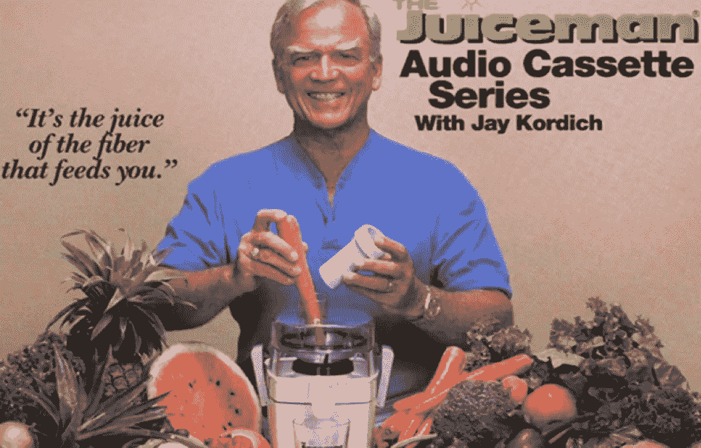

# 制作畅销产品视频的 5 个快速技巧

> 原文：<https://medium.datadriveninvestor.com/5-quick-tips-for-making-great-product-videos-that-sell-9f443cbfa5e8?source=collection_archive---------13----------------------->

20 多年来，我一直使用演示视频来销售许多消费品，如 Juiceman 榨汁机、Sonicare 牙刷、乔治·福尔曼烤架、OxiClean、Rug Doctor、GoPro 等。从多年的贸易展览中，我了解到最成功的产品——那些抓住我注意力的产品——是那些让我看到和感觉到如果我买了它们事情会变得更好(如果我不买会变得更糟)的产品。建立这种联系最有效的方法是通过演示。

我最早的一个电视广告节目是由推销员杰伊·科尔迪奇(Jay Kordich)主演的，他对在我们以肉类为主的饮食中加入更多水果和蔬菜的热情具有感染力。杰伊对榨汁的好处的关注鼓舞了他的客户群。他们相信他，因为他们可以看到果汁机将一整袋胡萝卜和绿叶蔬菜液化成充满活力的健康食品混合物。在 Jay 展示机器功能的同时，他也宣布了天然饮料改变生活的益处。视频给了我们一种捕捉杰伦的说服力并与世界分享的方式。

 [## 2019 年值得关注的 20 种数字营销趋势和技术|数据驱动的投资者

### Faisal 在加拿大工作，拥有金融/经济和计算机方面的背景。他一直积极从事外汇交易…

www.datadriveninvestor.com](https://www.datadriveninvestor.com/2019/02/04/20-digital-marketing-trends-techniques-to-watch-out-for-in-2019/) 

# 为什么是视频？

在消费主义被视频和社交媒体主导之前，Jay 耸人听闻的演示使我们的公司在四年内销售额超过 7500 万美元。今天，如果你没有使用视频，你应该使用！

# 你知道吗？

*   当观看视频时，观众能记住 95%的信息，相比之下，以文本格式阅读时，只能记住 10%
*   在登录页面包含视频可以将转化率提高 80%
*   在亚马逊商品上使用视频可以增加 20%或更多的销售额

# 制作优秀产品视频的 5 个技巧

# 第一步——介绍你的产品——告诉我们它能解决什么问题

谁能从使用你的产品中获益？当我们制作 Oxiclean 视频时，我们明确表示 Oxiclean 是一种强大的去污剂。你可能还记得广告语，“奥克斯力能去除顽固污渍！”我们还强调了[产品的好处](https://www.youtube.com/watch?v=u9HNaleAefU):漂白剂的*功效*，但对衣物的*安全*。

# 步骤 2——演示

通过使用[视频展示您的产品](https://www.youtube.com/watch?v=NHRkx4Xhh-U)，您展示了其有效性的证据。特写镜头显示产品正在工作和/或正在解决问题。对于乔治·福尔曼烧烤店，我们的竞争角度是用更少的脂肪和油脂烹饪你最喜欢的食物。我们特写了脂肪从烤架上的肉中流出的镜头。

# 第三步——特征说明一切。利益销售。

特色很重要。好处结束销售。看看[我们如何营销 Juiceman 榨汁机](https://www.youtube.com/watch?v=FlsLYddwXco)，问问自己哪一个类别更有吸引力？

**特色:**

*   马力电机
*   不锈钢刀片
*   可用洗碗机清洗
*   无污染塑料

**好处:**

*   活得更久
*   更多能量
*   缓解疼痛
*   降低胆固醇
*   逆转心脏病
*   看起来更年轻
*   更好的皮肤、头发和指甲

# 第 4 步——添加真实的证明

听到别人对产品的体验可以建立信誉，帮助我们克服异议。这种“社会证明”元素是可用的最强大的营销工具之一，因为它有助于说服人们进行购买。使用推荐的一个最生动的例子是 GoPro 使用病毒媒体来推动销售——通过讲述你的*故事。每天都有超过 6000 个用这种独特相机拍摄的视频被上传到该公司的 YouTube 频道，并被数千人观看。谁不想成为[下一个 GoPro 明星](https://www.youtube.com/user/GoProCamera)？*

# 步骤 5 —陈述您的行动要求(CTA)

一旦你吸引了买家的注意力，促使他们立即做出反应，通常使用“现在打电话”、“了解更多”或“访问我们的网站”等提示来获取更多信息。如果他们在我的网站上注册，我喜欢添加一个特别优惠:

*有关创建有效视频内容的免费信息，请访问我的网站。如果你喜欢你在这里学到的东西，并希望看到更多促进销售的营销技巧，请前往我的* [*YouTube 频道*](https://www.youtube.com/user/CesariDirectPostPro/) *或购买我即将出版的书籍* [*视频劝说*](https://rickcesari.com/books/) *，该书将于 9 月份发行。*

最初发表于[里克·塞萨里](https://rickcesari.com/5-quick-tips-for-making-great-product-videos-that-sell/)

Rick Cesari 自 1994 年以来一直从事直接回应和视频营销行业，自 1999 年以来一直从事咨询工作。他的热情是继续这项工作，并与组织分享这方面的知识。你可以关注他在 RickCesari.com 的最新消息。