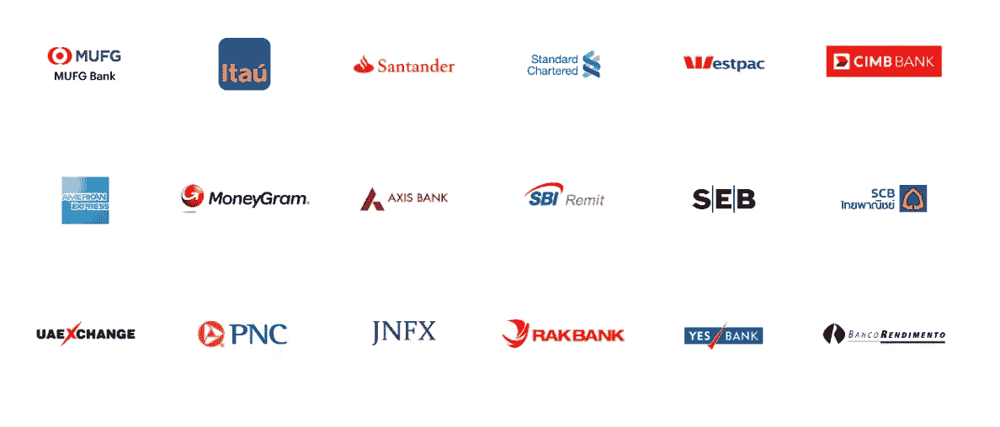
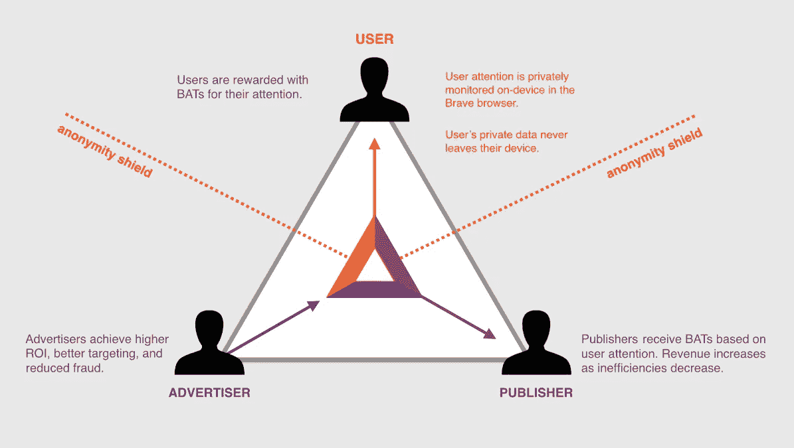

# 正在改变行业的 5 个真实世界区块链应用

> 原文：<https://medium.datadriveninvestor.com/5-real-world-blockchain-applications-that-are-transforming-industries-d2bc1eee213a?source=collection_archive---------13----------------------->

除非你一直生活在岩石下，否则我相信你现在已经听说过区块链了。虽然区块链应用程序看起来具有足够的破坏性，但是很难想象一个分散的数据库在实践中能做什么。

今天，我们将更新区块链技术的功能，并探索现实世界中的 5 个区块链使用案例。

# 什么是区块链？

In this video, the World Economic Forum explains the concept brilliantly in 2 mins

区块链是一个去中心化的数据库，它以链的格式记录信息，以密码安全的方式将一块数据链接到另一块数据。

关于区块链，你应该熟悉 5 个表达:

*   **去中心化-** 没有控制区块链的中央实体，节点一起决定在平台上注册什么
*   **不变性-** 在区块链上注册的数据不能被修改或删除，因为所有的信息片段都是相互关联的
*   **共识-** 成员使用共识机制就区块链上发生的事情以及注册的交易达成一致
*   **权限-** 根据谁可以作为成员参与，区块链分为有权限和无权限
*   **智能合约**–区块链网络上的自动化智能协议和算法

如果你想深入了解，唐·塔斯考特在这个 19 分钟的 Ted 演讲中解释了区块链(完全值得！)

那么，区块链应用程序在哪里使用，用于什么目的呢？

区块链是一种利润丰厚的注册和完成交易的工具。由于它可以形成一个庞大的网络，无论物理上的接近，它可以很容易地连接世界。没有中间商，交易成本更低，同时保持网络安全透明。

# 1.金融

[**涟漪**](https://ripple.com/) **—快速银行交易**

众所周知，国际银行交易是有缺陷的:通常情况下，一笔转账可能需要几天时间，交易费用很高，中间要经过几个中间人，还要支付汇率成本。Ripple 的目标是以更低的成本实现跨境实时交易。Ripplenet 拥有超过 200 家主要机构的不断增长的网络，使国际交易更快、更便宜、更安全。

Some of Ripple’s partners

# 2.保险

保险是区块链的另一个有前途的领域。复杂的保险合同可以制定为智能合同，对各方具有同等约束力，没有解释上的差异。

****—飞行保险自动化****

**自动保险服务的一个例子是 Etherisc，在那里你可以很容易地购买航班保险，并且在你的航班延误或取消的情况下获得自动的、几乎即时的赔付。所有的帮助下，智能区块链应用程序！**

# **3.供应链**

**你知道你的食物来自哪里吗？还是你的衣服？供应链管理是一个非常复杂的领域，从生产到采购往往要经过数十个中间商。在漫长而乏味的供应链之旅中，我们如何确保产品的质量、透明度、可信度并提高效率？答案是区块链。**

**[**安布罗斯-**](https://ambrosus.com/) **跟踪立易****

**Ambrosus 是两项新技术的产物——区块链和物联网。他们的产品是跟踪硬件的组合——物联网芯片和跟踪门，产品会自动在他们的区块链网络上注册。这使得你可以将手机对准你最喜欢的早餐麦片，并发现其成分来自哪里，是否不含杀虫剂，以及储存温度是否总是合适。**

# **4.广告**

**区块链正在迎来广告的新时代。通过使微交易成为可能，观众可以因关注他们选择观看的广告而获得回报。**

**[**勇者与蝙蝠**](https://basicattentiontoken.org/) **—把权力还给观众****

**Brave 是一款内置广告拦截器和独特奖励系统的互联网浏览器，带有 BAT(基本注意力令牌)。在 Brave 中，如果用户选择看广告，他们会得到奖励，而作为回报，他们可以奖励自己喜欢的出版商。通过这种方式，出版商可以获得两个收入来源，而观众可以控制广告的数量和质量。凭借每月 550 万的活跃用户，Brave 正在成为领先的区块链用例之一。**

****

# **5.艺术**

**你怎么证明真实性？大家在使用一首歌的时候真的是在为版权付费吗？当艺术家的努力成果被无情地复制时，他们常常会发现自己处境艰难。在区块链的帮助下，原创内容——音乐、照片、绘画——可以得到保护。**

******艺术品和收藏品登记处******

****在 Artory，收藏品在区块链注册，发行注册卡，每一笔交易，当艺术品被出售时，都在区块链注册。人们可以很容易地扫描注册卡，并验证杰作的来源。****

****今天的 5 个区块链使用案例到此结束！我们对这项杰出的发明还只是皮毛。还有许多更有趣的用例有待发现。请在下面留言，让我知道您希望在第 2 部分中看到的其他用例！****

*****原载于 2019 年 2 月 13 日*[*【www.datadriveninvestor.com】*](https://www.datadriveninvestor.com/2019/02/13/5-real-world-blockchain-applications/)*。*****