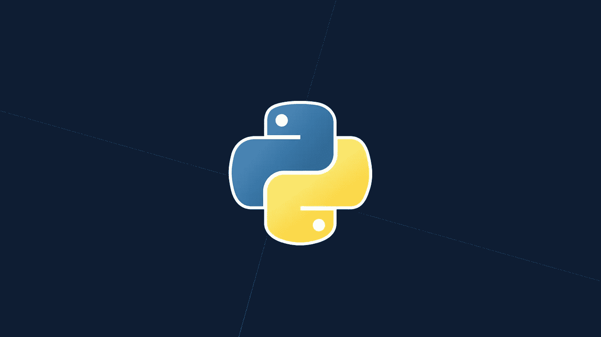

# 学习 Python 是最佳决定的 5 个理由

> 原文：<https://medium.datadriveninvestor.com/5-reasons-why-i-learned-python-and-why-you-should-learn-it-as-well-917f781aea05?source=collection_archive---------2----------------------->



Python 被用于从网络和游戏开发到机器学习、人工智能、科学计算和学术研究的不同领域。作为第一语言，它很容易学习，而且由于其多种多样的用法，它是任何程序员都需要的一套有价值的技能。这是一个多功能的工具，几乎在任何职业中都有用，所以它不会很快出现在任何地方。我个人一直最喜欢的语言，以下是我认为你也应该开始学习 Python 的五个原因。


Python 语言富于表现力和生产力。因此，您可以快速创建解决方案，其他人也可以轻松理解。Python 背后的一个基本思想是促进代码的易读性。Python 的语法简单、干净、易于理解。与许多其他编程语言不同，它的代码相对容易阅读，因为它类似于我们所说的日常英语的一部分。在 Python 中你不必处理复杂的语法。例如，下面是 Python 代码，它直接告诉计算机打印“我棒极了”

```
print(“I’am awesome”)
```

在 Java 中是这样的

```
public class HelloWorld {

    public static void **main**(String[] args) {

        System.out.**println**("I'am awesome");
    }

}
```

在 C++中，它是…

```
#include <iostream>int main() {
std::cout << "I'am awesome.\n";
}
```

此外，Python 代码严格依赖于适当缩进的使用，这使得代码清晰且更具结构化。考虑到它简单明了的语法，超级可读的代码，如果你想学习编程，但以前从未写过代码，它是推荐的语言。


尽管 Python 对于初学者来说是一种简单的编程语言，但它拥有完成高级工作所需的所有能力和资源。实际上，你可以用 Python 做任何事情，而且有很多重要的项目都是用 Python 构建的。它基本上无处不在，它非常小，因此出现在嵌入式设备和几乎每台服务器上。一旦你学会了它，你就可以在 web 开发、数据科学、机器学习、人工智能、web 报废、游戏开发、科学和数字计算等领域找到机会，这使得它成为了一门可以学习的通用语言。因此，如果你想学习编码，但还没有决定用它做什么，那么 Python 是显而易见的选择。因为它为您提供了在不同字段之间灵活切换的选择。

> 无论你的职业生涯最终走向何方，Python 都是对你技能的一大补充。


许多大公司都在使用 Python，因为它简单、通用且易于维护。我相信你会惊讶地知道这些公司；脸书、谷歌、美国宇航局、Quora、亚马逊、Reddit、网飞、Dropbox、Instagram 等等。这些公司尽可能地使用 Python。 **Python 的增长在各个行业中分布相当均匀**。由于其用户友好性、简单性、可伸缩性、健壮性和创新性，Python 是大多数初创公司首选的编程语言。


学习 Python 的另一个流行原因是它非常开放。它是开源的，所以如果你愿意，你可以了解它的方方面面。与此同时，Python 非常受欢迎，拥有一个庞大的开发者社区，当你遇到麻烦时，他们可以为你提供支持。

你可能会想，当你想成为一名程序员时，为什么你需要一个社区？当你学习一门语言或者使用它开发项目时，一个强大的社区会很方便。如果你在学习或构建 Python 项目时有任何疑问或技术问题，你可以从论坛、问答网站、Twitter、脸书等几乎所有地方的成千上万的 Python 社区成员那里寻求帮助。

你可以让你社区的开发者给你建议，或者用你的代码去找你找不到的 bug。随着许多人开始学习 Python，Python 社区比以前更强大了。2017 年，python 是 github 上第二受欢迎的语言。根据 StackOverflow 的说法，他们网站上关于 Python 问题的访问者数量增长速度比其他任何语言都快，声称 Python 是世界上增长最快的主要编程语言。

这种开放性和庞大用户群的结合意味着几乎任何人，从临时程序员到专业软件开发人员，都可以在他们需要的水平上使用这种语言。


在 Python 中，你通常不需要写很多代码，因为 Python 有很好的标准库。它是奇妙的第三方库的巨大宇宙的中心。使用 Python 的公司和个人越多，围绕它构建的资源就越多，这有助于开发人员完成复杂的任务，而不会遇到许多编码困难。

[有超过 125，000 个第三方 Python 库](https://pypi.python.org/pypi)，这使得 Python 在 web 开发、科学计算、云配置、数据分析、机器学习、人工智能和学术研究等多个领域广受欢迎。Python 已经成为科学界所需要的环境，从 Astropy 到 Biopython 都有专门的库。有用于数据科学的 NumPy，用于地球科学的 EarthPy，用于天文学的 Astropy，用于游戏开发的 PyGame，用于机器学习的 Tensorflow 等等。

Python 在 web 开发中占据了突出的位置，使用 django、falsk 和 pyramid 等 Python web 框架为 Youtube、Instagram、Reddit 和 Dropbox 等非常受欢迎的网站提供后端支持。

你可以在这里找到令人敬畏的 Python 框架、库、软件和资源的精选列表。

正如你所看到的，使用 Python 可以为复杂的应用程序构建简单的脚本。您可以快速、安全地完成它，并且代码行比您想象的要少。Python 有趣、富于表现力，其可读风格、快速编辑、运行开发周期意味着您可以坐下来编写代码，而不是与编译器和复杂的语法斗争。随着你的实验成为原型，你的原型成为产品，Python 将与你一起成长。Python 让编写软件的体验变得更加容易和愉快。

我写关于企业家精神和计算机科学的文章。关注我的每周文章。

# 最后一件事…

*如果你喜欢这篇文章，点击*👏*这样其他人就可以在媒体上阅读和欣赏了*

我是[PluraliQ.com](https://pluraliq.com/)的幕后推手——为孩子开设的私人在线一对一编程课程。

**在@上联系我**[**Linkedin**](http://www.linkedin.com/in/naushad-shaik-b8187362)**@**[**Twitter**](https://twitter.com/nsdnaushad)**。**