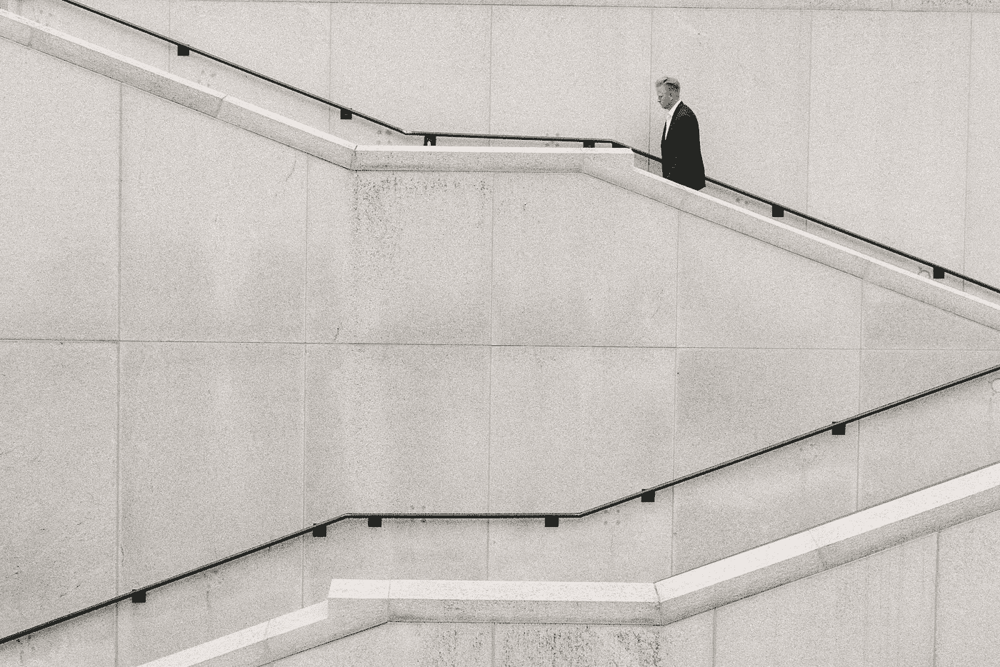

# 你效率低下的 5 个原因

> 原文：<https://medium.datadriveninvestor.com/5-reasons-why-you-are-unproductive-b927d04f4d72?source=collection_archive---------2----------------------->

Photo by [Joshua Ness](https://unsplash.com/photos/9iqqFZ7OuwY?utm_source=unsplash&utm_medium=referral&utm_content=creditCopyText) on [Unsplash](https://unsplash.com/search/photos/business?utm_source=unsplash&utm_medium=referral&utm_content=creditCopyText)

> 虽然忽略你的坏习惯可能会让你一开始感觉良好，但这种逃避最终会让你自食其果。当你不解决好习惯之外的低效和不健康的事情时，你会停滞不前。—艾米·莫兰

尽管“生产力”是主观的，但“非生产力”是一个真实的问题。我们的时间和资源有限。你、我和我们周围的每一个人都有如此少的时间，却有如此多的事情要做。每个人都有责任努力以富有成效的方式利用自己的时间。

如果你是那些总是小心翼翼明智地花费时间的人之一，那么你并不孤单。如果你是那些总是(或经常)感觉没有效率的人之一，那么你也不孤单。

不用花太多时间就能明白，知道导致低效的原因是战胜低效的最好方法。正如**孙子**非常明智地说——*“知己知彼，百战不殆。”*

所以在这里，我总结了与效率低下相关的最重要的问题。当你做这些事情时，你肯定会变得毫无收获。

 [## 人工智能预测:“颠覆，然后生产力”——数据驱动的投资者

### 人们越来越担心，随着机器学习和互联网的普及，所有白领工作都将消失

www.datadriveninvestor.com](https://www.datadriveninvestor.com/2018/08/06/ai-forecast-disruption-then-productivity/) 

# 1.你在牺牲你宝贵的睡眠

当工作堆积如山，或者当你雄心勃勃的时候，减少睡眠是最简单的事情。事实上，睡眠不足对生产力的影响是有害的。为了工作牺牲睡眠对事业和成功来说是极具破坏性的。睡眠不足会将疲劳转化为疲惫。

不用说，当你筋疲力尽时，大脑无法正常工作。

专注力受损。

注意力不集中会导致错误，进而影响生产力。

睡眠不足的一些常见后果包括:在工作场所误解任务，混淆文档和数据，忘记重要任务，经常出错等。

创造力和解决问题的技能飞出窗外。

长时间工作并不罕见，但这取决于我们是否有足够的睡眠。

当我们睡眠不足时，我们的压力会增加，而创造力会下降。虽然你可能是少数几个即使睡眠不足 4-5 小时也能惊人地高效的人之一，但对于我们其他人来说，我们至少需要 6 小时的睡眠才能拥有一个功能齐全的大脑。毋庸置疑，你的睡眠是宝贵的，所以好好睡吧。

# 2.你没有健身

《应用生理学杂志》发表文章称——[在跑步机上跑步增加了海马神经发生](http://jap.physiology.org/content/105/5/1585)，从而增加了神经干细胞/前体细胞。通俗地说，它让你变得更敏锐，增加了你解决问题的能力。

在一项对 23 名久坐不动的成年人(大多是 55 岁以上的女性)的研究中，参与者被要求每周锻炼四次。结果发现，运动参与者的*“在运动加睡眠卫生教育组中，自我报告的睡眠时间增加了 1.25 小时，高于其他非药物干预失眠的报告”。*

如前所述，适当的睡眠对生产力来说是必不可少的。

这一说法得到了斯坦福大学研究人员的支持，因为他们发现走路和创造力之间有直接的联系。所以，每当你想放慢脚步，或者变得没有效率时，就去散散步，你不会后悔的。正如充足的睡眠意味着更高的生产力，充足的锻炼意味着更高的生产力。

北大学的一项研究发现，锻炼是提高皮质醇的好方法，这样早上会更清醒。

各种疾病吞噬了我们工作生活的相当一部分。经常锻炼可以降低患某些类型肥胖症的风险。这意味着更少的病假。锻炼可以降低患二型糖尿病病、肥胖症、高血压、心脏病的风险——所有这些疾病都会影响工作效率。

事实上，自从我开始定期锻炼，我的时间表变得更加清晰，我解决问题的能力也大幅提升。而且，我可以在更短的时间内完成更多的工作。很明显，现在我的白天更有效率了，我的夜晚充满了深度睡眠。

# 3.你在一心多用

在当今忙碌的世界中，不同时参与多项任务几乎是不可能的。但是科学表明，虽然我们有时会情不自禁地一心多用，但我们应该尽可能地远离它。

为了尽快完成你的日常任务，或者为了应付繁重的工作量，你可能会尝试多任务处理。过了一会儿，你会陷入思考过程。对于某些需要批判性思维和解决问题技能的工作，这是一条通往低效之地的直线。

最近的研究表明，从一项任务转换到另一项任务会严重影响工作效率。

这项研究最可怕的结果是，大脑的变化影响着参与者，即使他们没有一心多用。因此，研究显示，即使这些长期一心多用的人只专注于一项任务，他们的大脑效率也较低。我不会详细说明多任务处理到底有多糟糕，但是[这里有一篇文章](https://www.verywellmind.com/multitasking-2795003)可能会有所帮助。

计算机擅长多任务处理，而人类却不行。所以不要尝试。我们的大脑根本不是为此而生的。

# 4.你不够专注

我们生活在一个智能手机正在控制我们的注意力、集中力和思维过程的世界。研究发现，美国消费者每天至少花 [5 小时](http://flurrymobile.tumblr.com/post/157921590345/us-consumers-time-spent-on-mobile-crosses-5)在他们的移动设备上。想象一下，如果一个人没有浪费那么多时间，他/她会有多高的工作效率。

只要把手机放好，或者打开静音模式，或者至少关掉通知，你就能获得数小时的工作效率和注意力。

这些智能手机是促使我们尝试多任务处理的头号原因。我们并不是天生擅长多任务处理。因此，我们所有的尝试都是徒劳的。

对科技的沉迷是真实存在的。如果你不能控制自己时不时地碰一下手机，你就会慢慢地上瘾。这不仅会影响工作效率，还会让你日后后悔。看起来我们的“智能”手机并没有让我们变得聪明。

为了增加你的注意力，你可以尝试冥想，或者设定每天的个人目标。你需要尽可能地排除干扰。学习时间管理，训练你的大脑专注。可以做，但是需要行列式。

划分你的时间可以让你的大脑分离出一项任务，这样你就可以完全专注于一件事，而不会经常分散注意力。

# 5.你没有提前计划

> “不做准备，就是在为失败做准备。”
> ― **本杰明·富兰克林**

有一个清晰的愿景让你有动力。当很多人缺乏动力时，他们也缺乏生产力。因此，为了保持高效，我们也需要保持高效。因此，重要的是我们要提前计划，并对我们的前进方向有一个清晰的愿景。

我们都需要有一个优先列表。不是所有事情都重要。也不是所有事情都是无关紧要的。我们需要选择什么对我们来说是重要的，现在。只有这样，我们才能合理规划。当我们提前计划时，我们会变得更有效率。

但是执行计划同样重要。否则，计划就变得毫无意义。

> 计划你的工作，然后实施你的计划——拿破仑·希尔

# 额外收获:你没有设定个人的最后期限

拖延是生产力的真正敌人。拖延和生产力不能共存。这就是为什么设立个人目标是实现生产力的好方法。

如果你是自雇人士或企业家，那么你有更大的机会拖延。为了保持工作效率，你需要设定个人的最后期限。这个建议对博客作者、作家和所有来自不同领域的有创造力的人特别有帮助。毫无疑问，这也会帮助你。

# 结论

> “那些疯狂到认为自己可以改变世界的人通常会这样做。”—史蒂夫·乔布斯

我们可以成为我们想成为的人。我们必须富有成效。没有别的办法了。我们只有一次生命和非常非常有限的时间。我们要么成功，要么失败。的确，有些事情我们无法控制。但是我们确实需要完全控制我们能够控制的事情。要做到这一点，除了充分利用我们的时间，别无他法。所以我想用约翰·班扬的一些机智的话来结束我的演讲

> 如果我的生活没有结果，谁赞美我都无所谓，如果我的生活有结果，谁批评我都无所谓。

让我们富有成效，完全掌控自己的生活。

# TLDR；

在这篇文章中，我总结了让你效率低下的最常见的原因。我建议你阅读整篇文章(如果你还没有的话),但是如果你时间不够，那就不要难过。这是给你的清单:

*1。牺牲宝贵的睡眠*

*2。不工作*

*3。多任务处理*

*4。聚焦不够*

*5。没有提前计划*

## 结尾部分

您想在列表中添加更多内容吗？在评论中发表你的看法或者通过 [Linkedin](https://www.linkedin.com/in/fuad/) 或 [Twitter](https://twitter.com/___fuad) 与我联系。如果你喜欢这篇文章，我肯定会感谢一些掌声。毕竟，谁不喜欢掌声呢？😄

你可以在 [Medium](https://medium.com/@nafis.fuad) 、 [Linkedin](https://www.linkedin.com/in/fuad/) 和 [Twitter](https://twitter.com/___fuad) 上关注我，以便在我发布新帖子时获得通知。