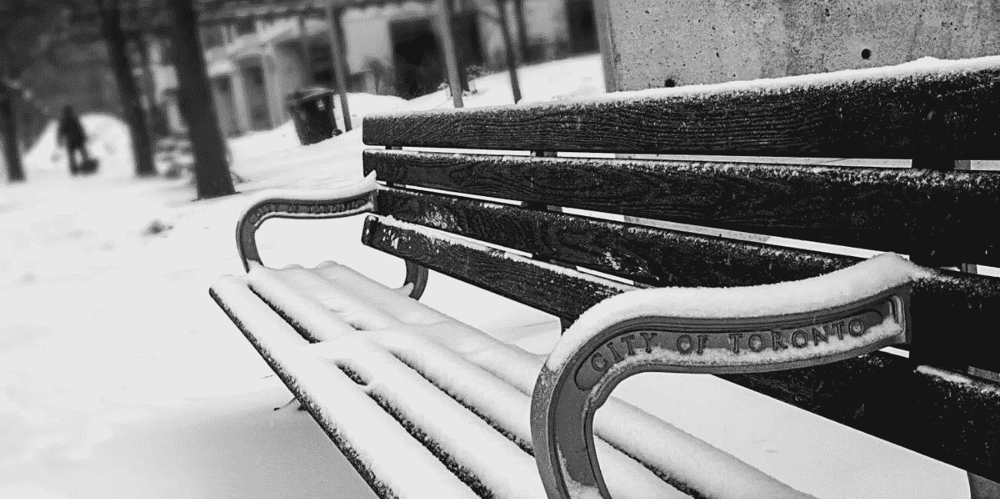
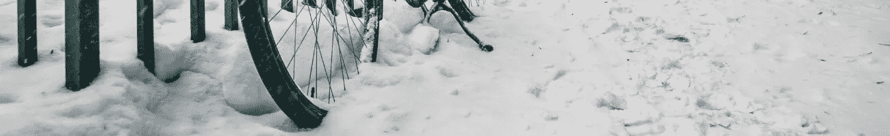

# 5 个冬季安全提醒

> 原文：<https://medium.datadriveninvestor.com/5-safety-reminders-for-winter-120e4692e831?source=collection_archive---------24----------------------->

## 冬天可能是温暖和幸福的时光，也可能是寒冷和令人沮丧的。区别在于我们准备的有多充分。

*最初发表于*[*【millennialmoderator.com】*](https://millennialmoderator.com/5-safety-reminders-for-winter)*。*

冬天的寒冷带来了各种各样的健康和安全问题，如果忽视了这些问题，往好了说会毁了你的一天，往坏了说会导致长期的健康问题。人们很容易忘记，随着天气的变化，我们的生活方式也一定会发生变化——即使只是暂时的。下面是 5 个安全提醒，帮助你的冬天充满快乐和幸福，而不是不舒服。

# 1.雪仍然会导致晒伤

尽管天空阴云密布，地面松软，阳光仍然对我们的皮肤有很大的影响。如果你曾经去过山上并戴着雪镜，你可能会带着浣熊晒伤的样子回家，或者在别人身上看到过。雪是一种强有力的折射阳光的物质，因为它是液态和冰状的。仅仅因为外面寒冷多风，并不意味着你不会被雪晒伤。捂脸或者涂点防晒霜！尽管——一点点维生素 D 肯定能帮助治愈那些冬季忧郁症。

# 2.运行你的热水管

随着地面结冰，你家的水管也会结冰。当你长时间不使用热水时，这种水温的突然变化会导致管道破裂——在经济上和物质上都是昂贵的维修费用！最好的做法是每天至少放一次热水，以防止水管结冰。这对于任何类型的家、公寓、共管公寓等都是一个很好的实践。现在你又有理由给自己倒一杯超级美味的暖冬饮料了！

# 3.练习戴上锁链

如果你以前曾经给你的车装过链条，那么你可能很清楚头几次装链条时的挫败感。穿上它们会很有挑战性，你最不想学的地方就是暴风雪中的路边。花几分钟时间，练习在没有雪的时候穿上防滑链，这样你就能为以后更平稳的过渡做好准备。这也可能是找到你的链子的好方法，以防你去年把它们放错了地方。现在感恩节你不会再迟到了！

# 4.不要给没电的汽车电池充电

当汽车电池在冬天耗尽电量时，它们就有冻结的危险——这是由于电解液的冰点。世界上许多地方冬天的温度远低于冰点，在这种状态下给它们充电可能会导致电池爆炸。如果你的电池没电了，在给它充电之前，把它放入室内加热足够长的时间，以确保它没有冻结。解冻冻结电池的建议时间约为 2-3 小时。

# 5.买夏装

在冬天，商店希望人们购买冬装，从而将他们的夏季选择放在**大规模的**折扣上。这可能是为假期做一些[黑色星期五购物](https://millennialmoderator.com/where-to-find-the-best-black-friday-internet-deals)的好时机，或者暗示你的另一半，你正计划给他们买一件时髦的泳衣或背心，过一个特别的暑假。通常情况下，零售商不会在网上列出他们的夏季销售，但他们通常会在店内有一个专门的夏季商品区。你也可以利用这段时间来超越你的[有趣的节日毛衣](https://millennialmoderator.com/5-unique-holiday-sweater-ideas)游戏。

做好准备，适应季节变化，让自己度过一个美好的冬天。如果你喜欢这些建议，请考虑分享，让别人免于不幸！

标记为: [SelfWinter](https://millennialmoderator.com/5-safety-reminders-for-winter#)

*原载于*[*millennialmoderator.com*](https://millennialmoderator.com/5-safety-reminders-for-winter)*。*