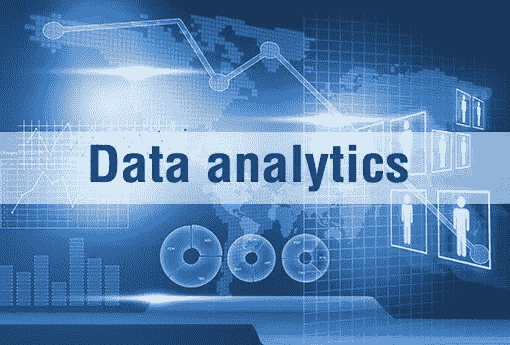

# 关于数据分析的 5 个简单事实—已解释

> 原文：<https://medium.datadriveninvestor.com/5-simple-facts-about-data-analytics-explained-175481734207?source=collection_archive---------5----------------------->

由于数据收集的增加、数据收集技术和方法的改进以及计算数据能力的显著增强，数据分析、数据科学、机器学习，无论人们如何称呼它，该主题在过去的二十年里都经历了巨大的增长。各种数据分析师工作汇集了来自多个工程分支、计算机科学家、统计学家和数学家的人才，并且越来越需要一个全方位的解决方案来解决企业在管理数据时面临的众多问题。事实上，没有一个商业、工程、科学等等的主流。一直远离数据分析，并在各自的行业中持续使用各种数据分析工具。也许这是学生们参加数据分析课程并为未来做好准备的最佳时机之一，因为未来就在数据分析中。

但是，随着数据分析工作被认为在短期内呈上升趋势，这里有一些关于数据分析的简单事实，人们需要在开始[数据分析课程](https://imarticus.org/post-graduate-program-in-data-analytics/)或数据分析职业生涯之前了解

1.没有数据是干净的

理论上，正如在数据分析课程中所教授的，缺少数据的分析只是一组理论和假设，而数据有助于测试这些理论和假设，以找到合适的背景。但是，在现实世界中，数据从来都不是干净的，总是一堆乱七八糟的东西。已建立数据科学中心的组织声称他们的数据不干净。除了缺少数据条目或不正确的条目之外，组织面临的主要问题之一是将多个数据集合并到单个逻辑单元中。各种数据集可能会面临许多问题，阻碍其整合。大多数数据存储业务都设计为与前端软件和生成数据的用户很好地集成。然而，很多时候，数据是独立创建的，数据科学家在较晚的阶段到达现场，通常最终只是数据的“接受者”,而不是数据设计的一部分。

2.数据科学不是完全自动化的。用户需要手动清除一些数据

绝大多数人并不完全理解什么是数据分析？关于数据分析最常见的误解之一是各种数据分析工具彻底清理了数据。然而，在现实中，由于数据并不总是干净的，因此需要一定程度的手动处理才能使其可用，这需要大量的数据处理，这可能是非常劳动密集型和耗时的，并且事实仍然是，没有数据分析工具可以在按下按钮时完全清理数据。

每种类型的数据都有自己独特的问题，数据分析师的工作包括动手处理数据，以测试模型，根据领域专家和商业意识等进行验证。

3.大数据仅仅是一种工具

围绕大数据有很多宣传，但许多人没有意识到它只是一组数据分析工具，有助于快速处理大量数据。即使在使用大数据时，也需要利用最佳数据建模实践，并且需要训练有素的专家分析师的眼光。

4.没人在乎你是怎么做的

高管和决策者通常是各种数据科学模型的消费者，并不断需要有用和可行的模型。虽然从事数据分析师工作的人可能会试图解释数据是如何获得的，但实际上，这些高管和决策者不太关心数据是如何获得的，他们更感兴趣的是数据的真实性以及如何使用数据来改善他们的业务职能。

5.展示就是一切

由于分析解决方案的大多数消费者不是数学家，而是各自领域的专家，所以演示在以非技术方式解释您的发现时起着至关重要的作用，最终用户可以理解这种方式。加载了信息图表的 PowerPoint 演示文稿可以帮助数据科学家以终端用户易于理解的语言和交流模式向他们传达信息。

原来这里加了[。](https://imarticus.org/5-simple-facts-about-big-data-analytics-courses-explained/)