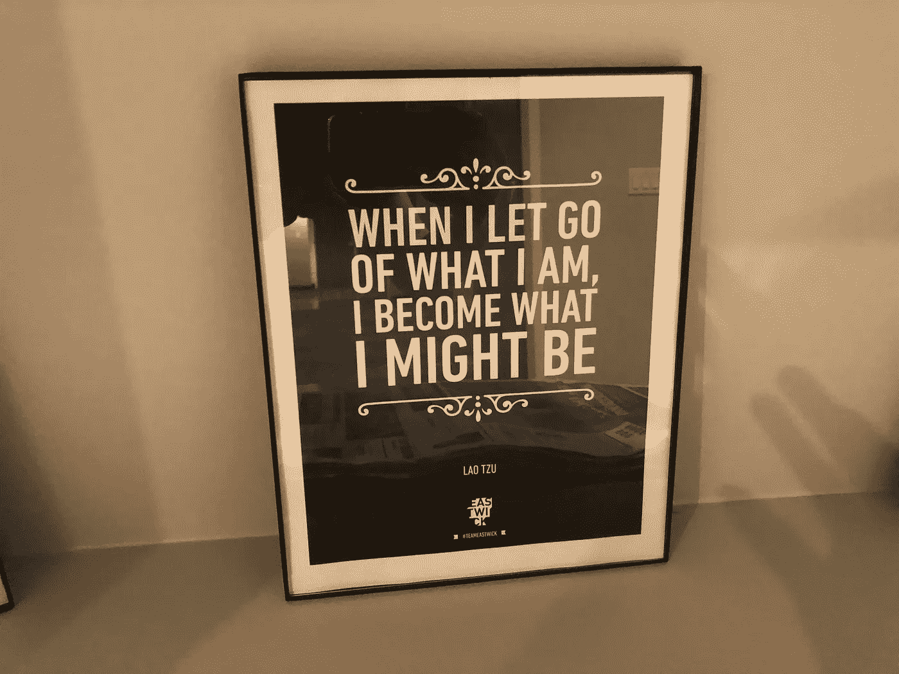
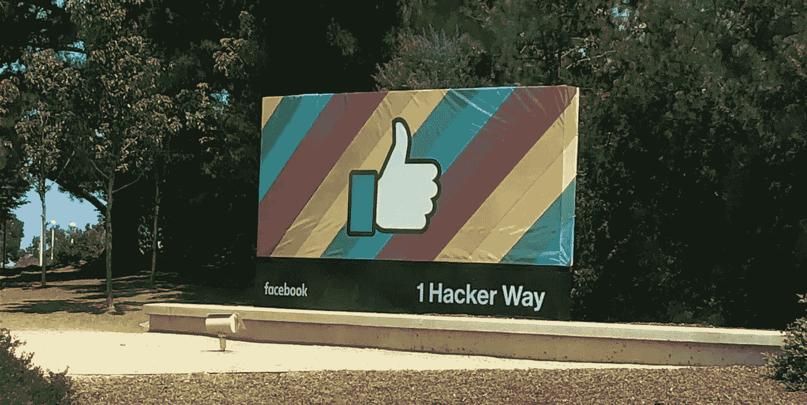
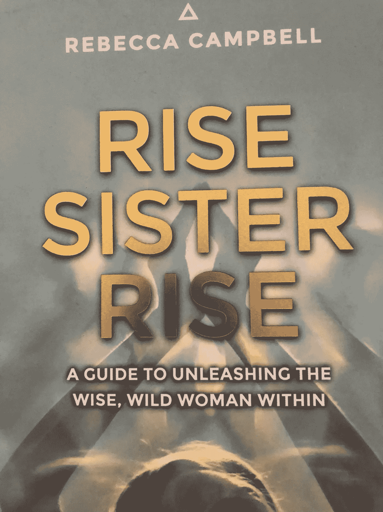

# 5 个简单的方法让你自己成为偶像

> 原文：<https://medium.datadriveninvestor.com/5-simple-ways-to-put-yourself-on-a-pedestal-first-df279cf8170?source=collection_archive---------0----------------------->

你有没有发现自己把一个人放在一个有权力的位置上？当有人看起来比你‘好’的时候，你会发现自己退缩了，没有安全感吗？你有没有注意到你给了对方如此大的权力，因为他/她似乎知道的比你多？

在这个数字时代，比较和对比是如此容易。多亏了互联网的力量，人们很容易看到发生在其他人身上的所有令人惊奇的事情。也很容易忘记不那么开心和惊艳的另一面。[赛琳娜·戈麦斯的 Instagram 帖子](https://www.instagram.com/p/BmuZvJ6gudK/?taken-by=selenagomez)击中了她的要害，她说，*“相信我，我的生活并不总是如此过滤和绚丽……我们都在自己的旅途上。”*

当你把某人放在你之上时，你给了他们你的力量。它会让你产生不满足感**、**感觉不够，或者害怕自己永远不会满足。

这里有 5 个把自己放在第一位的提示:

1.  通过做自己喜欢的事情来减轻压力。专注于做你喜欢的、真正让你开心的事情。注意:这些事情是你为了让自己(而不是别人)开心而做的。*也不需要有结果。我不得不承认这对我来说很有挑战性，因为我已经习惯了这种从小到大根深蒂固的成就。*

> 你的兴趣和爱好是什么？如果你可以做任何你想做的事情，你会如何度过你的时间？如果时间和/或金钱不成问题，你会怎么做？

2.提醒自己拥有自己的价值观。你欣赏对方的哪些品质/价值观？我们在别人身上看到的品质是我们自己身上真正拥有的品质。花点时间写下你喜欢自己的品质。对方简直就是一面镜子，让你认清自己的伟大。

> 你能放下的是什么不再为你服务？

Inspirational quote by Lao Tzu at the Hotwire SF office.

3.庆祝你的成功。提醒自己以前的胜利，记住每个人都有自己独特的方式。如果社交媒体让你感到困惑，让你怀疑自己有多特别，那就离开它，或者不要关注别人。

Facebook HQ

或者花些时间远离你的手机和通知，这样你就不会觉得自己总是“随叫随到”。

4.模式中断。反思当你遇到比你更聪明、更漂亮、更富有的人时，你会对自己说些什么。

> 发生这种情况时，你在给自己讲什么故事？

如果这是一个关于你不够聪明的故事，你如何改变这个故事，让它为你服务？提醒你自己你找到了解决问题的方法。

如何打破这种模式？散散步，和朋友聊聊天或者写下来怎么样？

5.你目前在读什么？你所阅读的内容如何影响你的想法和行为？根据[这篇文章，](https://www.businessinsider.com/14-reasons-why-reading-is-good-for-your-health-2016-12)研究人员发现，阅读可以减轻 68%的压力。

我读过的两本书给了我很大的帮助:

[崛起的姐妹崛起](https://www.amazon.ca/dp/B01HFEH2F4/ref=dp-kindle-redirect?_encoding=UTF8&btkr=1)，丽贝卡·坎贝尔。感谢 Pegah 的推荐！

[治愈你的心:用意识和意图重写你的故事](https://www.amazon.ca/Healing-Your-Heart-Awareness-Intention-ebook/dp/B07CT8ZZ2Z/ref=sr_1_1?s=digital-text&ie=UTF8&qid=1534830636&sr=1-1&keywords=tris+thorp)

有哪些对你有用的建议？我很想收到你的来信！