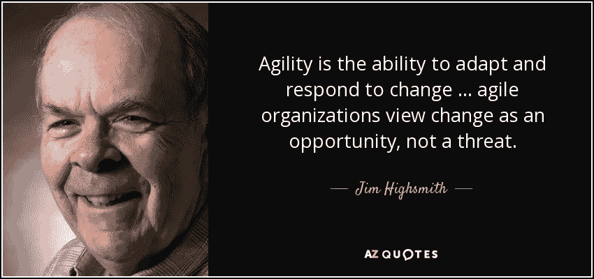

# 为 Scrum 大师面试做准备的 5 个简单方法

> 原文：<https://medium.datadriveninvestor.com/5-simple-ways-you-can-prepare-yourself-for-the-scrum-master-interview-e3193e379f01?source=collection_archive---------4----------------------->

在当今世界，组织已经明白，如果他们需要建立一个引人注目的产品，他们需要以下:

*   自主**团队**
*   可扩展的**架构**
*   **敏捷**的工作环境

随着越来越多的组织转向敏捷，他们取得了成果，也面临着挑战。你认为为什么敏捷变得如此受欢迎，但同时也面临挑战？

在我看来，敏捷变得流行是因为它基于简单的想法。敏捷不需要理解复杂冗长的文档。这很简单。[敏捷宣言](https://agilemanifesto.org/)只有 2 页，他们分享了价值观和原则。

 [## 睁大眼睛冲破多样性壁垒|数据驱动的投资者

### “科技女性”是蒂芙尼·霍兰的激情之一，最初她在 Twitter 上主持“科技女性”聊天。她也是一个…

www.datadriveninvestor.com](https://www.datadriveninvestor.com/2019/03/20/hurtle-diversity-barriers-with-eyes-wide-open/) 

尽管这些价值观和原则很容易理解，但要付诸实施却很困难。这是因为人们还没有理解核心思想。

**敏捷让组织处于一种不舒服的境地，人们被挑战以不同的方式思考！！**

这就是为什么我们需要能够帮助组织在这些简单的想法上指导和训练人们的人，并帮助解决他们的疑问。

## 介绍 SCRUM MASTER

Scrum 大师应该是个人:

*   彻底理解 Scrum 和敏捷的人。他们是在组织中实施 Scrum 的专家。
*   他们引导、影响、协商并果断解决问题。
*   他们是优秀的沟通者，能有效地与人打交道。
*   了解最新技术和商业趋势的知识渊博的人。

越来越多的人将他们的职业从测试、开发、业务分析师、项目经理转变为 Scrum 大师。

在这个故事中，我将分享我的 5 个想法，这将有助于所有专业人士准备和建立一个 Scrum Master 角色的职业生涯。

所以让我们开始吧！

## #1 —了解传统/瀑布模型

你必须知道在敏捷/SCRUM 之前执行产品开发时遵循的是什么。[瀑布模型](https://en.wikipedia.org/wiki/Waterfall_model)已经存在了 20-30 多年，并且仍然被一些组织所遵循。在这种模式下执行的项目具有挑战性。但这并不意味着这对组织没有任何好处。作为一个 scrum 大师，你必须能够判断哪些项目类型适合瀑布。

## # 2——了解 Scrum 的基础知识

在 Scrum master 的面试中，组织希望了解 Scrum Master 的思维过程。他们是怎么想的？重要的是，你已经通读了 Scrum 指南，并且真正吸收了其中的思想。你理解 Scrum 框架。**最好的准备方式是对每一行提出问题“我们为什么要这样做”**

我建议读 2-3 遍，记下你自己的想法。你同意还是不同意 Scrum 指南中提到的内容？

## # 3——了解项目管理的基本原理，并将其与 Scrum 联系起来

许多组织认为 Scrum Master 相当于项目经理的角色。这并不完全像项目经理的角色，但我想说的是，它远不止如此。项目管理是一个大课题，几乎每个组织都遵循它。这个角色曾经很有权威，因为整个项目都是由这个角色驱动的。而 Scrum Master 是一个领导角色。他们是谦逊的人，但**有主见。他们可以参与任何辩论和谈话，而不会咄咄逼人或唯唯诺诺。**

Scrum master 必须知道的一件事是传统的风险管理、沟通管理、问题管理、质量管理、资源/预算管理是如何在 Scrum 中完成的。

## #4 —了解技术和系统如何工作

科技公司的 Scrum Master 很可能是产品工程团队的一部分，他们经常与技术团队交流。技术团队成员可能会遇到技术性很强的阻碍/障碍。例如——他们可能会说“后端服务器没有响应，看起来好像停机了”。在这种情况下，一个 scrum 高手应该能够理解什么是后端服务器？如果这些发生故障，对团队有什么影响？如何确保这种情况不会经常发生？联系谁，如何引导对话？

**我建议人们更多地了解和学习系统的非功能方面，如可伸缩性、性能、安全性、可用性、可靠性、监控和可用性。**

## #5 —了解业务以及产品将如何帮助业务

Scrum Master 将会与负责管理产品路线图、backlog 的业务人员/产品负责人进行很多交流。

对于 Scrum 大师来说，理解产品的业务度量/成功标准是很重要的。

对于你开发的任何产品，Scrum Master 都应该尝试收集如下信息:

*   目标区域，
*   将使用此的用户
*   为什么现在需要它，它对整个组织有什么帮助
*   产品营销和商业化战略

在面试中，你甚至可能被要求写一些用户故事，来展示你在最佳实践方面指导产品负责人的能力。

## 后续步骤…

准备工作从你目前的组织开始。开始和这些领域的人交谈，分享你的观点。如果你在所有这些领域得到了你的团队和同事的认可，你就已经在为成为 Scrum 大师做准备了。