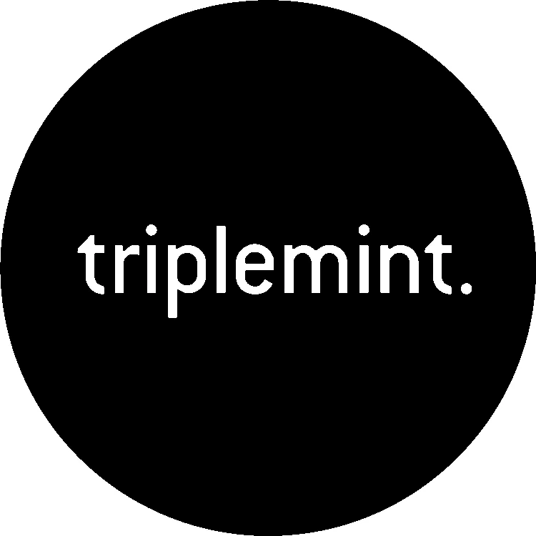
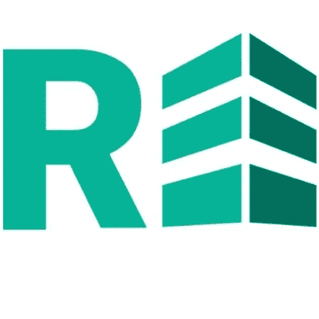
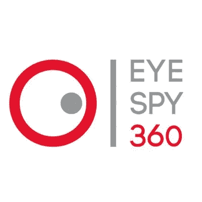

# PropTech 的 5 家创业公司颠覆了房地产

> 原文：<https://medium.datadriveninvestor.com/5-startups-in-proptech-disrupting-real-estate-90c61ac67252?source=collection_archive---------0----------------------->

随着颠覆性技术在你的新闻订阅中不断涌现，以及像 Forbe 的 30 under 30 这样的功能，我们看到了房地产行业的 5 家公司，他们的技术可能会塑造万亿美元市场的未来。

Credits: Yelp

# [TripleMint](http://triplemint.com)

纽约市是一个软件驱动的端到端房地产平台，它提供了一个单一的 TripleMint 经纪人来浏览您希望查看的所有公寓列表，而不是通常联系的经纪人列表。TripleMint 经纪人根据消费者体验获得奖金，以此来增强和改善消费者体验。

Credits: REalyse.com

# [真的假的](http://realyse.com)

英国房地产和投资大数据和分析平台将传统投资节省的时间从每个项目 40-120 小时减少到每个项目仅 16-48 分钟。包括企业商人、大型房地产开发商、投资者和金融公司在内的用户将从该平台获得最大价值。

Credits: Shelterzoom.com

# [ShelterZoom](https://www.shelterzoom.com/)

一个基于以太坊的区块链房地产报价和接受平台，可与任何房地产网站集成。该平台还提供在线租房服务，以及可为任何国家或州定制的房地产协议表格。ShelterZoom 在行业中提供了一种解决方案，旨在改善传统上分散和不透明的流程的安全性和透明度。

Credits: Eyespy360.com

# [EyeSpy360](https://www.eyespy360.com/en/)

提供一个 360 度的虚拟旅游物业从自己的家或办公室的舒适，这项服务允许业主和房地产经纪人，企业，场馆，餐厅和酒店打开他们的财产在一个全新的方式给他们的客户的第一手经验的所有提供。用户可以通过从任何 360 vr 相机上传自己的全景照片到 EyeSpy360 平台，在几分钟内创建自己独特的 360°旅游。

Credits: blockchain.noon.sg

# [正午的资本](http://blockchain.noon.sg)

NOON Capital 是一家房地产开发商和管理公司，旨在通过将开发部署到基于以太坊的区块链技术中，彻底改造新兴市场的房地产设计、管理和融资方式。他们的最新项目包括塔楼的三期开发，这是一个 74 单元的共管公寓，其中第一期已于 2017 年 12 月完成。这一数字解决方案遵循合规、透明和审慎治理的最高原则。区块链技术的实施将简化交易，并以最少的中介和低费用提供流动性。要了解这将如何产生影响以及他们项目的细节，请访问 [blockchain.noon.sg](http://blockchain.noon.sg)