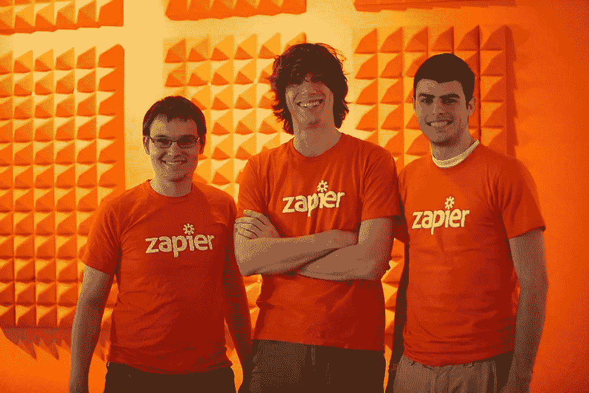
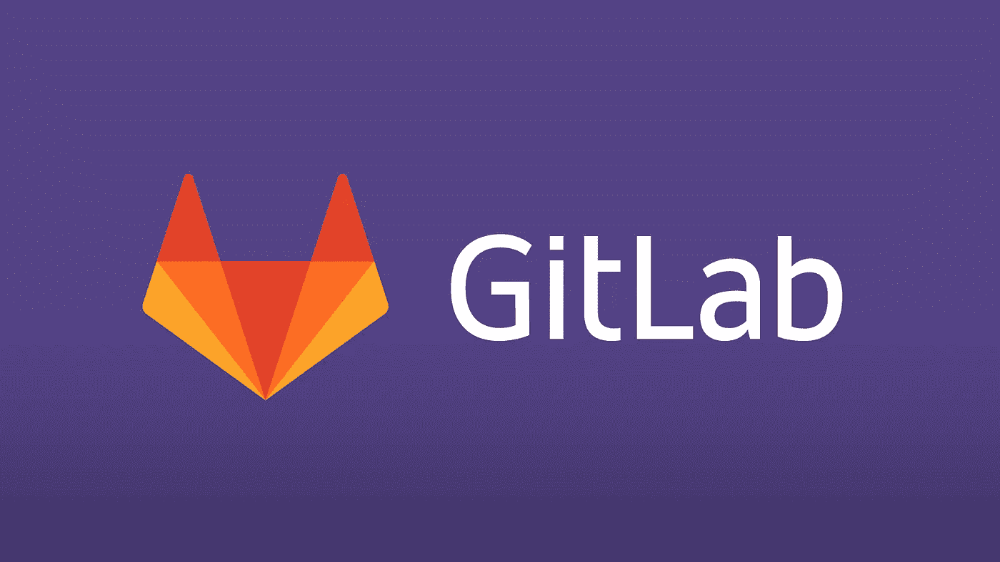

# 2019 年值得关注的 5 家创业公司

> 原文：<https://medium.datadriveninvestor.com/5-startups-to-be-watching-in-2019-ab555e0f972e?source=collection_archive---------27----------------------->

Image Credit: Tech Crunch

# **genes**

> “我们计划淘汰比特莫基”——阿卡什·尼甘

Genies 是 Bitmoji 的竞争对手。实际上，据 CEO Akash Nigam 称，他们“计划淘汰 Bitmoji”。他们在 7 轮融资中成功获得了超过 1 亿美元和 1380 万美元的估值。

值得注意的是，他们的公司背后也有一些大人物。不仅仅是你的大牌风险投资公司，还有名人，如烟鬼、肖恩·蒙德兹和社交媒体巨头杰克·保罗和卡梅隆·达拉斯都把他们的名字放在了这家初创公司上。

Genies 首先了解一个人的性格类型和他们的流行文化偏好，然后允许这个人编辑和定制他们的头像。随后，基于当天的相关话题，etc Genies 将向用户提供定制的头像，以便在社交媒体上分享。

Image Credit: Business Insider

# **扎皮尔**

Zapier 是 Y Combinator 的另一个成功案例。Zapier 将商业软件与商业软件连接起来，并自动移动信息，为您省去麻烦。他们最初在 2012 年的种子轮融资中筹集了 130 万美元，但自那以来一直保持盈利。Buzzfeed、Spotify、Adobe 和 FOX 都在用 Zapier。我绝对认为值得关注这家公司和三位联合创始人:布莱恩·赫尔米格(Bryan Helmig)、迈克·诺普(Mike Knoop)和韦德·福斯特(Wade Foster)。

Image Credit: Shippo

# **七宝**

Shippo 是一种基于云的电子商务运输服务，将客户与最佳运输费率联系起来，允许他们打印标签、跟踪包裹等。他们目前支持超过 35，000 名客户。迄今为止，他们已经在 8 轮融资中获得了 2930 万美元。它们目前也被山羊、hims、Etsy 和联合利华等公司使用。

# **GitLab**

> “适用于整个 DevOps 生命周期的单一应用程序”

GitLab 是面向企业的完整 DevOps 解决方案。GitLab 是 GitHub 的竞争对手，两者都是基于网络的 Git 库，但是 GitLab 已经逐渐为自己赢得了名声。许多企业已经注意到了这一点；索尼、NASA、纳斯达克、拜耳都在用 GitLab。

迄今为止，他们已经在 5 轮融资中筹集了 4560 万美元。最近一轮由谷歌风投公司(Google Ventures)牵头。底线是密切关注 GitLab。

Image Credit: Gladly

# 高兴地

> “我希望被当成一个案号，而不是一个人。”
> 
> -从来没有人说过。

乐意为客户创造高度个性化的现代体验。它们是你作为企业主想要实现的客户支持系统。欣然服务的不同之处在于，它们简化了将客户连接到正确代理的过程，代理从那里获得所有必要的工具和信息，为客户提供正确的支持。

这是一个奇妙的概念，他们已经被像 JetBlue 这样的公司所采用。迄今为止，他们已经在三轮中筹集了 6300 万美元，总部设在旧金山。关注这家公司，他们正在革新客户支持系统。

**演职员表:** [RocketSpace](https://www.rocketspace.com/tech-startups/7-silicon-valley-tech-startups-to-watch-in-2019) ， [TechCrunch](https://techcrunch.com/2017/12/08/genies/) ，[商业内幕](https://www.businessinsider.com/51-enterprise-startups-to-bet-your-career-on-in-2018-2017-11//?r=AU&IR=T/#fetch-robotics-creating-the-warehouse-robots-of-tomorrow-3)，[欣然](https://www.gladly.com)