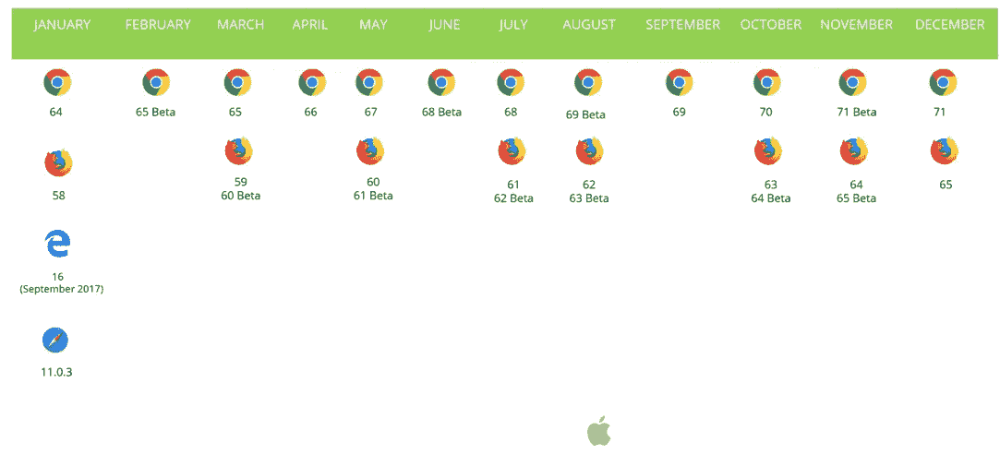
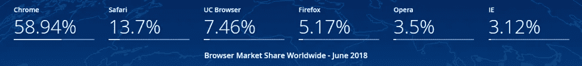
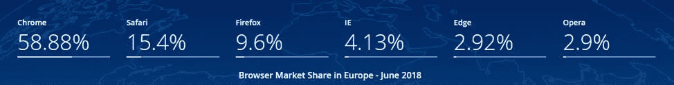
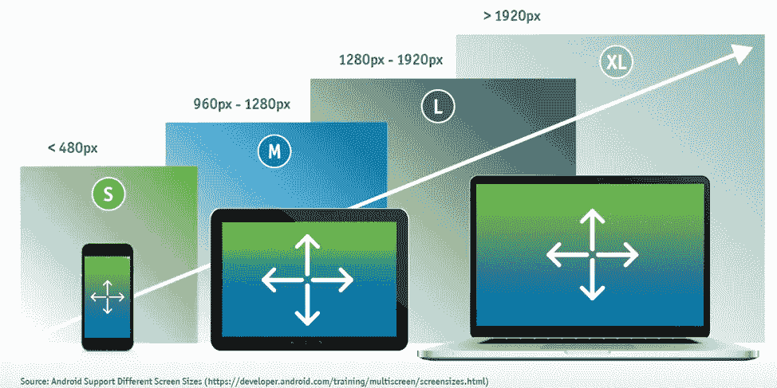

# 确保网上银行质量和 UX 的 5 个步骤

> 原文：<https://medium.datadriveninvestor.com/5-steps-to-ensuring-online-banking-quality-and-ux-c21e131b48ab?source=collection_archive---------2----------------------->

众所周知，数字银行或网上银行行业的需求在不断增长。它使金融服务能够利用业务效率、成本节约、提高准确性、增强安全性等。为了满足这些业务目标，这样的组织需要有一个定义良好的和执行的质量计划，该计划可以测试和监控服务并保证连续的操作。

大多数网上银行服务都是通过 web 或响应性 web 应用程序提供的。这些应用程序可以通过台式电脑或移动设备(智能手机/平板电脑)访问。确保这些应用的质量依赖于以下几点:

*1。正确的设备和桌面浏览器测试覆盖率*

*2。* [*应用程序的功能测试*](https://www.testcraft.io/product/)

*3。用户体验测试和性能*

*4。安全测试*

*5。无障碍测试*

## 正确的设备和桌面浏览器测试覆盖范围

如果您不在您的最终用户在其特定地理位置使用的平台上进行测试，您将面临巨大的业务风险。数字领域非常庞大，由成千上万的智能手机、平板电脑和客户正在使用的各种移动浏览器组成。此外，桌面浏览器领域非常活跃，至少每个月都会发布 Chrome 和 Firefox 浏览器版本。创建一个适当的测试[覆盖率](https://info.perfectomobile.com/factors-magazine.html)矩阵，利用当前的市场状态，覆盖领先的排列，并匹配 web 流量分析数据，这是成功的关键。

除了上面的日历之外，浏览器在不同地区有不同的用法，因此，通过像 [StatCounter](http://gs.statcounter.com/browser-market-share) 这样的网站来关注使用情况是很重要的。

如下图所示，不同地区的市场份额和浏览器使用情况有所不同。

**全球浏览器市场份额—2018 年 6 月**

**欧洲浏览器市场份额—2018 年 6 月**

## 应用程序的功能测试

特别是对于银行应用程序，功能集，处理各种第三方服务，如数据库，位置服务，支付服务和其他服务非常困难。在整个屏幕和用例集中对应用程序进行功能测试是一个清晰而明显的要求。通过持续集成(CI ),在每次代码提交时持续进行这样的测试对于发布速度是必要的。在这种情况下，遵循健壮测试代码的测试标准(将测试代码视为生产代码)，利用围绕对象识别的[最佳实践](https://www.testcraft.io/cross-browser-testing-banking-applications/)，并使用像 ATDD/BDD 这样的高级敏捷实践，可以帮助在正确的产品功能实现上协调来自业务、开发和测试的对应方。

## 用户体验测试和性能

没有获得卓越数字体验的用户会转向不同的网站、应用，并简单地离开这些品牌。为了防止这种情况，除了上述功能测试需求之外，产品团队应该强调非功能测试的重要性，包括可访问性、性能(网站的响应时间/可用性)和 UI。即使对于响应迅速的网站来说，根据执行它们的平台自动调整，执行 UI 和视觉测试以确保布局、CSS 和其他视觉元素(在某些情况下是动态的)正确显示也是很重要的。对于在线银行网站来说，挑战甚至更多，因为这些网站涉及特定的传感器，这些传感器的行为会产生具有上下文感知、位置感知和平台(移动/网络)感知的弹出窗口。

## 安全测试

作为上一点 UX 和非功能性测试的延续，尤其是对于银行业，跨所有平台的身份验证、授权和数据加密测试是一个巨大的挑战，也是业务成功以及符合该领域标准的关键。由于市场大量实践敏捷，涉及静态代码分析、动态分析和其他恶意软件测试的测试应该尽可能多地转移到构建过程中，以便问题总是随着构建验收过程自动进行，并且问题由开发人员尽快识别。

## 可访问性测试

正如在安全段落中提到的，可访问性不是一个新的要求，但是，它是一个单调乏味的任务，必须尽可能最大程度地自动化，并在关键产品里程碑处根据适当的平台覆盖范围执行，以识别问题，遵守法规并更好地服务于所有类型的垂直受众。

## 网上银行质量的底线

网上银行质量保证是一项持续的挑战和任务，需要完全自动化的流程、健壮的测试自动化和大量“智能”的见解，以使团队在该领域快速前进的同时取得成功。如果不牢记这篇博文中提到的要点，银行和金融服务就无法正确创新并快速、高质量地发布产品——构建一个利用最佳测试框架的健壮测试、在正确的平台上进行可扩展测试、在整个流程中连续执行多种测试类型是至关重要的。

*原载于 2018 年 7 月 25 日*[*www . test craft . io*](https://www.testcraft.io/5-steps-online-banking-quality/)*作者 Eran Kinsbruner。*