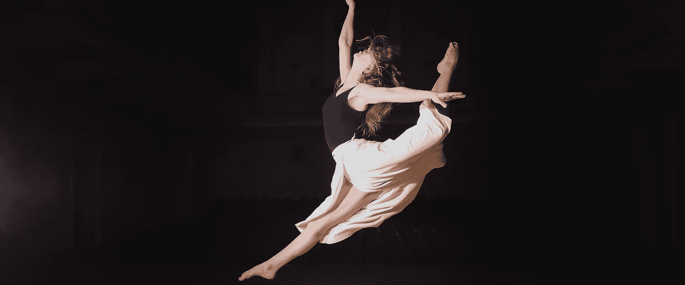
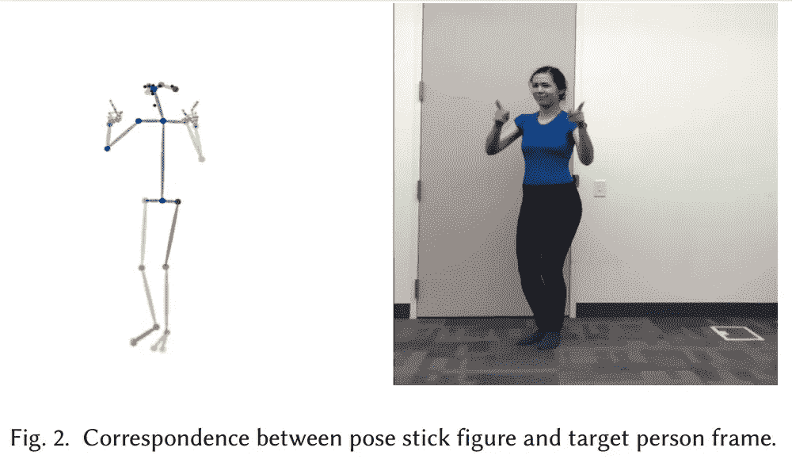
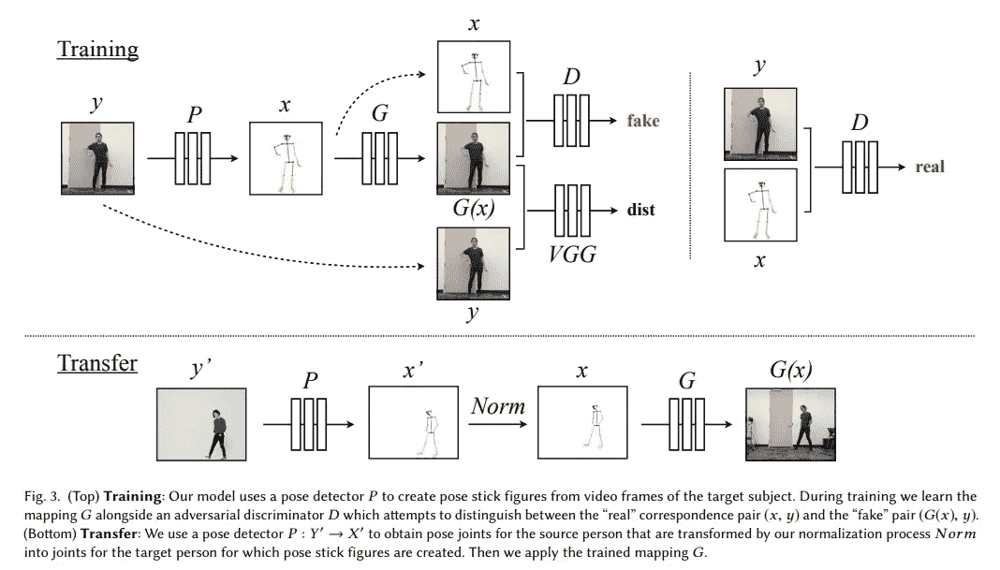
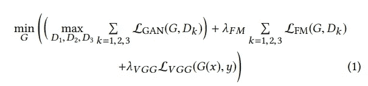
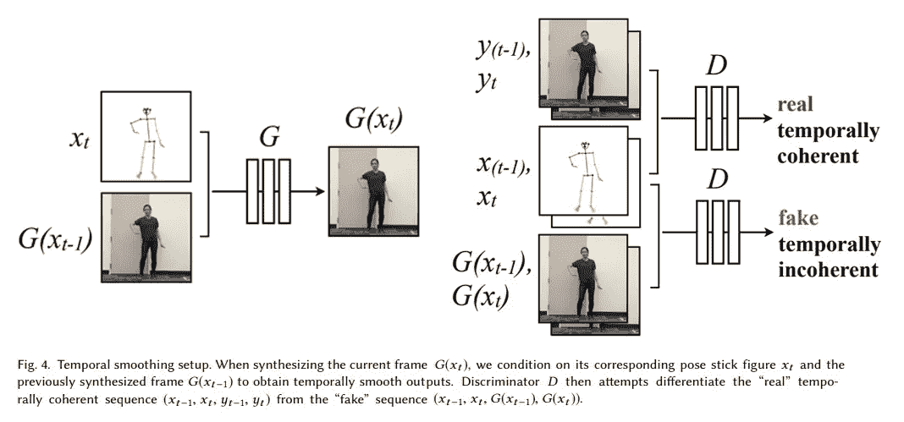
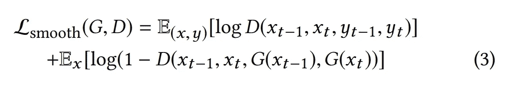

# 实现完美视频运动转换的 5 个步骤

> 原文：<https://medium.datadriveninvestor.com/5-steps-to-make-a-perfect-motion-transfer-for-video-aa9d3441c5fa?source=collection_archive---------6----------------------->

如何创建一个视频，使任何人都能像专业舞者一样移动。

**寻找一种便捷的“随我做”运动转移方法？Ralabs 的首席执行官**[**Andrey Yasinishyn**](https://medium.com/u/b27146539d86?source=post_page-----aa9d3441c5fa--------------------------------)**解释了由加州大学伯克利分校的 Caroline Chan、Shiry Ginosar、Tinghui Zhou 和 Alexei A. Efros 创建的一个新框架。这项技术使得制作视频成为可能，使任何人都能像专业舞者一样移动或表演武术踢腿。**

# 第一步。背景

在谈论新方法之前，我们先来看看在运动传递领域已经做了些什么。以前的方法大多基于现有内容创建新的图像或视频。比如[视频改写](https://www2.eecs.berkeley.edu/Research/Projects/CS/vision/human/bregler-sig97.pdf)。为了让特定的人说出全新的单词或短语，系统使用该人的任何可用视频。它在视频的不同帧中找到所需的嘴部位置，并将它们组合成一个新单词的谜题。所以，新方法的第一个好处是——伯克利的研究人员创造了一个新的运动，而不是改变旧的运动。

现代技术使得有可能生成处于新颖姿势的人的定性图像，甚至为时间相干视频产生这种图像。例如， [Recycle-GAN](https://arxiv.org/abs/1808.05174) 和 vid2vid 已经学会了面部之间以及从姿势到身体的运动传递。但是这种新方法不仅仅能产生姿势，还能保留一些小细节，比如眼睛或微笑。

用于近似生成模型的生成对抗网络(GANs)用于不同的目的。图像生成是其中之一，因为这些网络能够创建具有高质量细节的图像。所以现在高级 **GANs 的输出依赖于结构化的输入**。此外，还有图像到图像翻译的研究。为了解决这些映射，一些框架经常使用这些 GANS: pix2pix、级联精化网络、CoGAN、DiscoGAN、CycleGAN 等。伯克利研究小组为他们的运动传递新方法采用了一些框架。

# 第二步。方法学

伯克利研究人员提出的方法与过去二十年的方法形成对比。为了将运动从一个人类主体转移到另一个，他们建议使用**一个端到端的基于像素的管道**。这是什么意思？让我们来看看。

框架有两个视频。在第一个场景中，我们可以看到一个目标人物，他的动作将被合成；在第二个场景中，一个源主体的动作将被施加到目标人物身上。为了了解这种转变，在这种情况下，研究人员没有让两个受试者做同样的动作。为什么？即使两个主体做出完全相同的动作，仍然不可能有一个清晰的框架来建立身体姿势的对应关系——例如，每个主体都有其独特的差异，比如身体形状。因此，研究人员希望找到两个人的视频之间的最佳映射系统，或者说，基本上是图像到图像的转换方式。

熟悉计算机视觉和数据科学的人都知道这个框架中的姿态检测过程。现代计算机视觉基于卷积神经网络(CNN)。在我们的例子中，CNN 被训练来检测代表人体不同部位位置的关键点。可以是脚、膝盖、骨盆、肩膀、手肘、手、鼻子、眼睛、耳朵等。然后，这些关键点由姿势简笔画中的线条连接起来，该图形将扮演中间主体的角色。与 **Ralabs 团队在我们的项目中使用的监控摄像头**完全相同的系统——根据人们走路的方式来识别他们。

对于 Berkeley 项目，姿势简笔画方法可以保留动作签名，但会去掉所有不必要的主题细节。看看这个例子:

通过这种方式，研究人员从主题视频的每一帧中获得了一个明确的姿势。这有助于实现图像到图像的翻译，并训练模型为特定主题制作特定视频。

为了让目标主体以与源主体相同的方式移动，他们需要将姿势图放入一个训练过的模型中。此外，您可以注意到生成的视频的真实性。伯克利的团队通过两个小组件实现了它。为了时间的平滑，他们在每一帧的预测都以先前的时间步长为条件。为了使人脸更真实，他们训练了特殊的对抗网络来生成目标人脸。

有了最终确定的方法，他们开始制作视频。在图 3 中，您可以观察到我们将在下面讨论的整个过程。

# 第三步。姿态检测和标准化

正如我们已经说过的，这个框架中的姿势图形代表了源身体位置。为了创建这个数字，首先，我们需要一个源视频。源视频不需要高质量，因为我们只需要从中检测姿态。所以你可以从网上选择**任何可以接受的视频**。对于一个目标视频，有一些确切的要求。它必须有足够的活动范围和最小模糊的框架。研究人员使用最小褶皱的布作为目标，并以每秒 120 帧的速度拍摄了大约 20 分钟。

为了获得编码身体位置的姿势图，他们使用了预先训练的最先进的姿势检测器(P)。它估计 x，y 关节坐标。在图 2 中，您可以看到通过线条连接的关键点来创建姿势简笔画。在训练期间，这些**数字将作为生成新图像**的基础。但是由于每一帧中源和目标之间的差异，它们需要被归一化。归一化坐标将作为生成器(G)的输入。

他们所说的正常化是什么意思？对象可能具有不同的身体形状、肢体比例、关于框架的位置等。因此，研究人员需要根据目标人的位置和比例转换源姿势关键点(见图 3，转移)。为了解决这个问题，他们在两个视频中都使用了最近和最远的脚踝位置。脚踝关键点之间的线性映射有助于根据相应的姿势检测来计算每一帧的比例和平移。

# 第四步。培养

基于 2017 年在同一个加州大学伯克利分校开发的算法 pix2pixHD 的训练方法。这个算法是如何工作的？生成器网络 G 正在与多尺度鉴别器 D = (D1，D2，D3)对抗，该鉴别器将真实图像与生成器生成的图像进行区分。因此，发生器必须能够产生高质量的图像，鉴别器不能识别为假的。这两个网络应该同时被训练以互相提高。看看基本的 pix2pixHD 格式:

在这里，LGAN(G，D)是对抗性损失，而吕 GG (G(x)，y)是感性重建损失。

对于这个框架，研究人员在单个图像生成设置的水平上修改了原始的 pix2pixHD。现在，相邻帧被强制实现时间一致性(参见图 4)。系统预测两个连续的帧。第一个依赖于其相应的姿态简笔画和零图像，第二个依赖于其相应的姿态简笔画 xt 和第一个输出。因此，现在鉴别者必须找到图像的真实性和假帧与真帧之间的时间一致性的差异。这样，甘的目标看起来像是:

为了使生成的视频中的人脸更加真实，研究人员在系统中添加了另一个 GAN。在生成器(G)生成完整的图像后，他们将一小部分图像放入面部区域，并将同一部分的姿势简笔画输入到另一个生成器(Gf)。这给出了输出残差 r = Gf (xF，G(x)F)。并且最终输出是该剩余和原始面部区域的组合。然后鉴别器鉴别输入姿态简笔画的人脸区域、目标人物图像的人脸以及它们的伪对。

**至于网络架构，他们在流程的不同阶段使用不同的模型:**

*   艺术姿态检测器 OpenPose，用于定义姿态关键点(身体、脸和手)；
*   王在 pix2pixHD 模型中对图像进行翻译；
*   用于面部残差预测的 pix2pixHD 的全局生成器；
*   用于面部鉴别器的 70x70 贴片 GAN 鉴别器；
*   LSGAN 物镜(以及 pix2pixHD ),用于完整图像和面部 GAN。

更多关于研究和数据计算的信息，你可以在这里找到。

# 第五步。利弊

总的来说，这种模型可以产生相当长的视频，质量可以接受，节省了很多细节。然而，由于几个原因，输出**有一些缺点**。结果的质量水平取决于输入的姿势简笔画。由噪声引起的不正确的关键点导致输入中的错误，即使具有时间平滑设置和时间一致性。例如，我们在转移视频中看到的最常见的错误是不同的移动速度。

在舞蹈动作从源视频到目标的转换中，我们仍然可以看到一些抖动和不安。研究人员**用两个实验对象**独特的身体结构来解释。他们认为运动依赖于在转移过程中保持的同一性。此外，该系统没有考虑不同的肢体长度和摄像机位置角度。这些差异也会影响最终结果。

此外，2D 坐标也有自己的缺点。它们限制了对象之间的运动目标，而 3D 可以完美地连接位置。为了避免这些缺点，系统需要在时间相干视频生成和运动表示方面进行升级。但即使有这些开放性的问题，这种方法也允许用各种各样的输入创建引人注目的视频。

一般要了解一个人工智能今天能做什么，可以看短片**《Zone Out》**。挺诡异的，但是从头到尾都是本杰明做的**，为什么基本上都是 AI** 。本杰明花了 48 个小时制作这部电影，使用了旧电影的数千帧画面和专业演员的绿屏镜头。这个想法和实现属于导演奥斯卡·夏普和人工智能研究员罗斯·古德温。

点击阅读更多关于[区的信息。](https://www.wired.com/story/ai-filmmaker-zone-out/)