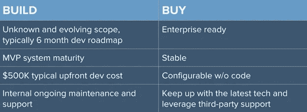
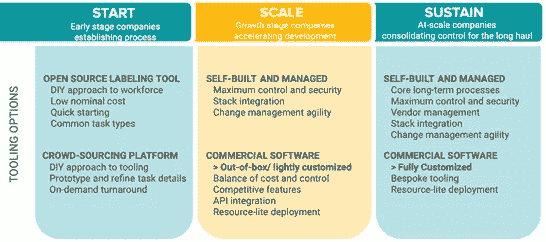

# 选择数据标注工具的 5 个战略步骤

> 原文：<https://medium.datadriveninvestor.com/5-strategic-steps-for-choosing-your-data-labeling-tool-b350910fc5eb?source=collection_archive---------3----------------------->

越来越多的企业希望应用人工智能(AI)来创新客户体验并推出颠覆性产品。如果你的公司是其中之一，你将不得不[标记大量的文本、图像和/或视频](https://www.altexsoft.com/blog/datascience/how-to-organize-data-labeling-for-machine-learning-approaches-and-tools/?utm_source=MediumCom&utm_medium=referral)来为你的机器学习(ML)模型创建生产级训练数据。这意味着你需要聪明的机器和熟练的人。

*“当人类和机器一起工作时，公司实现了最显著的绩效提升，”【Paul Daugherty 和 Jim Wilson 在[哈佛商业评论](https://hbr.org/2018/07/collaborative-intelligence-humans-and-ai-are-joining-forces)中写道，这是关于他们在埃森哲涉及 1500 家公司的研究。通过这种协作智能，人类和人工智能积极增强彼此的互补优势:前者的领导能力、团队合作、创造力和社交技能，后者的速度、可扩展性和量化能力。”*

 [## 机器学习的外汇交易挑战|数据驱动的投资者

### 机器学习是人工智能的一个分支，之前占据了很多头条。人们是…

www.datadriveninvestor.com](https://www.datadriveninvestor.com/2019/02/18/the-challenge-of-forex-trading-for-machine-learning/) 

在为数据标注提供熟练的[云工人](https://www.cloudfactory.com/how-it-works)十年后，我们知道这是一个渐进的过程。您将不断发展和改变它，以满足您的业务和技术目标。也就是说，你今天给新手贴标签的任务很可能在三个月后会有所不同。在此过程中，您和您的数据标注团队将找到标注训练数据的更好方法，以提高质量和模型性能。

在工具方面，我们了解到最好的数据标注工具是用户友好的，并且将工作分解成原子的或更小的任务，以最大限度地提高标注质量。当您将一个复杂的任务转换为一组原子组件时，很容易度量和量化这些任务。毕竟，你可以衡量的，你可以改善。它还允许您确定哪些任务最适合人，哪些任务可以自动化。

那么如何选择一个数据标注工具来满足自己的需求呢？在参与了 150 多个人工智能项目后，我们发现这些步骤对于选择数据标注工具来优化数据质量和劳动力投资至关重要。

# 1.根据您的用例缩小您的工具选择。

当然，您需要标记的数据类型将决定您可以使用的工具。有一些工具可以标记数据文本、图像和视频。一些图像标记工具还具有视频标记功能。工具在注释功能、质量保证(QA)能力、支持的文件类型、数据安全认证、存储选项等方面各不相同。标注特征可以包括边界框、多边形、二维和三维点、语义分割等。基于您的用例以及您的 ML 模型将被部署的领域，您将想要准确地评估哪些特性将为您提供适当的质量数据。

每种数据类型都会带来劳动力挑战。文本标注通常[要求数据工作者具备上下文](https://www.cloudfactory.com/white-papers/scaling-quality-training-data)以及在整个数据集内一致做出准确、主观决策的能力。图像标注可能需要上下文，但在这三种数据类型中，图像是最容易组织团队进行标注的。缩放视频标签显然更具挑战性。十分钟的视频包含 18，000 到 36，000 帧，每秒 30 到 60 帧。逐帧视频标记是一项耗时的专业技能，需要实践培训和指导才能达到最大的准确性。基于工具的自动化和人的战略结合使这一过程更加容易和快速。

# 2.比较“构建与购买”的优势。

如果您构建自己的工具，您将有更多的控制权来使用自己的开发人员快速做出更改。当软件范围改变时，你不必担心费用。您还可以应用技术控制来满足公司独特的安全要求。请记住，当您构建一个工具时，您面对的是一个未知的和不断发展的范围。一开始你可能不确定所有的要求。

通常需要六个月的时间来开发软件和基础设施，使 ML 项目从模型验证到生产。你开发的任何工具都需要维护。您可以维护和支持您自己的工具，也可以自动跟上最新的商业工具并利用他们的第三方支持。

有商业工具可以购买。您通常会得到一个稳定的企业级解决方案，您可以配置您需要的功能，通常不需要很多开发时间。寻找一种能够与数据标注团队的工作很好地集成并包含数据质量框架的工具，以确保最终数据集的完整性。

*Build v. Buy*

还有第三种选择。您可以使用一个[开源工具](https://www.altexsoft.com/blog/engineering/how-to-use-open-source-software-features-main-software-types-and-selection-advice/?utm_source=MediumCom&utm_medium=referral)并自己支持它，或者使用它来启动您自己的构建工作。有许多关于图像、视频、自然语言处理和转录工具的开源项目。评估这些工具可以让你知道你想在你自己的产品中包含什么，如果你选择继续构建的话，你会怎么做。

尽管构建自己的工具需要投入大量的精力，但还是有一些实实在在的好处。具体来说，您可以:

*   在你选择的工具中建立你自己的过程。这通常是您可以发现并利用竞争优势的地方。
*   通过根据您的需求配置工具，减少 ML 模型中的意外偏差。使用现成的工具可能会在数据注释任务中引入偏见。
*   使用您自己的开发人员，快速灵活地对软件进行更改。当软件范围改变时，你不必担心费用。
*   更好地控制您系统的安全性。通过在您的堆栈中拥有该工具，您可以应用符合您公司安全要求的精确技术控制。
*   选择您选择的工作人员来帮助实现您的目标，而不是局限于一个提供商。当您拥有该工具时，工作人员可以更容易地融入您的任务工作流程。

# 3.考虑你的公司规模或阶段。

初创公司应该优先考虑不同的因素，而不是快速扩张或已经规模化经营的公司。

如果你的公司是一个建立过程的早期公司，你使用开源解决方案来构建你自己的工具，你必须找到你自己的劳动力。您可以选择众包，并利用该供应商的工具平台。请记住，通过众包，您的数据工作人员将是匿名的，并且经常未经审查，因此随着时间的推移，您将不会获得与同一团队合作带来的好处。这意味着您的数据的上下文和质量将受到影响。无论您计划构建还是购买，一定要询问工作人员供应商他们使用工具的经验，以及他们是否可以提供建议。

如果您正在作为成长期公司的一部分加速开发，开源工具提供了对安全性、集成和灵活性的更多控制，以进行更改。如果您选择商业工具软件，您通常可以配置和部署一些有竞争力的特性。

如果您正在大规模运营，并且希望长期维持这一过程，那么开源工具是经过良好规划和测试的。您可能会拥有核心的长期流程和堆栈集成，以提供对安全性的最大控制以及做出更改的灵活性。在这个级别，如果您使用商业软件，您通常可以获得完全根据您的需求定制的定制工具，并且不需要大量的开发资源。

*Tooling Based on Company Size-Stage*

# 4.不要让你的劳动力选择将你锁定在一个工具上。

工具和劳动力看起来有点像先有鸡还是先有蛋的选择。一些团队希望首先选择他们的工具，其他团队优先选择劳动力。我们知道，您的员工选择可以决定数据质量，而数据质量是您模型性能的核心。这就是为什么保持您的工具选项开放是重要的。

理想情况下，您需要一支能够快速调整您的工具，并帮助您调整它以更好地满足您的需求的员工队伍。与您的数据工作者建立一个闭环反馈非常重要。随着他们对您的数据越来越熟悉，他们将为您带来宝贵的机会来简化您的流程。他们可以建议对您的流程和工具进行调整，从而为您正在开发的 ML 模型引入竞争优势。

根据数据科学平台 Hivemind 进行的一项[研究，托管团队比众包团队提供更高的准确性，hive mind](https://www.cloudfactory.com/reports/crowd-vs-managed-team)为自然语言处理(NLP)提供了数据标记工具。您的贴标机应进行筛选，以确定贴标任务的熟练程度，并接受持续培训，以提高他们的技能。当工作人员像团队的延伸一样运作时，您将获得更高的准确性。

# 5.考虑您的数据质量要求。

许多工具都包含 QA 特性，你甚至可以自动化你的一部分 QA。然而，即使您在数据标注过程的一部分中使用了经过时间考验的自动化，您也需要有人对这项工作进行 QA。例如，光学字符识别(OCR)软件对每个字符的错误率为 97%到 99%。在 1800 个字符的页面上，有 18-54 个错误。对于一本 300 页的书，有 5400 到 16200 个错误。您将需要一个包含 QA 层的流程，由具有上下文和领域专业知识的熟练贴标员执行。

有一些管理劳动力提供商可以为受过培训的工人提供贴标任务方面的丰富经验，从而产生更高质量的培训数据。小心不要与你的劳动力供应商签订多年合同。如果您的数据团队不能满足您的质量要求，您会希望能够灵活地测试或选择另一家劳动力提供商，而不会受到惩罚。

# 从大处着眼，从小处着手，快速扩展

当您设计、测试、验证和部署任何 ML 模型时，您对工具和劳动力的选择将是您成功的重要因素。而且，这一过程将是渐进和反复的。当心被工具或劳动力合同所束缚。如果有一件事在 [ML 开发](https://www.altexsoft.com/machine-learning-solutions/?utm_source=MediumCom&utm_medium=referral)中是确定的，那就是在这个过程中会有技术变化、学习和大量的惊喜。

确保您的工具、劳动力和流程提供创新所需的灵活性和敏捷性。一般来说，你会想大，开始小，快速扩展。您的选择可能会决定您走向市场的成败。
_ _ _ _ _ _ _ _ _ _ _ _ _ _ _ _ _ _ _ _ _ _ _ _ _ _ _ _ _ _ _ _ _ _ _ _ _ _ _ _ _ _ _ _ _ _ _ _ _

*Philip Tester 是人工智能数据标签的全球劳动力供应商 CloudFactory 的业务发展总监。他领导该公司与合作伙伴关系、集成和专业服务相关的战略，以帮助人工智能创新者找到解决棘手数据生产问题的解决方案。*

***想为我们的博客写篇文章？*** ***阅读我们的要求和指南*** [***成为投稿人***](https://www.altexsoft.com/become-a-contributor/?utm_source=MediumCom&utm_medium=referral) ***。***

*最初发表于 AltexSoft 技术博客“* [*选择数据标签工具的 5 个战略步骤*](https://www.altexsoft.com/blog/datascience/5-strategic-steps-for-choosing-your-data-labeling-tool/?utm_source=MediumCom&utm_medium=referral)