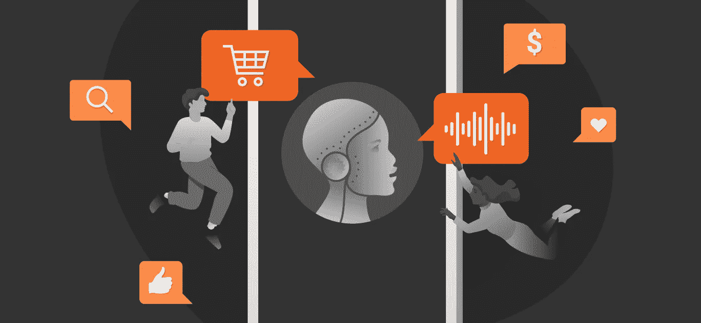
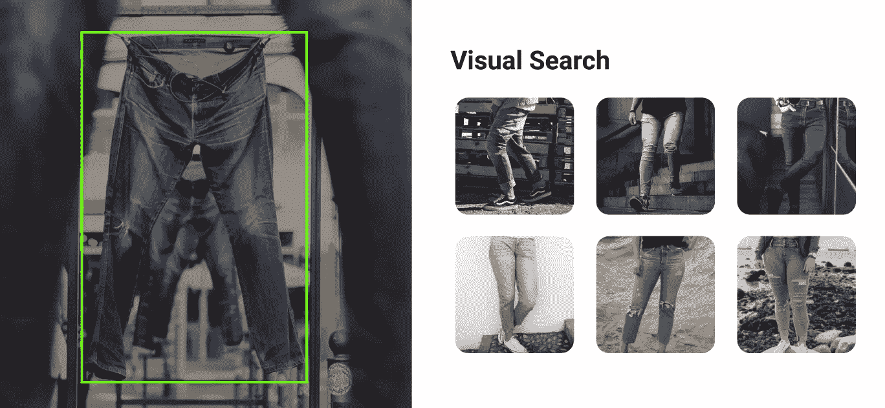

# 人工智能在电子商务中的 5 个战略用途

> 原文：<https://medium.datadriveninvestor.com/5-strategic-uses-for-ai-in-ecommerce-afeab2d95f54?source=collection_archive---------19----------------------->

## 深入了解人工智能在电子商务中最受欢迎的用途:它做什么，如何使用，以及为你自己的业务采取的实用的第一步。

人工智能在电子商务中的应用并不令人意外。在线业务总是快速采用新技术，这也是该行业蓬勃发展的原因；增强客户体验，发现新市场，推动进一步销售。随着聊天机器人、视觉搜索和个性化推荐等人工智能技术的持续发展，[电子商务](https://lionbridge.ai/industries/ecommerce-data/)的世界正在再次转变。

但是人工智能技术到底有多有效和有用呢？它在哪里被使用？哪些选项最适合您的特定电子商务项目？

在这篇文章中，我们将看看电子商务中最流行的人工智能实现，以确定它们做什么，它们是如何被使用的，以及实际应用的第一步。我们希望它为思考和规划你自己的基于人工智能的策略提供了一个很好的概述。

# 聊天机器人:

有一段时间，聊天机器人将彻底改变电子商务体验。然而，这场革命……仍未完全到来。原来传统的搜索和浏览方式仍然是网上购物的首选方式。也就是说，聊天机器人确实在电子商务中占有一席之地，并且是接触客户的有效方式。 [Shopify](https://www.shopify.com/messenger) 通过 Messenger 提供购物体验，可以为聊天机器人应用程序量身定制。同样，Kik 也是包括 H & M 在内的许多品牌的电子商务聊天机器人的所在地

你是否实现了一个人工智能聊天机器人归结到一个关键点:你的客户群中有多少百分比的人使用并乐于使用信息进行购买。这将决定聊天机器人是否是一个好的投资。这一点很重要，因为聊天机器人需要训练数据才能有效，最重要的是，不要惹恼或劝阻使用它们的潜在客户。

聊天机器人训练数据由理解和响应询问和评论所必需的单词、句子、问题和答案组成。这可以来自记录的客户电话、电子邮件通信、开源数据集的转录，也可以从头开始创建。您的训练数据是您的聊天机器人理解客户查询并以适当的答案、信息和建议进行回复的能力的核心。

聊天机器人的实施需要计划和时间，但最终结果是客户通过一个平稳的自动化体验得到他们想要的东西。仅此一点就使它成为一个值得研究的领域。

# 视觉搜索引擎:

就像聊天机器人一样，2010 年初，有人大胆预测人工智能视觉搜索引擎将在电子商务领域迅速崛起。喜欢那件 t 恤吗？给它拍张照片，让一个人工智能程序为你找到它，并提供类似的服装。好主意，但是视觉搜索现在在哪里？

视觉搜索最大的成功可能是 Pinterest Lens。Pinterest 报告称，其镜头功能——根据用户拍摄的照片向用户提供建议——能够识别超过 25 亿个家庭和时尚图像中的物体。它还声称，80%的 Lens 用户在购物时会从视觉搜索开始。在 Pinterest 之外，科技巨头脸书、Instagram、谷歌和亚马逊都在尝试进军视觉搜索领域。虽然现在说这是否标志着潮流的改变还为时过早，但它确实表明我们在网上搜索和购买的方式越来越多样化。

进入视觉搜索领域需要图像标注。这意味着根据图片中的物品是什么、品牌名称等等来标记它们。时尚和家具是现在最受欢迎的搜索，但食物和食谱也越来越受欢迎。虽然可以训练一个机器学习模型在你上传项目时自动标记它们，但另一个选择是简单地将标记工作外包给专业的注释公司，他们可以根据你的规格注释图像。

点击阅读更多关于电子商务中人工智能的众包图像注释解决方案[。](https://lionbridge.ai/services/image-annotation/)

# 语音搜索:

语音搜索完全是为了方便。这是当你在洗碗或开车上班时，你不能输入“100 美元以下的耳机”。在这些时刻，许多人可以选择简单地问 Siri 或 Alexa:“100 美元以下最好的耳机是什么？”

随着虚拟助手的激增，这一搜索领域正稳步增长。一些消息来源称，多达 20%的移动搜索是通过这种方式完成的。这可能意味着 20%的潜在客户群无法通过他们喜欢的渠道找到你的服务。如果你的电子商务业务是一个人们可以使用或受益于语音搜索，现在是时候优化。这里有 3 种方法可以提高你的语音搜索可见性:

1.  使用语音搜索的客户通常都很忙。也许他们正从一个地方走到另一个地方。也许他们正在开车。无论是哪种情况，语音搜索用户都希望尽快得到答案。优化您的网站速度将有助于潜在客户获得他们想要的东西，当他们想要的时候。
2.  基于类型的搜索侧重于关键词，但语音搜索更倾向于对话式搜索。关键词搜索可能只是“芬达吉他纽约”，但语音搜索更有可能是“在纽约哪里可以买到芬达吉他？”关注长尾关键词将有助于你面对潜在的语音搜索客户。
3.  如上所述，语音搜索比基于类型的搜索更具对话性。出于这个原因，有必要针对问题型搜索的答案。从回答以“在哪里、何时、如何、什么和谁”开头的问题的角度来思考。这将有助于您优化您对转换漏斗中所有级别的客户的关注。

为一种新的搜索风格准备一个策略可能是令人生畏和耗时的。如果你不确定你当前的搜索策略，考虑专业的搜索评估帮助是值得的。这种支持可以帮助您修改和改进您的搜索查询、搜索结果、相关结果、标题和广告。

更多关于众包搜索评估的内容，[从这里开始](https://lionbridge.ai/services/search-evaluation/)。

# 搜索改进:

一个好的搜索引擎算法不仅能帮助客户找到他们想要的，还能帮助他们找到他们不知道自己想要的。通过分析客户的搜索查询，优化的搜索算法可以向客户推荐有竞争力的备选方案，并提供补充的购买选项。亚马逊就是一个完美的例子；即使你找不到你想要的东西，你也总能得到次好的东西。

为电子商务零售店实现搜索改进的一种方法是使用人工智能产品分类。这从广泛的(书籍、家具、电子产品)开始，到非常深入的(书籍类型、家具类型、电子品牌名称等)。).产品分类的深度网络意味着各种相关产品将出现在对单个客户查询的响应中，从而改善他们的整体体验并增加购买的可能性。

对于成长中的企业，手动分类非常耗时。对于不断更新产品范围的网站来说尤其如此。机器学习模型可以通过自动化分类过程来解决这一问题。结合全面的分析系统，人工智能系统可以学习为你对产品进行分类，并发现新的搜索查询和补充项目组合。

关于个性化搜索的产品分类和数据标记的更多信息，[从这里开始](https://lionbridge.ai/services/data-annotation/)。

# 带有情感分析的意见监控:

现代企业产生大量数据，这些数据非常有价值。评论、社交媒体、博客；人们总是以各种方式谈论他们使用的东西。通过分析这些意见，你可以更好地了解人们对你的公司和服务的感受和评价。这个过程也有助于发现趋势和发现见解。通过了解谁在谈论你的产品以及他们是如何谈论的，你可以学到很多东西。它可以帮助你做出重要的决定，比如如何谈论你的品牌，以及把精力集中在哪里。

然而，收集和组织用于意见监测的数据需要时间和人力。小型初创企业可能会很快发现自己跟不上业务规模，手动数据分析需要专门团队的工作。

那么 AI 和机器学习能有什么帮助呢？

机器学习意见监控策略从数据收集开始，从内部来源或在线获取。对这些数据进行清理，为其特定目的进行注释，然后用于训练自动进行分析的模型。情感分析、关键词提取、命名实体识别；这一点以及更多的问题可以实时自动处理，让您的团队能够利用数据做出决策，而不是仅仅为了理解数据而苦苦挣扎。

关于数据分析的数据收集和注释的更多信息，[从这里开始](https://lionbridge.ai/solutions/training-data-analytics-solutions/)。

人工智能在电子商务中的最佳应用增强了客户体验。它们使流程更简单、更顺畅、更方便。这反过来鼓励顾客购买。也就是说，人工智能在电子商务中的任何应用都是一项复杂的工作，需要规划、培训和准备。了解所涉及的内容很重要。

幸运的是，你不必一个人去做。如果您正在考虑在电子商务解决方案中使用人工智能，Lionbridge 可以提供帮助。我们专门的项目经理团队可以帮助您分析您的电子商务风险，并帮助您规划人工智能和机器学习解决方案。然后，我们的 100 多万名员工社区可以帮助您收集和注释数据，这些数据将训练和驱动机器学习模型，从而转变您的业务。

[如有疑问，请随时联系我们的团队](https://lionbridge.ai/contact-sales/)。

*最初发布于*[*https://lionbridge . ai*](https://lionbridge.ai/articles/ai-in-ecommerce-5-strategics-uses/)