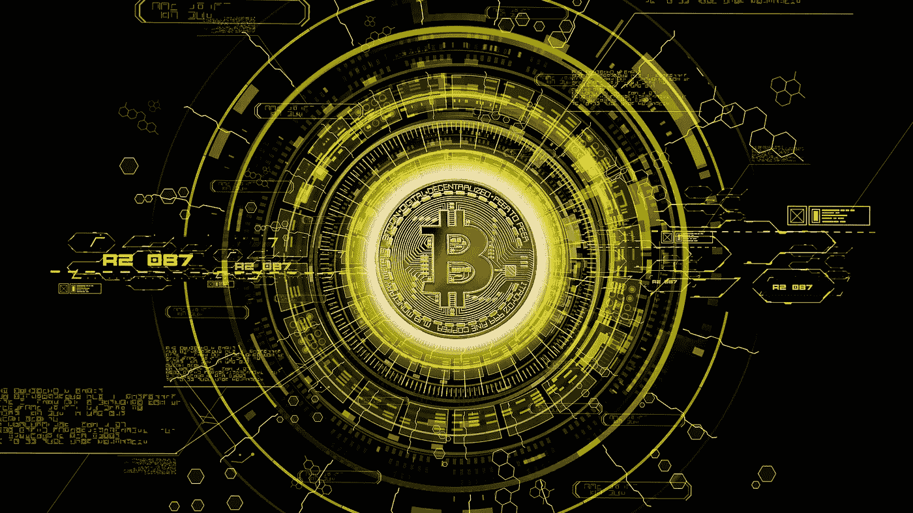
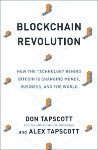

# 我从区块链革命中学到的 5 件事:比特币背后的技术如何改变货币、商业和世界

> 原文：<https://medium.datadriveninvestor.com/5-things-i-learned-from-blockchain-revolution-how-the-technology-behind-bitcoin-is-changing-money-973c1c73a190?source=collection_archive---------3----------------------->

智能合同。权力下放。脱媒。加密货币。

这些是与区块链相关的一些术语，该平台使交易能够在安全、透明和高效的数字环境中进行。

但是有点混乱。

如果你认为“区块链”仅仅是指管理比特币和加密货币的平台——它们被认为是一种数字资产——那么准备好大吃一惊吧。

如果我们能够克服某些障碍，减少与广泛采用相关的挑战，那么未来所有的金融交易——甚至可能是其他类型的交易——都完全有可能通过区块链完成。但那个时间不是现在，它可能是几年，如果不是几十年，直到我们看到“革命”全面展开。

当我想到区块链时，我不禁想起了我曾经和一位经验丰富的吉他技师的讨论，他也是我的朋友。他问我，“你有没有读过关于吉他拾音器的书，却很难理解书中所描述的内容？”

我欣然回答:“是的，我有。”

他回答说，“那是因为我们还没有 100%知道这项技术是如何工作的。”

在过去的几年中，围绕吉他拾音器的许多秘密已经被揭示，这在理论上应该使我们能够在今天创造出比过去更好的吉他拾音器。

拾音器有着悠久的历史，在 20 世纪 10 年代，电话发射机被改造并放置在小提琴和班卓琴中以放大它们的声音。公平地说，皮卡的发明根植于这种早期的创新。

对我来说，现在的区块链有点像吉他拾音器，当时它还笼罩在神秘之中。我这样说的原因是，如果不使用我开始这次对话时使用的许多术语，我们就无法描述它——这些术语不一定会被普遍使用，除非你属于特定的行业。

这也是我购买*区块链革命*的原因——为了更好地了解这项技术是什么，以及它将如何影响我们的未来。如果你是一个商人或者金融行业的人，我建议你现在就开始，而不是推迟。

那么，让我们来看看我从阅读*区块链革命*中学到了什么。

# 1.黑链将让我们从工业时代的赚钱机器走向繁荣的平台

如果这是真的，我对未来感到兴奋。赛斯·戈丁不断提醒我们，工业时代正在结束，如果还没有结束的话，它的原则弊大于利，因为我们希望在信息时代和未来成为更有价值、更有能力的人。

但是如果这种说法引起了你内心的一些愤世嫉俗和怀疑，你肯定不是一个人——我也有同样的感觉。公平地说，Tapscotts 夫妇确实用了他们书的整个第三部分来描述区块链技术的广泛实施和采用所面临的挑战。

但如果我们假设区块链的所有积极方面都是真实的，它允许更透明、更高效和更安全的交易，那么得出它可以鼓励全球范围内的财富分配的结论并不是一个过于大胆的假设。

但是在使用“繁荣”这个词时，有些谨慎是必要的。毕竟，我们当中有多少人被电视布道者、传教士、牧师、网络营销者、网络营销者、作者等等许诺过繁荣？如果你的思想从未改变，你的环境会真正改变吗？人类的情况是这样的，虽然我们无法控制结果，但我们比任何人都要对自己的个人结果负责。

我要说的是，“繁荣平台”听起来确实比“工业时代的赚钱机器”更有吸引力

# 2.垄断企业有研发资源，但没有创新所需的文化

我挑选了这句话，因为它引起了我的兴趣。这也很有意义。如果你在你的行业中处于垄断地位，你可能有必要的资源投入时间进行市场研究，并开发满足客户需求的产品和服务。但是你没有创新的文化，这就为颠覆的发生留下了空间。

在我们现在所处的世界，不创新就意味着停滞不前。技术变化太快了，你很容易被地震般的变化弄得措手不及。

托尼·罗宾斯总是喜欢说，如果我们在生活的某个特定领域没有成长，我们就在萎缩。在商业和音乐领域，我们不能不发展，当我们主导一个市场时，我们必须记住，我们将自己置于被饥饿的、开拓性的竞争者篡夺的风险之中。

# 3.区块链允许人们在组织稳定的情况下工作，但没有等级制度

这是一个很好的洞察区块链能为商业做什么。大企业经常受到繁文缛节的束缚。坚持最严格的标准、规则和形式有利于鼓励以一致、标准化和受监管的方式完成项目和任务，但也减缓了新方法和创新的速度。

这就是为什么区块链有潜力成为许多行业的主要颠覆者，如果它还没有成为的话。它是一个稳定、安全和透明的在线分类账，可以在几秒钟而不是几天内记录交易，因为交易本身不必经过多个中介才能完成。

这将对企业内部的工作方式产生相当大的影响，尤其是对于一个习惯了过多官僚力量、阻碍快速决策的企业。在一家上市公司，为了一个本应在几个月前就做出的决定而走上指挥链是一个再普通不过的现实。从发现问题到领导层正式解决问题之间的时间间隔太长了。

如果区块链技术成为企业环境中的标准，我无法想象在这个领域不会有阻力——这几乎是肯定的。但对于那些看到繁文缛节弊端的人，以及那些希望引领商业新方法的人来说，区块链可能为他们提供的机会将会让他们感到振奋。

# 4.技术不创造机会；人们会的

我喜欢这句话，当我们考虑区块链的这个问题时，这句话非常适用。

回想起来，我记得曾经分享过一个工具本身并不能让你成功。

一个工具可以帮助你扩大你的信息，一个特定的平台可能证明是适合你的特殊情况。这并没有改变一个事实，那就是脸书和 Twitter 代表了我从社交媒体获得的绝大部分流量和关注，构成了我每天有机流量的大约 80%。我创建的所有网站和企业都是如此。

我永远不会阻止你做实验，因为这是我自己做的事情。正如我已经分享的，突破界限和创新是很重要的。每当遇到新事物时，就让我感到怀疑。

我最近听到塞思·戈丁问道:“你能逃脱的最小足迹是什么？”

有许多营销人员和企业家敦促你跳上这个网站，跳上那个应用程序，但现实是，有些人在对你撒谎，有些人根本不知道什么对你的职业和业务发展最有利。你是领路人，所以你比任何人都知道该怎么做！

专注是一种艺术形式——这一点我毫不怀疑。我相信在过去的几年里，我的生活比过去几年更加稳定，但是我和其他人一样容易患上闪亮物体综合症。

但是，如果你记住，人对机会负责——而不是技术——你将在每个人都像无头鸡一样跑来跑去的时候保持清醒的头脑。

# 5.当创意产业蓬勃发展时，我们都会受益

在他们的书的第九章，题为“在区块链上解放文化:我们耳朵里的音乐”，Tapscotts 夫妇探讨了区块链技术对未来的艺术家和音乐家可能意味着什么。

也许你听说过英国作曲家兼创作歌手伊莫金·希普。她一直在倡导音乐行业的区块链，甚至与 Pacifico 和 Vinay Gupta 等公司合作，为这个非常分散、容易受到负面影响和不断波动的行业开发新的生态系统。

正如 Tapscotts 一家解释的那样，这个行业已经从数以千计的唱片公司变成了三大巨头——索尼、环球和华纳。他们在 2018 年 4 月上市的 Spotify 中拥有 15%的股份。这些唱片公司将在很大程度上受益。在 360 度交易中，艺术家是最后得到报酬的，唱片公司从艺术家的所有收入中抽取相当大的一部分。可以说，他们甚至把手指放在了不属于他们的地方。在音乐行业，唱片公司不是唯一的中介——我们也有像 YouTube 和 Spotify 这样的科技公司加入进来并举手。

基本上，这个行业太复杂了，而且版税的监管成本已经上升，这使得向艺术家倾斜变得更加困难。

现在你开始明白为什么它有潜力成为整个创意产业的游戏规则改变者。不难看出，为什么签约艺术家也开始推动这项计划是有意义的。

但是那个小家伙呢？这对独立音乐人、音乐企业主、开拓者、音乐企业家会有什么影响吗？谈论大艺术家在他们的作品中保留更大份额，以及唱片公司在行业中扮演不同的角色，这都很好，但区块链到底会为独立人士做些什么，这条职业道路是必要的，还是有作用的？

如果泰普斯科特夫妇在这本书里记录的东西有任何暗示的话，那么可以有把握地说，区块链对小家伙来说同样重要，如果不是比大家伙更重要的话。

这里有一个我们可以预期会发生的转变的例子。现在，作为一名艺术家，每当你看你的数字销售和会计报告时，你可能会注意到它们落后了几个月，特别是关于流媒体网站上的播放。

但有了区块链，这些虚拟交易或多或少会被即时记录下来。这实际上意味着你的报表是最新的，你也能更快地拿到钱。

我们都想保留更多属于我们的东西，我认为这是区块链为音乐行业带来的机会。

# 最后的想法

一如既往，我用我自己的话和从我个人的角度分享了我对这本书的想法。作者可能同意也可能不同意我不得不与你分享的东西，但希望我在提取你会发现有价值的想法方面做得很好。

在一篇博客文章中，没有办法打开一份 300 页的关于区块链技术各个方面的文件。如果我激起了你的好奇心，我建议你自己拿起这本书读一读。

我希望你喜欢这篇书评，我期待着将来与你分享更多。