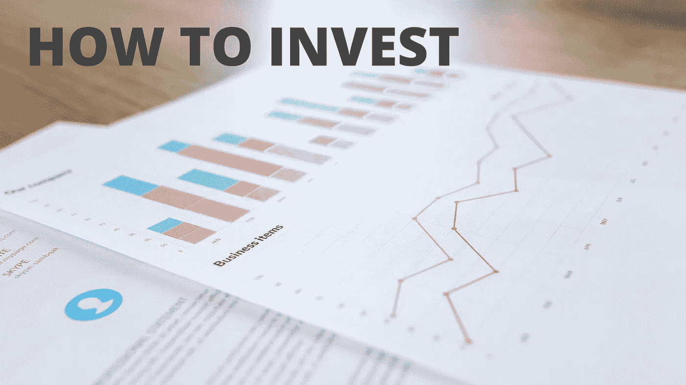

# 我从沃伦·巴菲特之路中学到的 5 件事:世界上最伟大的投资者的投资策略。

> 原文：<https://medium.datadriveninvestor.com/5-things-i-learned-from-the-warren-buffett-way-investment-strategies-of-the-worlds-greatest-682fb4f1014c?source=collection_archive---------1----------------------->

投资。

正如托尼·罗宾斯在他的书《金钱掌控游戏:实现财务自由的 7 个简单步骤》中所言，投资令人困惑。

一旦你掌握了技术术语，事情就没有看起来那么糟糕了，但是建立这样的舒适度需要时间。

让我们面对现实吧——除非你已经从投资中赚钱，否则这不一定是一个令人兴奋的话题。这才是真正的乐趣！

现实是，我们大多数人都需要投资于*的某样东西*——我们自己的生意、股票市场或其他地方。

我为什么这么说？因为我们大多数人都没有足够的钱退休。或者，一旦我们准备好退休，我们就没有办法过我们想要的生活方式。

除非你有非凡的天赋、技能或知识，有能力赚很多钱，或者你非常精明，善于储蓄，否则很有可能你无法仅靠养老金和退休储蓄生活。

税要钱，水电费要钱，旅游要钱，吃饭要钱。即使你还清了抵押贷款，在你离开工作岗位后，仍有一些东西需要你支付。

想想就害怕，不是吗？但这正是我们需要讨论这个的原因。你需要为你的未来做一个计划。

不幸的是，*沃伦·巴菲特之路*并没有真正揭开投资的神秘面纱。它也没有展示行业术语背后的含义。它确实为巴菲特的投资策略提供了一些实用的见解。这大约是全书的百分之五到百分之十。另外 90%是关于巴菲特的投资历史，大多数人，包括我在内，都不会觉得这很有趣。

尽管如此，我还是从头到尾读完了这本大部头的书，我想和你们分享我从中获得的一些见解。我们开始吧，好吗？

# 1.投资于你了解并完全相信管理层的企业

这一点在这本书的不同部分以不同的方式被反复强调。

另一种说法是:

*买企业，不买股票*。

你相信这个行业吗？你认为管理层有能力吗？管理层是否知道如何以明智、战略性的方式分配财务资源？你确信正确的部分已经到位，企业的未来是安全的吗？

如果你回答“不”，那么你是否觉得你在盯着一笔“好交易”并不重要。巴菲特不投资股票，他投资商业。

尽管他是这个星球上最富有的人之一，但他也犯了一些错误。这是必然的。投资不能 bat 1,000。

但是下一次当你听到有人告诉你他们听说的一笔很棒的投资交易时，你的第一反应不应该是，“我加入！”应该是“你相信管理层吗？”

# 2.你越是一个好的投资者，你就越是一个好的企业主&反之亦然

我认为这是一个很好的外卖。

这个想法是，你越是优秀的投资者，你就越有可能成为优秀的企业主。或者说，你越是优秀的企业主，当你打算投资时，你就越容易发现企业的优势和劣势。这两个学科是互补的，一个学科的优势将帮助你在另一个学科取得成功。

所以，如果你对投资和保障你的未来感兴趣，那么你应该进入商界，因为它也会教会你很多关于投资的知识。

# 3.经济实力最常出现在特许经营中

当你听到“特许经营”这个词时，你会立即想到什么？麦当劳？沃尔玛？地铁？星巴克？

特许经营是系统化的。我认为这是这本书缺少的一个重要观点。

我的意思是，你可以走进任何一家特许经营店，通常你会在所有这些店里获得非常一致的体验，无论你是点咖啡、薯条还是三明治。

另一个方面是员工的行为，他们如何问候顾客，他们如何追加销售，他们如何准备你的饭菜，他们如何在一天结束时结账。如果不是所有的话，大多数特许经营店都将所有这些步骤记录在案，以便在所有地点保持一致性。

但是在投资的背景下，这里的要点是特许经营通常是好的投资。为什么？因为他们不需要称职的管理人员。大多数其他商业模式严重依赖强有力的管理，但有了特许经营权，一个称职的经理就能做得很好。

# 4.不要不必要地担心经济

该书甚至指出，巴菲特本人没有花时间或精力分析经济。

如果你在我身边呆过一段时间，你就会知道为什么我认为这是一个有价值的见解。

同样，如果我们将它应用到投资领域，这里的想法不是观察股票市场并让它告诉你该做什么，而是独立于市场运动采取行动，做出对你和你的投资组合有利的可靠选择。这是根据你能得到的最佳信息采取行动和对市场的起伏做出情绪反应之间的区别，这是不可避免的。

如果你让经济支配你的行动，你将永远处于等式的反动一边。

这并不意味着经济不会影响你。但这是企业家精神崛起并找到新机会的地方。如果他们找不到，他们就自己做。

所以不要担心经济，开始发展自己，这样你就能成为一个更足智多谋的人。

# 5.只有当企业的实际价值大幅折价时，才买入它们

不管你是否知道，即使是大企业也有起伏。作为投资者，这意味着你可能有机会以比实际价值低得多的价格投资一家企业。这里的关键是，你必须时刻关注企业的运营情况，除非你首先对企业感兴趣，否则你不会这么做。

当我思考这本书的内容时，很明显，这一原则肯定是巴菲特多年来投资策略的一部分。

这很有意义。如果你能以低于其实际价值的价格收购一家企业，那你就买到了便宜货。只要投资本身是合理的，随着时间的推移，你就能享受公司复苏和增长的好处。

# 最后的想法

在这一点上，我有义务说，凭良心说，我不能给你投资建议。在这方面，我有过一些成功，也有过一些失败，但这些天我只玩我专门留在“积极增长基金”中的钱，这是一个独立于我的应急和梦想基金的基金。我不是会计师、经纪人、律师，也不是百万富翁投资者。如果你有兴趣寻找适合自己的投资，请考虑咨询专业人士。

一如既往，我用我自己的语言和从我自己的角度分享了我对这本书的见解和想法。作者可能同意也可能不同意我与你分享的内容。但希望我已经很好地提取了一些你会觉得有价值的东西。

当然，我不可能把这么长的一本书拆开，把它所有的智慧浓缩成几分钟的音频或 1500 篇博客文章，所以如果我引起了你的兴趣，我会建议你直奔主题。但正如我在开始时所说的，除非你喜欢对投资和投资策略“极客化”,否则你会陷入长期阅读。

我希望你喜欢这篇书评，我期待着将来与你分享更多。