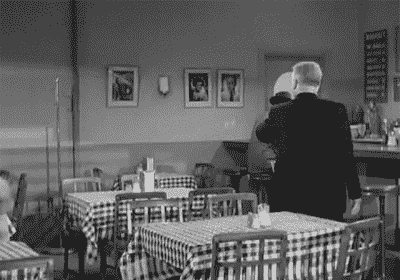
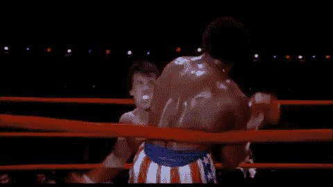
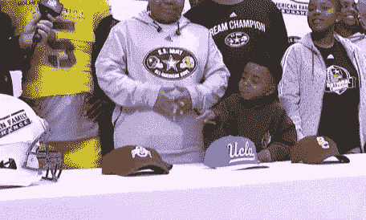
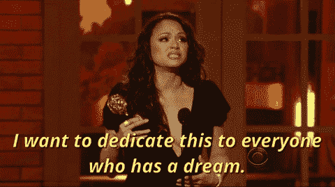

# 体育教会了我学校没有教会的 5 件事

> 原文：<https://medium.datadriveninvestor.com/5-things-sports-taught-me-that-school-didnt-e0de4f266de5?source=collection_archive---------21----------------------->

教育在全世界都是一个有争议的话题。在大多数情况下，人们对教育的看法可能仅限于他们自己的经历。然而，在各个层面，人们普遍对教育系统的运作方式感到不安。

但我不是来告诉你上大学是否值得。归根结底，这取决于你如何利用学生时代获得的技能和时间。我来这里是要与你分享我在 18 年棒球生涯中学到的五个重要教训，这些教训是我 22 年学生生涯中学不到的。

开始吧！

# 1.应对逆境。

虽然人们倾向于坚持不懈地取得好成绩；他们只面对一个敌人，内在的敌人。在体育运动中，这是一个完全不同的球赛。影响你成功与否的外部因素太多了。那些包括你的队友，天气情况，裁判，其他球队等等。

回想过去，我记得我在左外野打球，跑着去接球，即使是一块小石头也能让球去一个与我预期不同的方向；这意味着，在最好的情况下，给对方一个机会去接近得分(相当于棒球中的一个进球或一分)。

当你在任何行业开始职业生涯时，学会如何处理生活抛给你的事情都是一种优势。这不再是把事情做对的问题；现在，你必须努力在疲软的市场条件、法规、激烈的竞争对手，有时还有你团队成员的情况下取得成功。

# 2.竞争是一件好事

大多数时候，学校环境是没有竞争的。但事实是，在现实世界中，我们几乎整天都在竞争。

如果你学会了如何将激烈的竞争转化为灵感的源泉，那么你就遥遥领先了；体育运动就是要力争上游。

作为一名棒球运动员，我记得的一件事是我效力的一个队与另一个队之间的竞争。那些游戏太疯狂了。尽管我们还是孩子，但我们对此非常认真；还有我们的父母。我仍然能听到另一个队的父母在季后赛中带到看台上为他们的孩子加油的鼓声。我们输了那场比赛，而他们最终赢得了冠军。但是你知道吗？第二年，我们赢得了奖杯，甚至进入了地区系列赛。

# 3.跳出框框思考

棒球就像其他运动和学校一样，你必须服从命令。然而，在激烈的比赛中，你必须有快速思考的能力，在几秒钟内想出解决方案。

让我们想象一下，你正在比赛中，发生了不在你教练计划之内的事情，你有两个选择:失败或者想出一个独特的解决方案，在没有你教练的帮助或指导的情况下取得可能的最佳结果。

在我的工作中，这样的事情每天都发生在我身上。虽然我的老板给了我一些指导方针，告诉我她希望我如何执行一项特定的任务，但有数百个因素可能会修改最初的计划。就在那一刻，我解决问题的技能发挥了至关重要的作用，我在那几分钟内做出的决定可能会让公司损失数千美元。

# 4.谦虚一点

无论你走到哪里，你都会发现自我。运动中充满了它们，随着时间的推移，你学会了如何管理它们，更重要的是，如何控制你的自我。

这在现实世界中至关重要。历史上有无数拥有优秀技能和潜力，但自我膨胀的人失败了。谦虚是一门艺术；实际上，我称之为倾听的艺术。

如果你培养了倾听同事意见、分析和尊重竞争对手、脚踏实地的能力；那么你就走上了成功之路。

# 5.为你的梦想而战

我知道很多人的目标是成为一名医生、律师或工程师。这些都是合法的梦。但对我来说，学业从来都不是动力，因为我的梦想是成为一名职业棒球运动员。对于那些不关心棒球的人来说，这相当于在欧洲足球联赛中踢球。

在那 18 年里，我学会了如何克服障碍，如何赢得与恐惧和怀疑的内心斗争，我学到的最重要的事情是，当你找到你喜欢做的事情，并投入所有的时间和精力；最终会有结果的。

回顾我的童年，如果我能重生，我会回到那个梦想的地方去打球。我坚信你小时候的经历可以永远塑造你，对我来说，很明显我是今天的我(尽管还有很长的路要走)，因为我作为一名棒球运动员所发展的技能。

虽然我在学校取得了成功，也没有在棒球场上实现我的目标，但我自豪地说，我穿制服的那几年是我一生中最伟大的时刻。作为学问，我可以告诉你:

睁开你的眼睛，准备好参与别人通常不做的事情，找到你自己的道路，最终，你会更好地了解自己。