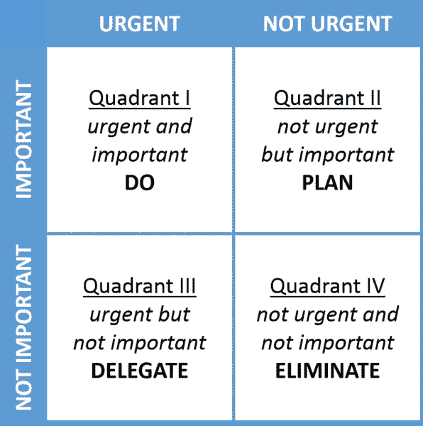

# 为了在 2020 年更有效率，你必须停止做的 5 件事

> 原文：<https://medium.datadriveninvestor.com/5-things-you-must-stop-doing-to-be-more-productive-in-2020-6b355a6c95dc?source=collection_archive---------6----------------------->

Photo by [Andrew Neel](https://unsplash.com/@andrewtneel?utm_source=medium&utm_medium=referral) on [Unsplash](https://unsplash.com?utm_source=medium&utm_medium=referral)

当我学化学的时候，我曾经每天学习 10 个小时。我不是因为特别上进心才这么做的，而是没有别的选择。或者至少当时我还不太清楚。

我通常坐在我的办公桌前，开始我的倒计时钟。我把它设定为 8 -10 小时。每当我站起来或者休息的时候，我就停止了时钟。所以，最后当我学完 8 到 10 个小时的时候，才是真正的学习时间。

所以是的，我的大脑仍然存在，我仍然能够思考，有可能学习长达 10 个小时。

然而，回头想想，我不会再这样做了。想象你坐在桌子前，确切地知道你还需要花多少时间学习。你开始盯着墙壁，看着窗外，或者只是让你的思想游荡。换句话说，你尽一切可能避免集中注意力。

 [## 跑步摆脱疯狂:锻炼如何提高你的生产力|数据驱动的投资者

### 没有比锻炼更好的方式来开始一天的工作了。我试着一周至少做四天，在…

www.datadriveninvestor.com](https://www.datadriveninvestor.com/2018/10/23/running-to-get-rid-of-the-crazy-how-working-out-increases-your-productivity/) 

是的，我可能花了 10 个小时学习，但我在那 10 个小时里都没有集中注意力。

我不想限制任何人的潜力，所以我没有说不可能集中注意力 10 个小时，但就我现在所知，我会在更短的冲刺中学习得更激烈。

**尽管你可能觉得自己很有效率，但这并不意味着你很有效率。**

做得更多并不总是成功之路。

# 为了在 2020 年变得更有效率，以下是你必须停止做的五件事

## 1.不要那么容易分心，而是要学会集中注意力

我记得，当我学习化学的时候，我几乎每天晚上都要花两个小时来学习。不幸的是，在这两个小时中，只有半个小时，我花在了学习上。其余的时间我都浪费在 Youtube 上了，看着窗外，发短信，或者只是在墙上看了一整部。幸运的是，我不知道 Instagram 支持他们。否则，我的“专注”时间会更低。

专注不是在适当的时候出现在你面前的。你必须提高和培养你的专注能力，这样你才能抓住机会。

有两种简单的方法来训练你的*焦点肌肉*:

*   冥想
    专注于你的呼吸，感受空气从你的鼻子进出。每当你的思绪飘忽不定的时候，把它们带回呼吸。我开始每天这样做一分钟。我一感到舒服，就延长了疗程。目前，我每天做 10 分钟。
*   番茄工作法
    设定一个计时器，并严格专注于一项任务。在旁边放一张纸，写下那些分散注意力但却很重要的想法。比如你忘记的生日或者杂货。我开始时集中注意力 10 分钟，然后休息 5 分钟。我进步到 30 分钟的专注和 5 分钟的休息。然后我冒险尝试了 60 分钟的集中注意力。效果很好，我决定停留在 60 分钟。

## 2.不要做不必要的事情，只做重要的事情

根据帕累托原则，我们百分之八十的结果源于百分之二十的行动。这个原则是以意大利经济学家维尔弗雷多·帕累托的名字命名的，他指出意大利大约 80%的土地被 20%的人口所拥有。第一个让我认识到这种思维方式的人是蒂姆·费里斯，他在《每周 4 小时工作》一书中写道。

一旦你采取了这种心态，你开始意识到忙于错误的事情不会带来想要的结果。更糟糕的是，它会耗费你大部分的时间。因为 20%的结果需要 80%的努力。现在的挑战是识别那些高价值的活动。

但是我如何对我的任务进行分类，这样我就可以决定关注哪些任务了？

以美国第 34 任总统德怀特·戴维·艾森豪威尔的名字命名的艾森豪威尔矩阵可以帮助你决定和优先处理任务。

By [Davidjcmorris](https://commons.wikimedia.org/w/index.php?title=User:Davidjcmorris&action=edit&redlink=1)

立即做重要的任务，安排重要的，但不那么紧急的事情。

紧急但不太重要的事情可以委托，紧急和重要的事项都不能忽略。

现在你知道如何区分工作的优先顺序了。这样你就不会陷入忙于错误事情的陷阱。

## 3.不要经常说“是”,而要开始说“不”

如果你工作出色，老板通常会给你更多的工作，因为他们觉得你有能力应付额外的工作量。嗯，你是，但讽刺的是，最初让你成为高水平执行者的是你能够专注于更少的任务。但是现在，由于你不得不分散注意力，你表现优秀的能力就会减弱。

在他的书 [*本质主义*](https://medium.com/@roadtolimitless/essentialism-by-greg-mckeown-practical-book-summary-103b3fa284b3) 中，Greg McKeown 鼓励读者更多地说*不*。对一件事说*不*能让你对另一件事说*是*。要么是*地狱是*要么是*否*。不要对某件事说*是*，那不会提供至少 9/10 的价值。当难以说“不”的时候，想想说“是”会让你放弃什么。每次你对某事说*是*时，你就对另一件事说*不*。如果你说*是*出去大醉一场，你就说*不*第二天早上要有所收获。

## 4.停止消费，开始生产

你浏览一篇又一篇文章，尽可能多地吸收关于一个主题的内容。时间过得飞快，不知不觉就该睡觉了。但是，你什么都没生产出来。

这听起来熟悉吗？

这就是忙碌和高效的区别。

即使研究感觉是对的，在某个点之后，它只是让你忙起来，而不是富有成效。

关于像斯蒂芬·金那样写作，你想看多少就看多少。在某个时候，你必须开始生产东西。生产一样东西是困难的。你的大脑还没有被训练成能够像专家的大脑那样进行生产。

试着通过每天生产一些东西来克服惰性。哪怕很小，也要坚持下去。随着时间的推移，你会获得动力，变得难以停止。

## 5.停止工作，花些时间思考

比尔·盖茨在经营微软时，定期花几周时间思考。他会去一个偏僻的湖边小屋，除了阅读和思考什么也不做。史蒂夫·乔布斯培养正念和沉默来平静他的思想，培养创造力。

当你什么都不做的时候，你允许你的大脑变得有创造力。创造力是一个近乎神奇的过程，当我们的大脑突然之间将之前没有联系的事物联系起来。像用蒸汽为机器提供动力，或者用你在丛林中找到的豆子制作美味的巧克力，这些想法都需要极大的创造力。只有当我们什么都不做的时候，创造性的见解才会来到我们身边。

## 外卖

不是 2020 年做多了。

相反，关注你的优势，停止那些拖你后腿的不必要的事情。

祝大家 2020 年一切顺利！

# **准备好变得无限吗？**

如果你想变得无限并大大加快你的学习速度，看看我的小抄:

[点击此处立即获取备忘单！](https://roadtolimitless.com/cheatsheet/)