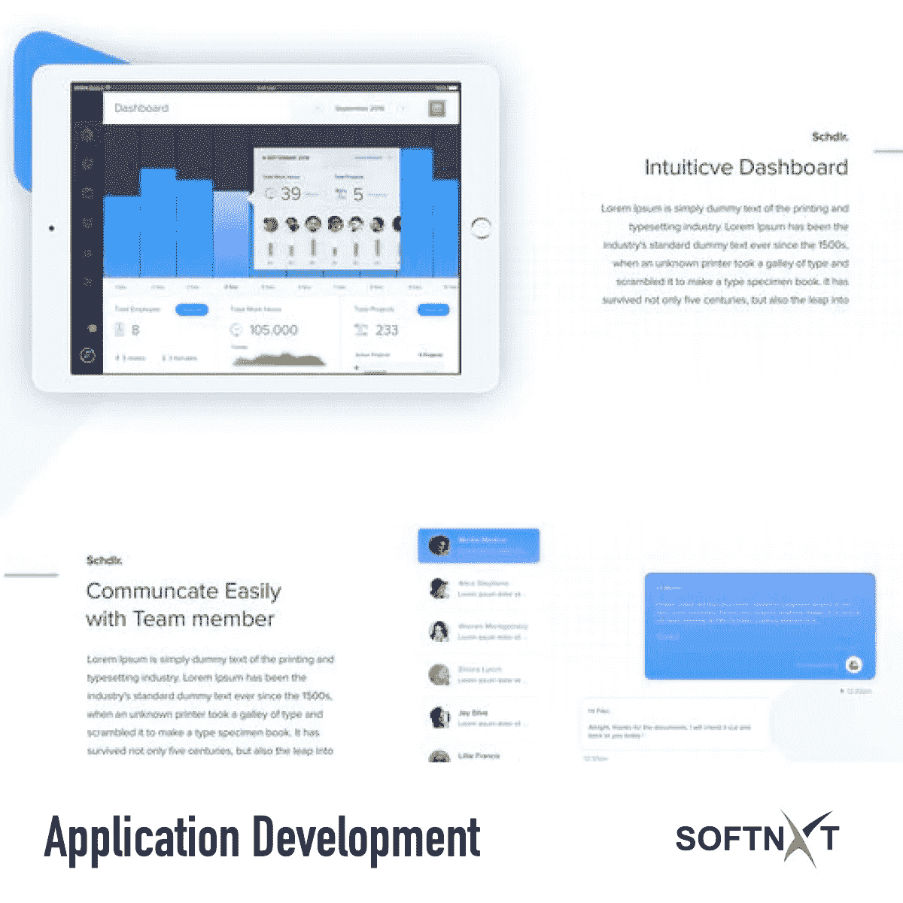

# 今天你需要知道的关于移动应用开发的 5 件事

> 原文：<https://medium.datadriveninvestor.com/5-things-you-need-to-know-about-mobile-app-development-today-3321cd8532ee?source=collection_archive---------53----------------------->

Mobile Application Development

如今，移动应用正在成为电子商务平台中非常必要的一部分。它使做生意变得容易，也使顾客容易购买特定的产品或服务。即使是一家小公司，仅仅通过移动应用程序也能获得丰厚的回报。关于移动应用，一个商人应该知道很多事情。这是今天你需要知道的关于移动应用开发的 5 件事。

**1。** **增加曝光:**

通过使用移动应用程序，你可以让顾客不顾一切地购买你的产品。也有利于您的业务增长，并取得更多的客户，更多的销售，也可以通过扩大您的业务来提高您的生产力。

**2。** **打造品牌认知度:**

无论你的企业是新进入市场的还是已经存在的。您可以通过移动应用程序来提高[您的品牌](https://softnxt.wordpress.com/2018/11/14/5-things-you-need-to-know-about-mobile-app-development-today/)的认知度。通过添加一些有用的新功能，确保客户经常使用您的应用程序。你的客户打开你的应用越频繁，你的生意就越好做。广告业有一条黄金法则，如果一个人看到某个品牌超过 20 次，那么这个品牌就真正被注意到了。

**3。** **增加客户参与度:**

每个顾客都需要一条正确的道路，展示他们可以购买感兴趣的产品或服务的业务。如果你的企业无法接触到合适的客户，那么记下你的公司即将失去客户。因此，您的移动应用程序应该通过支持这种接触而方便客户使用。在您的移动应用程序中创建一个帮助台，客户可以通过它给出他们的评论和要求。这样你就可以亲自接触他们。通过这样做，您可以增加客户参与度。

**4。** **建立客户关系:**

移动应用程序能建立客户关系吗？是的，通过移动应用程序，你可以建立更多的客户关系。一旦你的应用程序进入客户手机，你就有很大的机会让你的客户更多地接触到你的应用程序，每次都提供新的提要和关于你产品的信息。通过这样做，它使你的业务，值得信赖。即使通过制作优惠券和优惠，你也可以让你的客户从你的企业那里再次购买。通过这样做，你的业务将成为一种优势，甚至你的客户也将因购买价格更低的产品而受益。

**5。** **加强社交媒体营销:**

大多数人都喜欢社交媒体。通过在你的应用程序中加入让用户用他们的脸书、推特或谷歌+账户登录的功能。你可以收集他们的社交媒体账号，经常和他们联系。根据最近的调查，大多数人登录社交媒体是为了了解他们的朋友在说什么。以便您可以经常更新应用程序的最新更新和最新功能。

