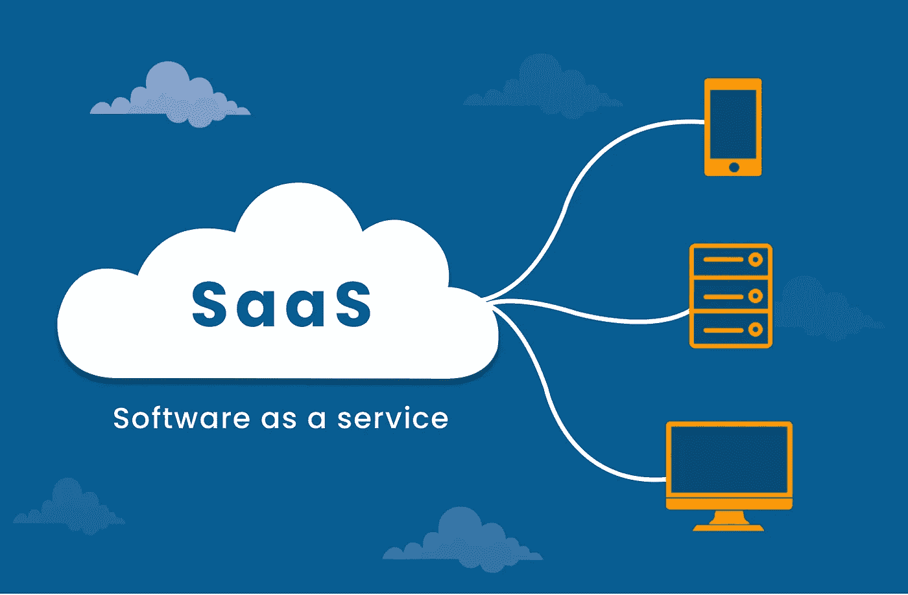

# 如何在 SaaS 成功创业的 5 个技巧

> 原文：<https://medium.datadriveninvestor.com/5-tips-on-how-to-start-a-successful-saas-business-77f307fa187e?source=collection_archive---------6----------------------->

我遇到了很多创业企业家，他们的一些商业想法非常适合作为 SaaS(软件即服务)产品。好处是一旦你有了一个运行的基本产品，你就不必担心产品的安装和维护。您可以专注于业务和客户。产品和新客户入职将自行运行。

以下是我给那些打算开始软件业务的人的 5 个建议(你可能正在考虑一个软件/应用程序，但它可以成为 SaaS)。

*   开始精益生产，但要尽快开始赚钱。选择一个好的循环计费公司。

 [## 动荡迫使暴风雨中的平静|数据驱动的投资者

### 自然界中很少有东西是直线行进的，尤其是经济。当投资者和消费者希望平静时…

www.datadriveninvestor.com](https://www.datadriveninvestor.com/2019/03/25/volatility-compels-calm-amid-the-storm/) 

每个人都建议从精益开始，比如构建一个 MVP，然后从那里扩展，尤其是在制作软件产品的时候。但我想说，在开始精益的同时，也要尽快开始创收。否则，除非你对自己的想法如此自信，否则如果你觉得自己付出了如此多的努力却没有得到预期的结果，你就有可能放慢脚步。

此外，许多企业家有想法，然后他们免费提供产品几个月，以建立用户群。虽然这可能在一些特定的利基市场有效，但没有什么比有人付钱更能证明产品的可行性和价值了。你没有一个好的产品，直到你有一个收入模式来支持它。

*   **验证你的想法——不只是在开始的时候，而且要经常验证。**

想法验证是我们应该经常做的一个重要过程。基本上，创始人应该始终致力于产品的独特性/创新性/优势。我并不是说这应该是一个非常独特的产品创意，但你应该对市场的发展趋势有所了解，有哪些主要参与者，以及如何与他们竞争。

*   **用消费级 UX 做企业级产品。**

这是我从一些最伟大的 SaaS 企业家那里听到的建议。无论产品的垂直方向如何，都要做一个具有良好用户体验的企业级后端(这意味着它的健壮性、可访问性、安全性等)。用户界面/UX 让用户喜欢使用产品，它的安全性和可靠性让他们总是不假思索地使用你的产品。

*   **客户支持与众不同。**

你必须花时间与每一位顾客相处，以获得合适的产品。建立适当的反馈机制，并定期解决问题。

如果你获得了客户，但他们不怎么使用你的产品，你就真的没有 SaaS 产品。订阅业务的优势是巨大的，但是如果你的产品没有被经常使用，最终客户会取消他们的订阅。因此，始终与客户交谈，支持他们，做出他们认为有价值的改变，关注目标用户工作流程，并向用户介绍产品及其独特优势。

*   **建立电子邮件营销&利用社交媒体。**

对于建立一个电子邮件营销活动&为你的产品使用社交媒体，你不一定需要一个营销部门或者你不需要成为一个营销人员。从小处着手，收集潜在客户的电子邮件，开始偶尔发送一些内容，在社交媒体页面上发布相关内容。它慢慢起飞。

这是我突然想到的几点。请添加想法和建议！

阅读完整博客:[https://www . stunntech . com/blog/29/5-如何成功启动 saas 业务的技巧](https://www.stunntech.com/blog/29/5-tips-on-how-to-start-a-successful-saas-business)