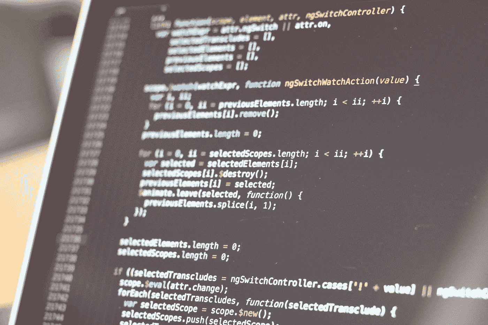

# 帮助成为更好的软件工程师的 5 个技巧

> 原文：<https://medium.datadriveninvestor.com/5-tips-to-help-become-a-better-software-engineer-b185d1a207db?source=collection_archive---------16----------------------->

以下是成为更好的软件工程师的五个有用的技巧:

**1。可教！** 我将从更重要的一个开始… *永远*保持可教性。不管你认为自己知道多少，不管你处于职业生涯的哪个阶段，也不管你爬了多高的梯子…在一个充满自我、骄傲和自我重要性的行业，保持可教性至关重要。

**2。不要害怕失败——做点什么，快速失败！不要成为“分析麻痹”的受害者，因为你花了太多的时间考虑一些事情，却什么也没做。最好尝试一些事情，然后很快失败，从错误中吸取教训，下次做得更好。甚至尝试几种不同的解决方案作为概念的证明——毕竟爱过然后失去总比从来没有爱过好。**

**3。完美的代码是不存在的！** *每一款*软件都存在 bug。我并不提倡垃圾代码，而是试图对抗一个完美主义者的心态，这种心态经常伴随着一个软件工程师。我们经常花太多时间关心我们的代码有多干净。如果你认为你总能写出完美的代码，记住这是固执己见，而且很可能只有你有这种想法！

**4。平衡技术实现和用户价值！对我们来说，这可能是一个很难把握的问题。一般来说，我们都从某种为用户创造价值的商业收入/财务支持中获得报酬。虽然我们的技术实现很重要，但如果使用方法一交付特性需要 4 周时间，而使用方法二需要 8 周时间，那么您需要在上市时间和用户价值与您选择的实现之间取得平衡。时间就是金钱！**

**5。找个导师，帮助别人！最后，找一个你可以学习的人...多年来，有一个导师真的帮助了我。通常从经验中获得的智慧是无法传授的。和走在你前面的人一起喝咖啡，制定你的 2/3/5 年计划要容易得多。确定一个你可以信任的人，并要求按照对你们双方都合适的时间表一起喝咖啡。我觉得对你的专业技能进行指导也是非常重要的，比如向一群人展示、影响他人和营造工作环境。这些和你的编码技能一样重要。同样，成为他人的导师——[向前看](https://en.wikipedia.org/wiki/Pay_it_forward)！**

> 感谢您花时间阅读我的文章。