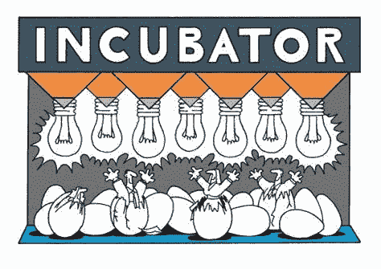
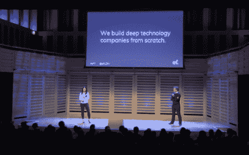
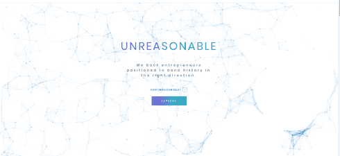
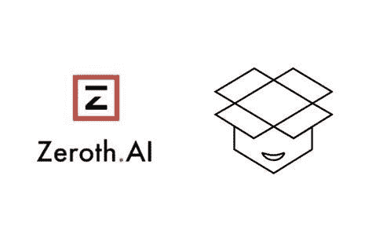

# 5 个独特的科技创业生态系统

> 原文：<https://medium.datadriveninvestor.com/5-unique-tech-startup-ecosystem-2c5a0ce5ae05?source=collection_archive---------10----------------------->

加速器、孵化器、创业家——从 Pao Alto 到 Bangalore，从惠灵顿到圣保罗，从香港到特拉维夫，从拉各斯到伦敦，世界各地的每一个创业谷都有一整套创业生态系统提供商。科技创业公司正在加速全球的经济增长，这是非常可能的，因为越来越多的创业生态系统提供商处于种子阶段或成长期。Y-combinator 是第一个率先尝试建立一个卓越的创业生态系统的公司。

**什么是孵化器？**
孵化器通过提供工作空间、种子资金、指导等方式，帮助创业者解决与创业相关的问题，从而在早期阶段帮助创业公司。

**什么是加速器？**
加速器是定期的，通常是基于群组的计划，包括种子投资、网络联系、导师、教育成分，并在公开推介活动或演示日达到高潮，以加速增长。

**什么是公司/风险建设者？**
创业家们通过利用在他们的企业中共享的知识和资源，快速有效地共同创建并创办新企业。这包括构思商业理念、筹集资本、共享资源和管理业务。

我发现 5 个独特的生态系统提供商正在塑造科技公司:

1.  [企业家第一](https://www.joinef.com/)

创业者首先是人才投资人。与大多数孵化器不同，你不需要一个想法或一个 MVP 来申请 EnterpreneurFirst。他们的第一步是确定世界上最有才华和雄心的个人，然后投入时间和金钱来帮助他们找到联合创始人，开发一个想法，并创办一家公司。他们于 2011 年在伦敦成立，现在已经扩展到新加坡、柏林、香港、巴黎和班加罗尔。它们旨在向世界证明，企业家并不总是天生的，而是可以创造的。令人着迷的方法。

[2。社会资本](https://www.socialcapital.com/)
社会资本是一家“科技控股公司”，投资于解决难题的科技公司，没有特定的回报时间表。虽然大多数投资者寻找早期高回报的公司，但社会资本为有意义的问题开发有意义的解决方案，重点是医疗保健、教育和金融服务。从应对气候变化到治疗糖尿病和癌症，社会资本在某种程度上是独特的，它旨在致力于漫长、有时不舒服的进步之路。

[3。不合理的](https://unreasonablegroup.com/)
不合理的为成长期企业家提供沉浸式项目，为看似艰巨的挑战提供解决方案，除了作为一家多媒体公司、私人全球网络和投资公司。从旨在用清洁、安全和丰富的聚变能源转变世界能源供应的通用聚变(General Fusion)到可持续汽车公司 Riverside 和第一个在农村地区部署高速移动宽带的自主浮空器平台 Altaeros Energies，再到城市可持续农业技术公司 Growing Underground，不合理的解决方案相当雄心勃勃。

[4。创造性破坏实验室](https://www.creativedestructionlab.com/)
创造性破坏实验室是为大规模可扩展的、以科学为基础的公司设立的种子期项目。科学是技术背后的工具，提供杠杆作用。CDL 的参与公司定期与成功的企业家和投资者会面，他们给每家公司分配了三个必须在八周内实现的目标。未能实现目标或未能说服导师相信自己能够发展成大规模企业的公司将被淘汰出该项目。种子阶段计划主要关注人工智能、区块链、量子、太空、城市基础设施、能源、健康和通用技术。

[5。Zeroth](http://zeroth.ai)
Zeroth 是一家总部位于香港的加速器，专注于与亚洲各地从事边缘计算、农业技术、伦理计算、自然语言、自动驾驶汽车和人机界面技术的早期人工智能初创公司合作。他们在 pre-seed 和 seed 阶段投资资本，并与创始人合作 3 个月以上，通过经验丰富的企业家团队、合作伙伴和投资者网络以及其他创始人社区来建立他们的创业公司。

*image credits:*[*wf global*](https://wiki.wfglobal.org/five-trends-that-will-rule-indias-startup-ecosystem-in-2017/)*，* [*福布斯*](https://www.forbes.com/sites/morganhartley/2013/05/14/why-your-city-needs-a-strong-startup-scene/#7495d128ec78) *，*[*my start upland*](https://mystartupland.com/wp-content/uploads/2015/10/rocketman2.jpg)*，*[*TechCrunch*](https://techcrunch.com/2017/09/11/ef-greylock/)*，* [*社会资本*](https://www.socialcapital.com/) *，* [*不合理*](https://unreasonablegroup.com/)

## 来自 DDI 的相关故事:

 [## 数据科学和软件工程哪个更有前途？

### 大约一个月前，当我坐在咖啡馆里为一个客户开发网站时，我发现了这个女人…

medium.com](https://medium.com/datadriveninvestor/which-is-more-promising-data-science-or-software-engineering-7e425e9ec4f4)  [## 为什么数据会改变投资管理

### 有人称之为“新石油”虽然它与黑金没有什么相似之处，但它的不断商品化…

medium.com](https://medium.com/datadriveninvestor/why-data-will-transform-investment-management-4a60966c1c81)