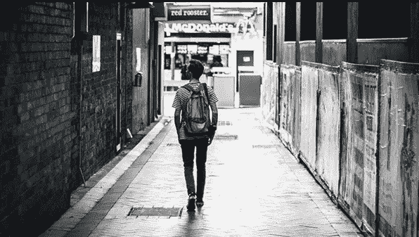

# 带领我走到今天的 5 个动词

> 原文：<https://medium.datadriveninvestor.com/5-verbs-that-led-me-to-where-i-am-today-2a2303663543?source=collection_archive---------18----------------------->

在教练博客——世界领先的领导力和教练博客之一，我们经常发布主要作者和权威的文章——今天我们很高兴地发布克洛伊·莱布的一篇文章，文章来自 Medium.com 的**。**

**2016 年 3 月 30 日，我和 Thomas Despin 一起从纽约骑自行车穿越美国到旧金山。我们的一个共同目标是在 120 天内每天坚持不懈，从而提高我们的自律性。他拍视频，我写文章。**

*从现在起的 5 年里，我从未想过我现在的生活。我不会在这里为你提供任何废话，告诉你我过着有史以来最好的生活。*

* [## Noobs 的数字身份——数据驱动的投资者

### 聪明人如何在增强现实中创造身份价值？我最近刚满 40 岁。作为一个生物…

www.datadriveninvestor.com](https://www.datadriveninvestor.com/2019/02/28/digital-identity-for-noobs/) 

第一，因为它没有任何意义。没有人过着最好的生活，有些人只是对他们所拥有的心怀感激，而这些人拥有最好的生活。你也可以拥有它，它来自于你的思考方式。

其次，因为总有更好的事情要做，总有更多的事要做。这就是生活的方式，也是让生活值得的原因:可能性的范围。我们已经并将永远有新的东西要学。

我才 27 岁。我做了我想做的一切。这并不意味着结果总是值得的旅程。这并不意味着我拥有一切。这意味着无论何时何地，只要我觉得某件事是对的，我就会去做。我不止一次犯错，我感觉像狗屎一样孤独，我前后倾斜，但我克服了它。生活在继续，我继续前进。

此时此刻，我在布鲁克林(纽约)布什维克的一家咖啡店里，在这里我写下了这篇文章。我想和托马斯一起骑自行车穿越美国，从纽约到旧金山，这是我三个月前不知道的。

我以前从未真正骑过自行车，也没有和一个我不认识的人一起生活和旅行过。有些人认为这是勇敢或鼓舞人心的。我觉得不是。

> 我完全可以在路上抓狂然后回家。我可以改变主意。我可能永远不会成功。如果这些事情发生了，谁在乎呢？

我在过我的生活，这是唯一的问题。有些人甚至没有意识到他们只有一次生命。

我想多了。事情就是这样。我一路怀疑，所以写。它让我头脑清醒。今天早上，当我走在阳光下，我提醒生活是多么神奇，当你拥抱它，而不是与之抗争。

我不想停止疯狂、敏感或过度。好吧，因为我永远不会变成别人。这就是我的方式，也是我来到这里的原因。

这条消息对我来说是一种痛苦，提醒我到目前为止我学到的最重要的东西。

# 感觉

“停止存在，开始感受”

我知道。我其实有很多感觉。但是有一天，当我意识到这是过一个不会后悔的生活的最好指标时，我开始采取不同的行动。除了接受自己的方式，我还根据自己的感觉做决定。

让你感觉更好的最佳秘诀之一。

# 实验

“开始尝试，开始行动”

我把生活视为一个巨大的游乐场。如果我不去寻找最适合我的，我将永远找不到。我旅行，我在不同的公司工作，以不同的方式，在不同的国家工作。

要建事业，要有家，要挣钱？我会一路想出来的。

# 学习

“我更喜欢从别人那里了解我”

我不是说我们必须去任何地方，做任何事情来更好地了解我们。有些人确切地知道他们在考虑他们在哪里。我不只是他们中的一员。每个人都必须追随适合自己的东西。

# 敢

“停止恐惧，开始惊奇”

我害怕不信任自己的日子。缺乏自信是最有害的。它可以促使你后悔的时刻或错过的人。

# 要求

“停止请求许可，开始寻求帮助”

我不相信我们能独自去任何地方。总会有人。它可以是任何人，在任何时候。有时候，与某人相处 10 分钟就能引领我们进入人生的下一个阶段。有爱，友谊，但也有意想不到的会议，陌生人，迟到的谈话，这将永远改变你的世界。

我不是说这很容易。我不是在告诉你有一种方法可以解决所有问题。

我只是在提醒自己，我有自己选择的生活，这取决于我是谁。这是亿万人中的一个。它只属于我。

在这里阅读更多内容，不要忘记订阅我的教练博客网站，获得免费的教练报告:[https://www . coaching-blog . com/5-verbs-that-lead-me-where-I-am-today/](https://www.coaching-blog.com/5-verbs-that-led-me-to-where-i-am-today/)

查看我们在这里提供的课程:[https://www . noble-Manhattan . com/training-courses/coaching-courses/](https://www.noble-manhattan.com/training-courses/coaching-courses/)

并获得我们的免费报道:【https://www.coaching-reports.com/ 

*原载于 2016 年 6 月 17 日*[*https://www.coaching-blog.com/*](https://www.coaching-blog.com/5-verbs-that-led-me-to-where-i-am-today/)*。**