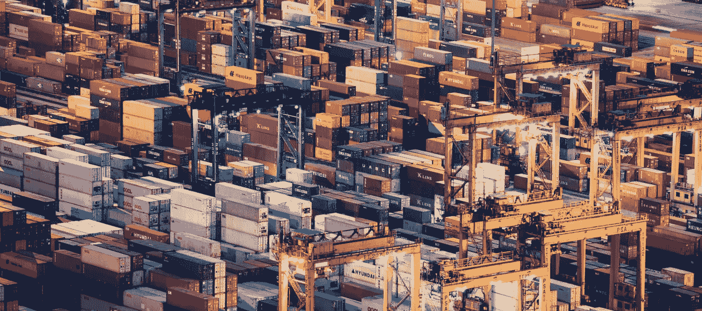

# 人工智能将改变物流行业的 5 种方式

> 原文：<https://medium.datadriveninvestor.com/5-ways-ai-will-transform-the-logistics-industry-53929ec8333c?source=collection_archive---------17----------------------->

这是科技博客作者卡米尔·彼得斯的客座故事。

人工智能(AI)在物流行业中发挥着越来越重要的作用。随着世界物流需求变得越来越复杂，大数据驱动的应用已经开始在全球范围内简化物流。[24/7 供应链在 2016 年表现最佳](http://www.supplychain247.com/article/transforming_logistics_with_artificial_intelligence)，他们解释说*“数据驱动和自主供应链的影响为以前难以想象的优化水平提供了机会。”*如果说数字化优化物流的未来在 2016 年看起来一片光明，那么今天肯定是一片光明。

AltexSoft 前情提要，[我们解决了已经猖獗的数字化](https://www.altexsoft.com/blog/business/digital-transformation-stories-how-jetblue-and-marriott-advance-travel-experience/?utm_source=MediumCom&utm_medium=referral)，它继续增加它的存在。它推动了旅游业和酒店业的发展——但这只是冰山一角。在线预订旅行和订购商品只是庞大的物流方程式中的一部分。现在，我们将仔细看看一些人工智能驱动的趋势，我们可以期待在构成供应链的其他部门看到这些趋势。

# 智能和自动化仓储

在英格兰的安多弗，一个主要由机器人管理的大型仓库能够完成 65，000 份订单(大约。350 万个杂货项目)。这是英国在线杂货商 Ocado 设计和建造的“蜂巢-网格-机器”的全部运行能力。自动化和智能仓储系统完全能够移动、提升和分拣杂货，然后由 Ocado 的员工包装并发送出去。

虽然分配给机器人的任务看起来很简单，但它们的主要任务是尽可能高效地利用空间。 [Ocado 的仓储机器人可以堆叠高达 17 箱的储存物品](https://www.theverge.com/2018/5/8/17331250/automated-warehouses-jobs-ocado-andover-amazon)。运行操作的算法将很少排序的项目放在底部，将经常访问的项目放在顶部。这最大限度地减少了完成公司大部分在线订单所需的时间。这完全符合 Ocado“自我颠覆”的目标——不断改进自己的技术，为仓储、物流和酒店行业的效率设定标准，并最终将他们的专利技术出售给其他有类似要求和担忧的公司。

在更广泛的范围内，这与专家的预测不谋而合，即物流和仓储行业的多种业务将在 2030 年左右完全自动化。Vero Solutions 相信，在未来几年内，30%的英国仓储工作将实现完全自动化，其中体力工作最有可能成为转换的第一候选对象。接下来是任何涉及处理和收集数据的操作，这是多智能优化应用的生命线。

自动化仓储的最终目标是计算机视觉。这是人工智能在改进操作时将学习和进化的地方。计算机将很快能够识别和组织存货，甚至对各种存货进行质量控制，而不需要人工监督。如果公司有一个以上的仓库，每个位置的人工智能将能够相互交流，以找到最佳的物流解决方案。

# 区块链可以大大提高供应链的可靠性和完整性

众所周知，全球供应链定期处理与效率、可靠性和安全性相关的问题。一些专家认为，这些问题可以通过在关键供应链交易中应用区块链技术来解决。这包括与供应流程相关的所有事务—从采购到内部交换，包括存储、交付和审计。

度量专家 Bernard Marr 解释说，这只是区块链的许多实际应用之一，他是《实践中的大数据和*关键绩效指标*的作者。 [Marr 解释说，区块链科技的本质](https://www.forbes.com/sites/bernardmarr/2018/03/23/how-blockchain-will-transform-the-supply-chain-and-logistics-industry/#3daf176b5fec)给了它很多机会来改善供应链和物流行业。区块链主要被称为用于交易加密货币的分散式数字账本，已经被几家公司用来优化他们自己的供应链。

这是可能的，因为区块链的工作方式。每笔区块链交易都被加密为不可擦除的记录或块，包含交易的每一个重要细节。这个区块立即被复制到链中包含的每一篇文章的数字分类账中。这些现在不可移动的数据块相互叠加，形成了一个数据“区块链”,可以在事务的每个流程中交叉引用。这样，就很容易保持透明度和问责制。这不仅使交易更加安全，还消除了对大量操作文书工作的需要。

此外，这些记录还反映了原始和准确的运营数据，这些数据可用于进一步优化供应链。这已经被一些世界上最大最富有的公司采用，包括雀巢、联合利华、沃尔玛和都乐。考虑到其在日益复杂的系统中提供可靠性和完整性的能力，区块链科技准备在不久的将来接管物流交易。事实上，其透明度和效率相关的好处对于人工智能在各种交易所和供应链流程中的安全使用也至关重要。

英国已经通过一个名为海关货运简化程序(CFSP)的系统实现了这一点，由英国税务海关总署管理。简而言之， [CFSP 是一个精简的海关税收系统](https://www.nibusinessinfo.co.uk/content/customs-freight-simplified-procedures-cfsp),允许来自欧洲以外国家的货物更快放行。该系统包括简化申报程序，用于通过大多数海关程序放行货物。名副其实，SDP 允许更快的交易，这就是为什么许多进口商使用该程序来运输易腐货物。与此同时，该系统的本地清关程序(LCP)是一个类似的选择，用于在货物通过海关程序放行之前储存货物。结合海关交易中的区块链技术，这种简化的海关申报有可能彻底重组供应链的许多部门。

这些新技术带来的数据可靠性的提高也可能为后勤中的后台人工智能铺平道路。交易数据的数字化已经变得越来越安全和普遍。这使得人工智能可以接管卑微但技术性的文书工作。[国际银行家解释说后台数据完整性服务](https://internationalbanker.com/finance/artificial-intelligence-storms-back-office/)取决于数据准确性、符合监管要求以及对运营效率的整体贡献等因素。银行、会计公司和保险公司已经利用这种技术来简化客户数据的处理。物流行业也在采取措施利用这项技术。

# 智能道路有助于维护基础设施，改善交通，提高道路安全性

智能道路技术在美国越来越普遍。[国家地理指出了一个目前正在进行现场测试的智能道路技术的显著例子](https://news.nationalgeographic.com/2017/07/chasing-genius-solar-roadways/)。在爱达荷州的桑德波特，一家名为 Solar Roadways 的初创公司开发了一种由耐用的太阳能电池板制成的“智能高速公路”，可以承受高达 25 万磅的负载。它们是由透明的钢化玻璃瓷砖制成的。在这些瓦片下面是收集太阳能的光伏电池，然后可以用来为附近的建筑、路灯和其他公共基础设施供电。这些瓷砖还配备了 LED 灯，其用途包括但不限于:标记交通车道，以控制或改变交通方向，并向驾车者传达信息，例如关于即将到来的危险的警告。由于路面板可以加热，它们在冬季也不会结冰。

[美国全国广播公司报道了科罗拉多州的一项类似举措。初创公司 Integrated Roadways 与科罗拉多州交通部合作，在 285 号高速公路的半英里路段上测试他们自己的“智能人行道板”，这是美国国家高速公路系统中出了名的事故多发路段。这种智能道路技术旨在连接驾车者的手机，提供即时交通报告和道路危险警告。更重要的是，压敏板可以检测各种形式的道路活动，从而可以智能地立即预测道路上的紧急情况或中断。反过来，这允许紧急服务重定向交通并且非常快速地响应任何事件。](https://www.nbcnews.com/mach/science/can-smart-roads-save-lives-new-test-may-provide-answer-ncna885816)

这一切都可以通过物联网(物联网)实现，物联网是一种概念，具有不同功能的“智能”对象可以通过内置的网络连接在它们之间交换数据。这项技术首先被引入世界，成为具有 GPS 功能的狗项圈、智能冰箱、智能手机控制的照明和通风以及健身跟踪手环。毫无疑问，这些家用和普通智能物体的创造和发展为物联网的蓬勃发展做出了贡献。今天，在一个更大的技术前沿，物联网技术在很大程度上推动了自动驾驶汽车的发展——这是当前人工智能趋势的另一个现代实际应用。

# 自动驾驶汽车不可避免

整个物流行业将受益于自动驾驶人工智能的持续快速发展。像英伟达这样的公司处于开发更快、更有效的微芯片的前沿，能够对现实世界的路况做出反应。虽然谷歌(Google)和苹果(Apple)等企业对自动驾驶汽车感兴趣，主要是为了在他们自己的庞大建筑群中运送员工，但自动驾驶汽车已经越来越多地出现在公共道路上。

我们可能需要一段时间才能看到完全自动驾驶汽车的实际送货服务。但考虑到这项技术最近在美国的成功测试，自动驾驶人工智能有可能消除(或至少大大减少)物流等式中的人为错误。这完全取决于这项技术在实践中的安全性，而不仅仅是理论上的。在自动驾驶汽车工程师找到一种方法，彻底消除因自动驾驶软件和/或硬件故障而导致致命事故的可能性之前，我们可能还有很长的路要走，才能让自动驾驶车队取代美国大量的货运司机。甚至在物流行业的这一方面，人工智能也发挥着越来越积极的作用。

# 车辆远程信息处理可以简化供应链

*远程信息处理*是一个复杂的术语，涵盖了远程通信和大数据行业的几个方面。如今，该术语主要指车辆远程信息处理，即使用 GPS 支持的车辆运行数据，这种数据正被用于运输车队。[威瑞森连接揭示了这种新型车队追踪软件的巨大潜力。配备电子记录设备(ELDs)的重型卡车现在可以由车队运营商实时跟踪。这使得管理人员能够找到并实施更高效的送货行驶路线，从而大大缩短送货时间。这也使得将合适的人员和资源分配给合适的工作变得更加容易。在运营改进方面，机会更大。虽然通过车队跟踪软件实现的人工智能机器学习可以识别从整理的运营数据中出现的模式，但经理们可以使用这些数据来制定越来越有创意、高效的解决方案，以解决当前和未来的物流问题。](https://www.verizonconnect.com/)

无论你如何看待物流世界即将发生的变化，人工智能及其支持技术都将接管整个全球供应链。人工智能尚未完善，因为多智能应用和算法仍处于起步阶段。与全球供应链中目前使用的主流技术和方法相比，人工智能相对来说是一个行业新人。

但是，随着世界上最聪明的工程师继续以惊人的速度开发人工智能和所有相关的支持技术，我们一定会在这个十年结束之前看到物流行业更多的技术驱动的创新。正如全球供应链膨胀到变得越来越复杂和难以管理一样，人工智能也将进化和成熟，在执行越来越复杂的任务方面更加熟练。无论是仓储、[运输](https://www.altexsoft.com/blog/business/digital-transformation-stories-how-ups-amazon-jdcom-delta-and-maersk-change-transportation-and-logistics-industry/?utm_source=MediumCom&utm_medium=referral)，还是交付完成，AI 技术都可以介入，填补人类局限性的空白。

*Camille Peters 大学毕业，获得计算机*科学*学位，并一直通过她的博客帖子探索她对这个主题的热情。她对人工智能和机器*学习*的未来很感兴趣，认为这将极大地改善世界。她的工作中最精彩的部分是预测人工智能技术下一步将走向何方，以及它下一步将颠覆哪个行业。*

***想为我们的博客写篇文章？阅读我们的要求和指南*** [***成为投稿人***](https://www.altexsoft.com/become-a-contributor/?utm_source=MediumCom&utm_medium=referral) ***。***

*原载于 AltexSoft Tech 博客**[***AI 将变革物流行业的 5 种方式***](https://www.altexsoft.com/blog/business/5-ways-ai-will-transform-the-logistics-industry/?utm_source=MediumCom&utm_medium=referral)*