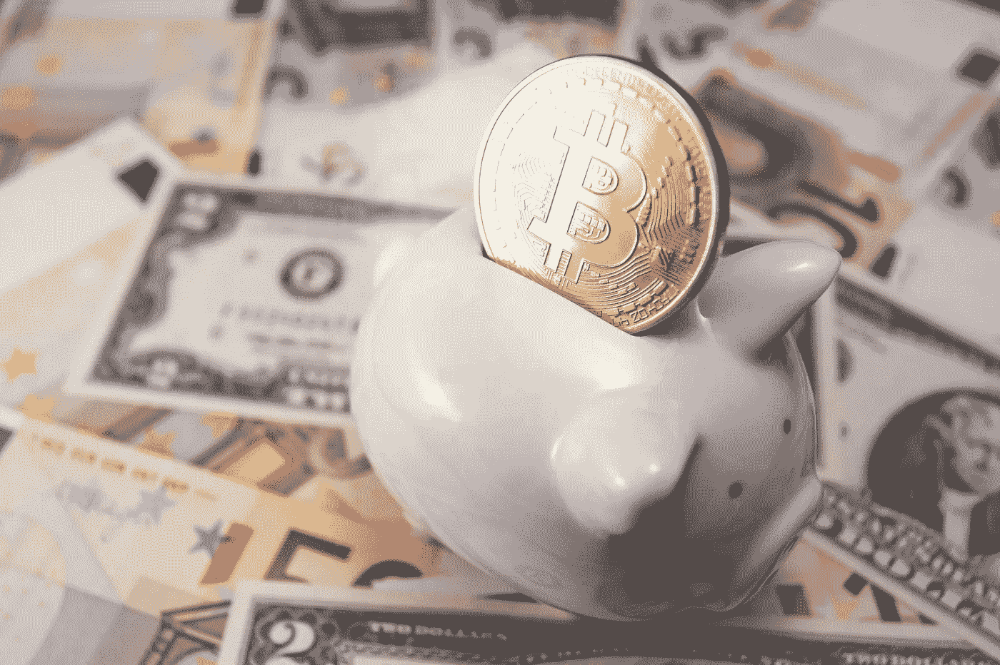
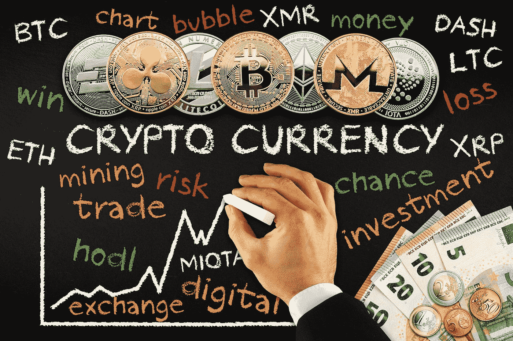

# 除了霍德林，从加密货币中获利的 5 种方式

> 原文：<https://medium.datadriveninvestor.com/5-ways-to-earn-from-cryptocurrencies-besides-hodling-80c578d42d2a?source=collection_archive---------1----------------------->

你们中的许多人可能认为，在密码领域赚钱的唯一方法就是以适当的低价购买一枚硬币，HODL，然后在它到达月球时兑现。

说实话，虽然对一些投资者来说，HODLing 可能已经足够了，但通过加密货币获得丰厚回报的方式还有很多。事实上，取决于你愿意投入多少时间、金钱和精力，这些方法中的一些甚至可能最终为你带来持续可观的收入。

我们列出了一些最受欢迎的…

# 1)采矿

对于法定货币，中央银行通常负责发行新的纸币和硬币。但在 crypto 中，某些加密货币的新单位(使用工作证明(PoW)共识算法的单位，如比特币和以太坊)通过**挖掘**被添加到现有的流通供应中。

这一过程包括将交易捆绑成块，并将它们添加到区块链中，它使用强大的加密技术来确保安全地完成这一过程。进行这一过程，矿工会得到新铸造的硬币作为奖励。好消息是，在大多数情况下，你可以自己完成这个过程。

你需要什么样的硬件来采矿很大程度上取决于你选择的硬币。在某些情况下，消费级计算机中的 CPU 就足够了，而其他人则需要更强大的 GPU。此外，还有像比特币这样需要被称为 ASICs 的专业硬件的产品。

购买这种硬件可能是一笔巨大的支出，并且考虑到采矿过程的高强度，通常会消耗大量的电力。因此，在电价低廉的国家，开采加密货币更有利。也就是说，可能仍然需要几个月甚至几年才能实现盈利，所以最好是挖掘一枚你预计会升值的硬币。

[开采什么](https://whattomine.com/)为目前最有利可图的采矿作业提供了有用的指南。

# 2)空投

甚至这个词本身也让人联想到来自天堂的礼物，空投在此刻风靡一时。基本上，它们是免费的令牌，通常由新项目分配给加密社区。例如，那些在币安交易的人无疑会在 11 月中旬惊喜地看到 500 创(TRX)出现在他们的交易所钱包里。

Tron 空投发生在一个交易所，但更多的时候，空投将需要一个非交易所钱包，如支持该项目的区块链的 ERC-20 钱包(例如，【myetherwallet.com】)。

此外，他们通常会要求你注册该项目的 Telegram 帐户，甚至可能在 Twitter 上关注它，因为你经常会收到关于如何在这些平台上接收空投的进一步指示。也建议注册 Bitcointalk，因为团队成员经常在这个论坛上交流他们的空投指令。

从 airdrop 发行人的角度来看，分发免费硬币是提高项目知名度的有效方式。当然，如果硬币最终反弹，那么最初的空投可能会证明是相当有价值的。

[Airdrops.live](https://airdrops.live/) 和【airdropalert.com 提供了关于提供空投的最新项目的有用信息。

# 3)打桩

对于那些使用某种形式的赌注证明(PoS)共识算法的加密货币，你可以通过下注你持有的硬币来赚钱。这包括把你的硬币放在一个实时钱包里，这个钱包与项目的区块链完全同步，全天候。这样做将有助于确保区块链，从而赢得你的奖励。

Komodo 是一个提供赌注项目的例子，而 Ethereum 打算从 PoW 改为 PoS，这表明它在未来也将提供赌注。

# 4)主节点

正如最近在[另一篇关于 DDI](http://www.datadriveninvestor.com/2018/04/09/a-guide-to-masternodes/) 的文章中所解释的，运行一个或几个主节点可以带来大量的被动收入。这类似于下注，因为要赢得奖励，您必须将您的硬币下注在一个活动的钱包中。

但是当运行 masternode 时，所需的最小硬币数量通常会很大，这意味着您需要大量的初始投资。它还需要一台能够为网络提供近乎连续的正常运行时间的专用服务器。

但作为回报，masternode 奖励可以是巨大的，特别是如果硬币升值，因此有可能提供稳定的被动收入。Dash、PIVX 和 Waltonchain 都是提供 masternode 机会的项目范例。

# 5)支付奖励/股息的 HODLing cryptos

有些硬币只是奖励你持有它们，你甚至不需要不断地把它们放在钱包里。

最好的例子之一就是 NEO。只需将您的 NEO 代币放在您的钱包中，您就可以每天以汽油的形式获得红利，汽油本身就是一种可交易的代币。事实上，有时天然气的价格会超过 NEO 的价格，这表明这些股息在未来可能会非常有价值。

或者，一些交易所创造了自己的硬币，为持有者提供了可观的收益。例如，KuCoin 股票允许持有者每天获得相当于 KuCoin 交易所交易费用 50%的“KuCoin 红利”。

与此同时，币安硬币使你能够在非常受欢迎的币安平台上支付费用，包括兑换费和取款费，并在兑换费上获得大幅折扣。随着时间的推移，BNB 代币的价格也会上涨，因为币安每个季度都会回购 20%的 BNB 代币并烧掉，从而降低流通中的总供应量。

*原载于 2018 年 4 月 7 日*[*【www.datadriveninvestor.com】*](http://www.datadriveninvestor.com/2018/04/07/5-ways-to-earn-from-cryptocurrencies-besides-hodling/)*。*