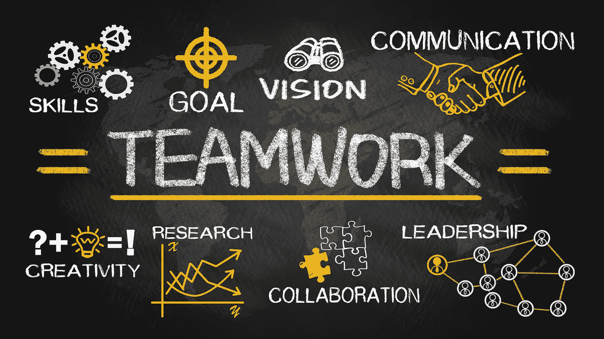

# 提高工程团队的 5 种方法

> 原文：<https://medium.datadriveninvestor.com/5-ways-to-improve-engineering-teams-5fa3557be200?source=collection_archive---------2----------------------->

Teamwork gets faster results

团队合作是工程成功的重要因素。工程师必须在面向团队的环境中出色地完成任务，尤其是在从事大型项目时。

强大的团队合作使工程师能够适应变化，适应多样性，从而提高生产率。

这里有 5 个关于如何建立更强大的工程团队的建议。

# 1 —调整目标

对每个工程师来说，识别和理解团队的目标以设定团队的方向和步伐是至关重要的。

团队的整体愿景和目标必须以可衡量的方式陈述，并与组织的使命、愿景、价值观、目标和目的直接相关。

团队成员应该清楚地知道他们的个人绩效相对于团队绩效的衡量方式。这样，每个团队成员都可以做出决策并朝着商定的目标努力。

# 2 —沟通

在团队成员之间建立并保持开放、诚实和尊重的沟通。工程师总会有不同的想法和方法来解决问题，所以让他们说出自己的想法并被倾听。

每个人都有自己的经验、知识和观点，这些都有助于实现最终目标。允许在创造性的学习环境中进行公开讨论、头脑风暴和思想交流。

记住，工程师对他们的想法和解决方案非常有热情，所以创造一个环境，让想法赢得不是自我。

试着给那些没有发表意见的人留出空间，问问他们是否有什么要补充的。鼓励人们说话并建立相互间的交流，以便更好地合作。

在工程环境中发展团队合作将提高整个团队的生产力，以获得更好的结果和更快地完成任务。

# 3 —提供和请求反馈

无论是作为工程团队的成员还是领导者，都要乐于接受反馈，并在被问到时自由地给出反馈。

有价值且可行的反馈将培养每个团队成员作为个体工作者的技能和知识，并将丰富工程团队的集体专业知识和力量。

提供反馈，表达对团队成员的支持和鼓励，尤其是当他们在完成分配的任务时遇到困难时。

团队中诚实、准确和建设性反馈的交流建立了信任和忠诚，这种信任和忠诚在项目之间传递。

# 4 —创造合作机会

在工程中，将项目分配给团队成员并让他们单独工作是很常见的。但有时，这样做会因为缺乏互动而降低动力。

团队建设活动将有助于发展强大的社会联系和团队合作。安排一些结对编程练习，经常聚在一起进行社交聊天。

创新并尝试引入人们协作的方式，作为他们正常工作流程的一部分，这将提高团队内部的动力和热情。

# 5 —降低复杂性

工程工作需要时间、高度的注意力和精力，以至于工程师们都筋疲力尽了。尽可能地降低代码复杂性、系统复杂性、产品复杂性，尤其是组织复杂性。

保持一切简单易懂。降低复杂性导致建立一个更强的团队环境，特别是对于工程团队。

在与团队合作时，冲突、误解以及个性、信仰和知识的冲突是不可避免的。但是，当工作环境的所有方面都不那么复杂时，所有这些问题都会更容易解决。

可以做很多事情来使你的工程团队更加有效，这些只是需要考虑的一些想法。尝试不同的方法，看看什么适合你。

让你的团队变得更强大，让他们自由交流，运用他们的优势实现共同的目标。团队合作是随着时间的推移和大量的努力发展起来的，以鼓励每个成员搁置分歧，协作和谐地工作。

花时间和精力与你的员工发展团队合作，你会发现它会带来巨大的回报。

如果你是一名寻求改变的工程师，或者是一名招聘经理或人力资源专业人士，希望与专业的工程招聘人员合作，请通过[lance@runtimerec.com](mailto:lance@runtimerec.com)联系我