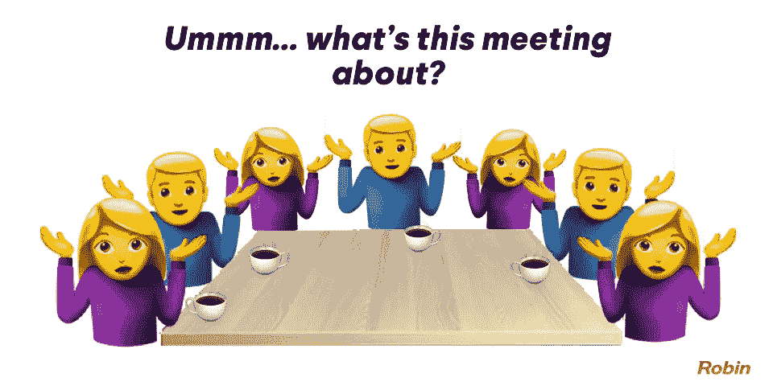

# 提高工作效率的 5 种方法

> 原文：<https://medium.datadriveninvestor.com/5-ways-to-improve-your-productivity-at-work-3767650756a7?source=collection_archive---------3----------------------->

时间是我们最宝贵的财富，我们必须明智地使用它。工作是永无止境的，如果你像我一样，你会发现自己处于电子邮件、会议和实际工作之间的持续战斗中。

下面我分享的技巧是我随着角色的演变和责任的增长而不断实践和学习的。我意识到，为了在这些角色中取得成功，效率和时间管理是关键。没有人会告诉你工作多少小时或者如何管理你的时间。

 [## 跑步摆脱疯狂:锻炼如何提高你的生产力——数据驱动型投资者

### 没有比锻炼更好的方式来开始一天的工作了。我试着一周至少做四天，在…

www.datadriveninvestor.com](https://www.datadriveninvestor.com/2018/10/23/running-to-get-rid-of-the-crazy-how-working-out-increases-your-productivity/) 

# 收件箱零

这是一个游戏改变者。我曾经有大量的规则和不同的文件夹来存放来自不同地区的邮件。让我告诉你一些事情——这是低效的。创建这些规则是耗时的，随着项目和职责的发展，它总是需要更新，最重要的是，它分散了你的注意力，需要你总是跟踪你需要审查的内容，没有有效的方法来区分优先级。

在零收件箱模式下，所有东西都放在一个文件夹里。查看完收件箱后，您就知道自己已经了解了自上次查看以来发生的所有事情。

通常，使用这种方法的人会沉迷于清理收件箱。忍住这种冲动，这是低效且费时的。

当你查看邮件时，想一想——如果你不到两分钟就能回复的话——马上回复，如果没有，就把它移到相关的文件夹里。

image source: [http://thecontextofthings.com/2016/12/30/inbox-zero/](http://thecontextofthings.com/2016/12/30/inbox-zero/)

# 将你的邮件整理成 5 个简单的文件夹

我第一次使用这种方法是在我读了马特·莫查里的必读之书之后，他是的伟大 CEO，我把我对这本书的看法加了进去。

当您查看收件箱时，请使用以下文件夹对您的电子邮件进行分类

**收件箱** —这基本上是你的电子邮件队列，默认情况下，所有的电子邮件都会进入这个文件夹，直到你查看并把它们分发到相关的文件夹。

**完成—** 这个文件夹代表所有不需要你做任何进一步操作的邮件，它们被移到那里只是为了存档**。**

**下一步行动** —此文件夹包含所有需要您关注的项目，完成这些项目需要几分钟以上的时间。这可能包括需要通读的长邮件、客户请求、经理/员工提问、你自己的职责等。因为这个文件夹本质上是你的任务列表，你也应该优先考虑它，以确保你处理最紧急和最重要的项目。

等待—此文件夹包含等待其他人完成的所有项目，例如，您向某人发送包含行动项目或反馈的电子邮件，并等待他们的回复。

**某一天** —这个文件夹包含了所有你想参加的项目，但是，它们并不紧急。

# 使用跟踪工具在一个位置组织您的任务

你必须对你的所有任务有一个统一的看法——我建议使用 [Onenote](https://www.onenote.com/) 或 [Trello](https://trello.com/en) 。

用和你的邮件一样的模式来安排你的任务，整合你盘子里的所有任务——

**下一步行动**——你清单上的所有项目，分成包括工作和生活任务的子区域。

*   *工作项目* —所有与工作相关的行动，你甚至可以将它们分成子区域，以避免长长的清单。
*   *首页* —你所有的个人任务

**待定于** —您正在等待其他人完成的所有项目。

**有朝一日** —可以定义为路线图的项目，可以阅读的有趣文章等。

## 阻止您的日历

这里有一些插槽应该是你一整天的锚—

*   **收件箱查看** **时间** —我建议每天查看两次邮件——早上和午饭后。创建 15/30 分钟的时间段。
*   工作时间——如此简单，却又如此困难。我们处理如此多的任务和会议，以至于我们忘记分配时间来准备这些会议和关注我们的议程。这可能会导致你为了按时完成那些你实际上需要做的事情而产生压力，你会发现自己为了弥补失去的时间而熬夜。我发现这是最难保持的一次会议，我建议继续这样做——首先在早上(或下午，任何你觉得最有效率的时间)开两次两小时的定期会议，专门回顾和完成你的任务。3 周后，进展到 3 次，以此类推。你会发现这将极大地提高你的工作效率。

## 减少会议时间，明确会议议程

你有没有发现自己在一周的开始，看着你的日历，在你甚至有机会计划你需要实现的事情之前，看到它充满了会议？如果你有，使用以下规则—

*   **减少会议时间** —人们倾向于安排一个小时的会议，以确保涵盖所有事项。99%的时候，整整一个小时是没有理由的。力争你日历中的大多数会议不超过 45 分钟。我的判断如下——如果是 4 人或更少人参加的会议，安排在 30 分钟，如果更多，安排在 45 分钟。当然，运用你对相关话题的判断。这条规则是双向的——适用于您安排的会议和您被邀请参加的会议。
*   **会议议程**–每次会议都应该有一个目的，并清楚地了解会议的结果。当你安排一次会议时，确保你指定了你想要讨论和达成的目标。此外，如果你想让其他人为会议准备具体的事项，在会议议程中提出来——这样可以设定明确的期望。此外，请你的同事也这样做，这将创造清晰度，减少不必要的会议。

image source: [https://robinpowered.com/blog/bad-meetings-how-to-avoid-manage/](https://robinpowered.com/blog/bad-meetings-how-to-avoid-manage/)

应用这些规则极大地提高了我的工作效率，改善了我的工作生活平衡。毕竟，关键不在于你工作了多少个小时，而在于你如何度过这些时间。