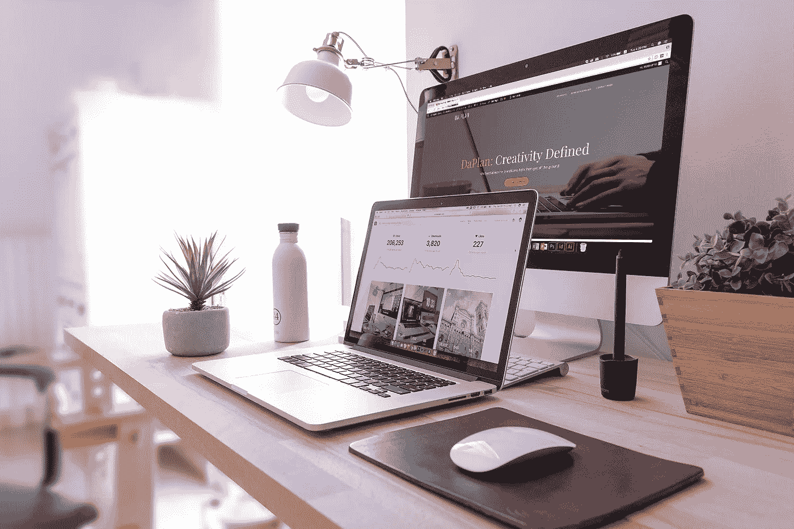

# 创业公司现在可以做的 5 个网站提示

> 原文：<https://medium.datadriveninvestor.com/5-web-design-tips-for-startups-e1843747733?source=collection_archive---------3----------------------->

在数字时代，公司网站对于你的受众了解你的品牌、故事或产品至关重要。处于科技行业的最前沿，初创公司如果想受到重视或获得资金，就需要展现出精明而专业的形象。但是你如何实现这种感知形象呢？

幸运的是，在为初创公司或小型企业建立网站的初始阶段，你可以做一些简单的事情。

这里有 5 个设计网站时可以使用的技巧。

# 1.创建响应式网页设计(手机友好)

近年来，越来越多的趋势是让网站在不同设备上更容易访问，尤其是在移动设备上。谷歌早在 2015 年就首次推出了他们的“[移动优先](https://techcrunch.com/2018/03/26/google-begins-to-roll-out-its-mobile-first-index/)计划，拥有一个移动友好网站将会影响你的 SEO 排名。据谷歌称，大多数人会在手机上进行搜索，以找到他们想要的东西。

观众可能会在手机上找到你的网站，但后来决定在桌面上找到更多。因此，让你的网站在各种设备上漂亮地运行是很重要的。

幸运的是，像 WordPress 这样的 CMS 系统有很多主题可供选择。这些主题通常可以根据您的需求定制，并且大多响应迅速。当你的资源有限的时候，这使得创业或小企业更容易和负担得起。

但是，您也应该考虑用户体验。因为响应式设计本质上是改变内容以流畅地适应设备窗口，所以当它改变时，你需要特别注意设计的视觉层次。记得在桌面和不同的移动设备上检查你的网站，以确保它看起来没问题。

# 2.与你的品牌颜色保持一致

我们观察到的一个常见错误是，许多初创企业(或小企业)选择的颜色并不一致。你可能会惊讶，仍然有许多设计糟糕的[网站](https://www.webimp.com.sg/blog/2016/04/5-badly-designed-websites-in-singapore/)。

你的品牌颜色应该代表你的品牌，你希望人们把这些颜色和你的公司联系起来，让他们觉得你的公司在传达一种一致的信息。例如，在 [DaPlan 的网站](http://www.daplan.co/)上，我们仅在一些我们希望访问者注意的地方使用我们的主导品牌颜色，例如我们的 CTA。

在某些情况下，您可能需要更多的颜色来使网站更加生动，或者突出网站的某些部分，如 CTA 按钮或不同的部分。如果你需要扩展你的配色方案，试着为你的网站使用相同的色调或互补色。您可以使用 [Adobe 颜色工具](https://color.adobe.com/create/color-wheel/)来帮助您决定哪些颜色是合适的。

# 3.网站导航

当你的观众访问你的网站时，考虑用户体验。你的观众会希望尽可能快而容易地找到他们正在寻找的信息。因此，在设计网站之前，规划和构建网站架构是非常重要的。

我们建议创建一个网站地图列表，这样你就会知道你有什么样的内容，你应该如何对它们进行分类。你也可以做一个简单的[卡片分类](https://www.usability.gov/how-to-and-tools/methods/card-sorting.html) UX 研究，帮助你了解用户的期望，以便更好地构建你的网站结构。

# 4.让你的网站脱颖而出

让你的网站脱颖而出的一个方法是限制内容，精炼文字。俗话说“一张图片胜过千言万语”——尤其是在情感层面的交流上。在任何你认为相关和可能的地方使用高质量的吸引人的视觉效果。

在文本较多的部分(比如博客)，要更加重视空白和文本层次。它会给人一种干净整洁的感觉，也更容易让观众阅读。

另一种方法是选择一种对你的品牌来说不常见的配色方案。但是，一定要注意选择的颜色应该代表你的品牌形象，而不仅仅是为了与众不同。你也可以参考我们的文章[创业品牌提示:创业标志设计指南](http://www.daplan.co/resources/startup-branding-tips-a-logo-design-guide-for-startups/)，了解更多关于标志设计或选择什么颜色。

# 5.优化了媒体元素

当你添加更多的媒体元素，如大图片或视频，以使你的网站脱颖而出，它可能会减慢你的网站的加载速度。

谷歌认为网站加载速度是排名因素之一。所以一定要记得优化媒体元素，这样它们就不会降低网站的加载速度，影响用户体验。JPEG 是图像格式的最佳选择，但有些浏览器不支持 PNG。

通常，我们会使用 Photoshop 来减小文件大小。但是，如果您没有访问该软件的权限，您可以使用这个在线工具 [TinyPNG](https://tinypng.com/) 来帮助减小文件大小，而不会降低分辨率。

# 额外收获:选择你的社交媒体

每个人都在脸书，Instagram，YouTube，Telegram 和 Twitter 上，所以你应该让他们接触他们，对不对？不一定。

你应该选择使用哪种社交媒体。研究你的受众在什么社交平台上，这种参与方式是否适合你的品牌。俗话说，媒介就是信息。

此外，如果你没有足够的资源或内容来持续与你的观众互动，那么建立一个社交媒体档案并将你的目标客户链接到所述页面只是为了看到一个死亡或被忽视的社交媒体流是没有意义的。

拥有正确的渠道将有助于增加你网站的流量，提高你的品牌知名度。

我对新创企业的建议是，首先把你的社交媒体链接放在页脚。如果你还做不到，就不要给人留下你正在努力经营社交媒体的印象。

# 现在你说了算。

希望这些建议能给你一些改进网站的想法。初创企业和小企业关注他们的网站很重要，因为这可能是新客户了解你的品牌的最佳方式。

如果你需要帮助，为你的初创公司创建一个定制的专业网站或标志，[点击这里](http://www.daplan.co/contact-page/)看看我们如何共同努力建立一个令人敬畏的品牌。

DaPlan 是一家总部位于新加坡的创意设计机构，专注于以视觉为中心的品牌建设。我们建立令人敬畏的品牌，并帮助他们起步。