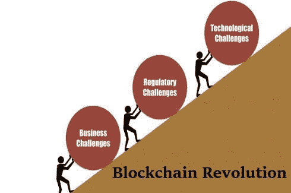
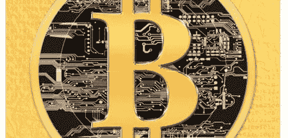

# 5.区块链面临的挑战是什么？

> 原文：<https://medium.datadriveninvestor.com/5-what-are-the-challenges-with-blockchain-6b9e51cec4a4?source=collection_archive---------26----------------------->

读: [1。为什么是区块链？](https://medium.com/@arvindvairavan/1-why-blockchain-a00012d328a7)

[2。什么是区块链？](https://medium.com/@arvindvairavan/2-what-is-blockchain-87e7a8932394)

[3。钱是什么？](https://medium.com/@arvindvairavan/3-what-is-mone-923ade1f41e8)

[4。区块链是如何运作的？](https://medium.com/@arvindvairavan/4-how-blockchain-works-947dc8124e35)

**区块链如何防范欺诈？**
节点用以前的链接解决数学问题现有的事务。如果与以前的事务有有限链接的新节点加入网络，将被视为无效。只有较长的链接将成为区块链 ie 验证块的一部分。提供安全性和稳定性。在上一篇文章中，这被解释为工作证明，然后还提到了另一种算法 Stake 证明。这些算法不能提供 100%的安全性，但是它们使得攻击者非常难以攻击，从而降低了攻击的可能性。

由于各种原因，未来可能会有来自政府、经济学家和公众的对区块链的完全反对，就像过去的每一次分裂一样。这可能不会太远。黑客攻击仍在继续发生。在一定程度上，反对和攻击都是权衡区块链利益和加强安全措施的必要手段。任何事物都是在错误、尝试和错误中发展的。

需要解决的几个**挑战**:

1.交易可以匿名发送和接收。虽然这保护了用户的隐私，但也为网络上的非法活动提供了空间，因为监管机构无法跟踪用户的身份。

2.尽管加密货币和区块链技术越来越受欢迎，但用它们交换商品和服务仍然不容易。

3.加密货币非常不稳定，受加密货币行业大型事件或公告的影响。

4.由于没有适当的监管，违约者的骗局和洗钱太多了。不知情的投资者希望将区块链作为一个快速致富的计划，投资于没有产品或真实团队工作的欺诈加密货币。

5.这项技术仍处于初级阶段。在提供更广泛的功能、工具和服务的同时，区块链的安全性和稳定性也在快速增长和发展。

6.区块链技术无法扩展，也不是均匀分布的。区块链技术需要超越互联网，不能在一个受控的空间上运行。

7.太多的服务声称使用区块链技术，但实际上并不需要。

8.区块链技术并没有真正去中心化，仍然有集中的交易所和控制一切的矿工。

9.区块链分配财富很差。将可编程资金直接发放给网络捐助者的可能性。

10.还没有一个杀手级的应用能让人们大规模地采用区块链技术。人类已经进化出分享故事和合作的能力，区块链技术需要成为一个分散的平台，让人类创造和传播信息。

在人类历史上每一个与技术相关的时代，我们都找到了解决现有问题的方法，但最终却发现这个方法有许多无法预见的问题。人们认为，从以马为基础的交通工具转向以柴油为基础的汽车将会减少马粪的数量，这是一个主要的担忧。现在，我们正处于一个向电动汽车迈进的时代，因为我们不断造成环境破坏。

被称为互联网 2.0 的区块链同样试图解决互联网 1.0 的预期——民主化访问。也就是说，区块链不是一步到位的解决方案。它今天面临一系列挑战，未来还会面临更多挑战。从长远来看，在没有强有力的中间人的情况下，人类组织如何更好地发挥作用，区块链提供的是一个进步。可信系统之上的不可信系统。

总的来说，凭借其去中心化和保持网络上匿名人之间信任的能力，区块链技术有可能彻底改变一些利用网络效应的行业，如治理、银行和能源分配。

[earn.com/dnivrav](http://earn.com/dnivrav)

*图片致谢* : [中等](https://medium.com/energy-premier-blog/what-are-the-opportunities-and-challenges-of-the-blockchain-technology-5c1a1793b104)，[哈希甘斯](https://www.hashgains.com/blog/6-challenges-blockchain-revolution/)，[挑战](https://www.challenges.fr/finance-et-marche/blockchain-la-revolution-qui-secoue-le-monde-de-la-finance_13483)