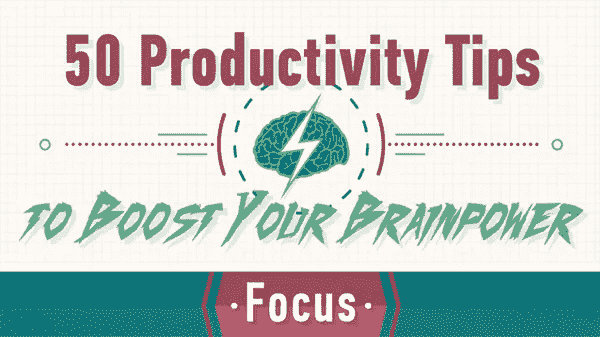
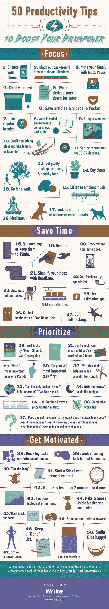

# 提高个人生产力的 50 种方法

> 原文：<https://medium.datadriveninvestor.com/50-ways-to-improve-personal-productivity-580678aa45b4?source=collection_archive---------20----------------------->

在教练博客——世界领先的领导力和教练博客之一，我们经常发布主要作者和权威的文章——今天我们很高兴发布 Brandon Gaille 的文章。

不管你从事什么职业，也不管你从事什么工作，总有一些改进的空间。你应该齐心协力提高你的生产力。生产力可以是你花在任务上的时间，所以你可以早点完成任务，把剩下的时间用在其他任务上。你可能同时做这项工作，但结果可能更好。可能两者都有。你可以节省时间，做得比其他方式更好。这里有一个简单而有效的方法让你更有效率。

**1)排除一切杂念。**
你需要专注才能更有效率。当你的手机嗡嗡作响，有电子邮件和社交媒体通知时，当你的屏幕上有弹出窗口时，或者即使你面前有太多事情，你也无法集中注意力。关闭不必要的标签或浏览器，关闭你不需要的文件，保持你的桌子干净，试着一次做一件事。多任务处理是一项技能，但并不总是必要的属性。一次专注于一项任务可能会在更短的时间内带来更好的质量。

拥有一个愉快的工作环境。如果你想更有效率，你不能身体不舒服、情绪低落或有压力。睡得好，吃得健康，在你最舒服的地方锻炼和工作。你工作的地方或任何你在的地方的温度应该是最佳的。你应该休息，至少每隔 90 分钟休息一次，如果不是更早的话。你应该试着在不同的地方工作，让事情保持有趣。尝试公共场所，公园，咖啡馆，你的家，显然还有你的工作场所。

充分利用你的时间。
尽量利用手头的大部分时间。不要延长会议时间，不要在不值得的事情上花费更多的时间，有一个整洁有序的时间表，严格控制时间。知道你什么时候在做什么，你应该能够计算你工作日的每一分钟，以了解你是否足够高效。

将你的任务分组。总是试着一个接一个地做同一类型的任务。当你需要做出实质性的改变时，大脑需要一段时间来适应新任务的要求。根据你早上的感觉，你可能想在头几个小时做最难的事情，然后再做容易的事情，反之亦然。

点击此处阅读更多内容，不要忘记订阅我的教练博客网站以获得免费教练报告:[https://www . coaching-blog . com/50-ways-to-improve-personal-productivity/](https://www.coaching-blog.com/50-ways-to-improve-personal-productivity/)

请访问我们的网站，订阅免费的教练杂志:【http://www.international-coaching-news.net/ 

最初[在这里发表。](https://brandongaille.com/50-ways-to-improve-personal-productivity/)