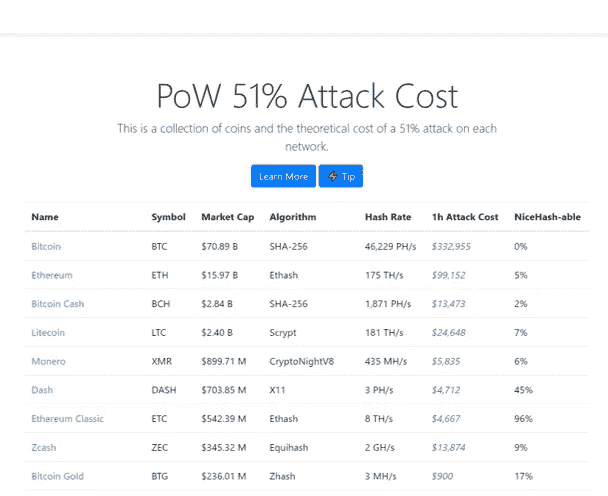

# 区块链能承受 51%的攻击吗？

> 原文：<https://medium.datadriveninvestor.com/51-attacks-are-happening-more-frequently-2400ffe42c4f?source=collection_archive---------15----------------------->

## 了解漏洞、最近 51%的攻击和潜在的补救措施

不幸的是，51%的攻击变得越来越普遍。事实上，一个正在以太坊经典网络上发生。几乎所有的区块链文献都提到 51%的攻击是一个漏洞，但是，这种情况发生的几率非常低，甚至几乎没有。

> 然而，当 51%的攻击实际发生时，会发生什么呢？有什么保障措施吗？比特币或任何加密货币是如何免受这种攻击的？

让我们深入了解一下。

对于区块链技术的 30 分钟快速概述，你可以在这里查看我的另一篇文章。

 [## 区块链是商业的未来，未来就在这里！

### 理解为什么区块链被预言将改变每一个行业和世界

medium.com](https://medium.com/techemerge/blockchain-is-the-future-of-business-and-the-future-is-here-f3ad0932d3e0) 

# 51%的攻击—是什么？

## 区块链和分布式账本

比特币和其他加密货币背后的底层技术是区块链。顾名思义，数据块(事务)以密码方式按顺序链接起来，形成区块链。它是记录交易的分类账。此外，分类帐由许多节点或参与者以分布式方式维护，所有这些节点(或参与者或实例)之间的数据使用加密技术始终保持同步。

## 多数获胜

现在，如果一个节点或几个节点(无论是否愿意)显示与网络中其他节点不同的数据，网络协议将确保只有一个版本(真实版本)有效，并且始终与所有节点保持同步。并且网络被设计成通过多数规则挑选真实版本，例如，与网络的大多数节点找到或匹配或同步的数据版本被认为是真实的。

现在，51%简单地表示大多数或超过 50%，其中漏洞是大多数节点攻击网络的场景。假设大多数节点串通在一起(可能由同一个实体控制等)，然后操纵或破坏整个网络，使其对自己有利。网络的其余部分，少数人，被迫接受腐败或错误的版本，只是因为技术协议是这样建立的——在有差异的情况下，强制以多数人的版本为准。请注意，这里的关键是，大多数“51%”或更多的人同时拥有一个完全相同的分类帐版本，无论是否对他们有利，然后成为网络中的大多数版本。

## 51%的攻击概率非常低

自比特币白皮书和许多其他区块链文献以来，这一漏洞一直被解释为概率上的罕见事件，因为在任何这种流行的分布式网络中仍有数千或数百万个节点，这种情况只是偶然发生的概率非常非常小——请注意，不仅大多数节点有不同版本的分类帐，而且所有这些版本实际上都需要相互匹配才能成为大多数版本。因此，51%的攻击只是偶然发生的概率非常低。

然而，如果 51%的节点串通在一起，或者归同一个实体所有，然后谁愿意操纵网络呢？然而，理论上这是可能的，一旦网络是一个大网络——像比特币或以太坊——有非常大量的活动节点，这就变得实际上不可行了。

## 有哪些保障措施？

在这种情况下，无论其余参与者是否知道，控制 51%或更多节点的多数实体将能够完全控制区块链并操纵其利益。例如，他们可以使用代币进行购买，然后在分类帐上撤销交易，再次使用相同的代币。

如果它真的发生了，有什么技术保护措施来防止它吗？不幸的是没有。一旦这种情况发生，在区块链技术中没有什么可以阻止这种操纵。区块链国内没有建立任何保障措施来扭转这种局面。

然而，少数人或更广泛的社区可以做出反应，获得更多的节点或购买更多的计算能力，以将腐败的多数人再次减少为少数人，并停止劫持。

# 51%的攻击比想象中更常见

仅去年一年就有 51%的攻击使这成为一种真正的威胁，而不再仅仅是理论上的担忧。此外，以太坊经典区块链目前受到了 51%的高调攻击，这使这个问题成为最重要的问题。

## [Ghash。2014 年 7 月)](https://en.wikipedia.org/wiki/Ghash.io)

2014 年 7 月，热门矿池 GHash。IO 超过了比特币网络中的 51%阈值。这迫使比特币社区想出了临时措施。GHash。IO 自愿承诺不超过整体比特币散列率的 39.99%，并要求其他矿池为了整个比特币社区着想，效仿它们的做法。讨论还导致了成立一个委员会的提议——包括矿池、比特币企业和该领域其他专家的代表——以作为对 51%问题的监督机构。

## [the Verge(2018 年 5 月)](https://globalcoinreport.com/verge-xvg-susceptible-to-another-51-attack-here-is-what-you-need-to-know/)

边缘(XVG)已经屈服于 51%的攻击。据报道，一名黑客设法欺骗了 Verge 协议，并获得了 51%的网络控制权。然后轻而易举地开采了 XVG，并带走了价值超过 100 万美元的 XVG。

## [比特币黄金(2018 年 5 月)](http://fortune.com/2018/05/29/bitcoin-gold-hack/)

比特币的一个鲜为人知的分支在 51%攻击中利用超强的计算能力被黑客攻击，伪造账本，从在线交易所诈骗至少 1800 万美元。

## [Zen cash(2018 年 6 月)](https://www.crowdfundinsider.com/2018/06/134560-zencash-cryptocurrency-hacked-in-51-attack/)

ZClassic 和 Zcash 的一个分支在黑客获得多数控制权仅 4 小时后就被黑客攻击，理论上他花费了大约 3 万美元，然后操纵账本窃取了价值 55 万美元的硬币。

## [以太坊经典(2019 年 1 月)](https://blog.coinbase.com/ethereum-classic-etc-is-currently-being-51-attacked-33be13ce32de)

据《比特币基地》报道，1 月 5 日，以太坊经典区块链发现了一个深度连锁重组和双重消费。截至昨天 1 月 7 日，比特币基地进一步更新了对总共 15 起此类重组的检测，包括 12 起重复支出，总计 219，500 欧元等，或截至昨天近 110 万美元的被盗资金。

# 51%攻击的成本效益分析

通过像 [NiceHash](https://www.nicehash.com/) 这样的市场和其他类似的提供商的即时可扩展的云计算能力，快速组装挖掘能力或节点变得越来越容易。

从另一个角度来看，绝大多数比特币矿工都在中国，因为那里的电力更便宜，然而，这也增加了采矿力量在地理和国家上集中的风险，在任何不幸的情况下，这些力量都可能被滥用来制造类似的攻击。

Crypto51 发表了他们关于一个人需要花费多少才能获得足够的计算能力以成为流行加密货币的 51%多数的研究。你可以在这里查看他们的研究和完整列表。

请注意，比特币网络的 1 小时攻击成本相当高，为 332，955 美元，对于较小的网络，成本下降得相当快。

根据这项研究，以太坊经典，目前被黑客攻击的网络，每小时花费约 4667 美元，因此，每天大约 112000 美元。据报道，黑客在 3 天内赚了近 110 万美元，因此，与成本相比，收益肯定更高。

1HourAttackCost, source: [Crypto51](https://www.crypto51.app/)

# 如何防止 51%的攻击？

如前所述，技术或架构中没有内置的解决方案。目前仍有一些想法，但是，很明显，网络，尤其是较小的网络，更容易受到这种接管和操纵。一些比较突出的想法是—

## [合并开采](https://www.cryptocompare.com/mining/guides/what-is-merged-mining-bitcoin-namecoin-litecoin-dogecoin/)

较小的货币通常有较少的用户和节点，因此，更容易获得 51%的多数和攻击。这个想法是将较小货币的开采与较大的、更成熟的货币结合起来，使它们不那么脆弱。

## [对延迟封锁的处罚](https://www.coindesk.com/a-solution-to-cryptos-51-attack-fine-miners-before-it-happens)

为了提高攻击的成本并进一步减少攻击的动机，被延迟封锁的矿工会受到惩罚或罚款。Horizen 的架构只允许这种惩罚发生在矿工是恶意的时候。

## 公证节点服务

独立于网络的互操作服务提供商在网络和协议内建立公证节点。这些公证节点验证所有交易，因此，防止任何明显的劫持或检测到 51%的攻击。看看[科莫多](https://komodoplatform.com/)。然而，这违背了加密货币或区块链网络的去中介化哲学。

## 被许可的区块链

同样，许多比特币纯粹主义者不同意许可区块链的想法，然而，如果任何网络都是通过许可来管理的，因此，用户的已知身份，防止 51%攻击就成为一个可以轻松实现的治理讨论。

虽然还有更多想法，但重要的是，是否有任何流行的加密货币平台正在实施任何解决方案，以防止 51%的攻击。

# 结论

如果说历史告诉了我们什么的话，那就是当技术驱动的系统在过去形成时，我们已经看到了类似的灾难，包括全球金融系统。

例如，1974 年德国科隆市的 [Herstatt Bank](https://en.wikipedia.org/wiki/Herstatt_Bank) 破产，这一著名事件说明了国际金融中的结算风险，导致全球采取了一系列措施，包括成立巴塞尔银行监管委员会，该委员会由中央银行和监管机构的代表组成，以帮助寻找避免未来此类风险的方法。它还催生了技术标准，如 [CLS 或连续关联结算](https://en.wikipedia.org/wiki/CLS_Group)，降低了与多支外汇交易相关的结算风险。

甚至追溯到 200 多年前，当市场领导者聚集在一起起草共同的规则时，纽约证券交易所就成立了。

我们仍然处于区块链和加密货币技术的早期。这些 51%的攻击变得越来越频繁——挑战货币和区块链技术的合法性。知名网络应注意并带头寻找、实施解决方案来防止/减轻此类攻击。

你觉得怎么样？你有什么建议我们加入讨论吗？如果您需要任何澄清或补充信息，请随时询问。你可以通过[邮箱](mailto:som.bando@outlook.com)、 [LinkedIn](https://www.linkedin.com/in/sombando/) 或 [Twitter](https://twitter.com/sombando) 联系我。

感谢阅读。如果你喜欢这篇文章，请随意点赞或分享，这样其他人也能找到它。