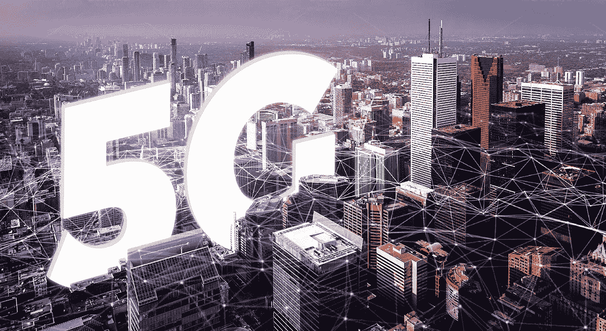

# 5G 未来:新一代的可能性

> 原文：<https://medium.datadriveninvestor.com/5g-future-a-new-generation-of-possibilities-10df41522b29?source=collection_archive---------4----------------------->

我仍然记得移动网络的每一代都提供了一些不同的东西，一些新的东西，并让我们(包括我自己)想知道即将发生什么。

**1G** 还是第一代移动网络是模拟技术；以巨大的能量消耗为特点。当然，我们可以打语音电话，但质量很差，不存在安全问题，考虑到它的速度，我们真的没有太多别的希望。

 [## 2019 年移动应用开发之路|数据驱动的投资者

### 任何在移动应用程序开发行业工作的人，无论他们是专注于在伦敦开发 iOS 应用程序还是…

www.datadriveninvestor.com](https://www.datadriveninvestor.com/2019/01/15/the-path-of-mobile-app-development-in-2019/) 

**2G** 无疑是对 1G 的大规模升级，因为它是从模拟到数字的转变——这一努力旨在确保更可靠和安全的通信渠道。不仅如此，2G 还让位于短信、电话会议和漫游等功能。

**3G** 负责我们所有人期望从我们的移动网络中获得的大多数功能，并且今天在全球各地都很常见。网络浏览、电子邮件、数据共享、即时通讯等等都成为了一种全球现象。这一代人还见证了流媒体服务的崛起。

4G 带来了全新的技术，就像从 1G 到 2G 的飞跃。突然间，我们拥有了高速度、高容量和增强的安全性，能够交付云计算、3D 娱乐、电话、移动支付等各种应用，而且没有任何妥协。

然而，我们正处于移动网络新时代的风口浪尖。被誉为本世纪最激动人心的突破之一，我们正处于某种神奇事物的黎明，这种事物将改变我们的旅行方式、交流方式、娱乐方式和商业方式。

5G 技术承诺不仅仅是下一代，而是一个新的历史点；一个能够创造一个互联世界的未来的时代，这是我们无法想象的。

出于对那会是什么样子的好奇，我收集了一些令人难以置信的用例以及功能展示。下面的视频证明了 5G 速度在延迟方面如何优于 4G。给你个提示，19 毫秒可以改变一切！

但是商业呢？让我们来看看这种卓越的网络将如何帮助大大小小的企业创造新的服务，交付新的创新产品，并在互联汽车、智能制造、互联能源、无线电子医疗、智能城市等领域实现效率和可能性。

可能性似乎是无限的，引领我们进入一个曾经被认为只有在电影中才有可能的世界。但这不是小说；这是我们正在快速逼近的现实。云虚拟现实和增强现实已经准备好颠覆娱乐世界，但程度如何还很难想象。

以下是我们如何度过空闲时间的一瞥。

如果你认为只有娱乐圈会从这一飞跃中受益，那你就错了。让我们看看这项技术的主要参与者之一如何设想让 5G 网络成为商业现实。

我们已经进入了兔子洞，并且正在观察一个看似不同的宇宙，一个不可能变得越来越难发现的宇宙。就目前的情况来看，我们仅仅是对这项惊人技术的皮毛。前进的唯一限制将是我们的集体想象力。我认为 5G 是我们一直在等待的魔杖。

(首次发表于 [mobileLIVE perspectives](https://perspectives.mobilelive.ca/blog/5g-spectrum) )