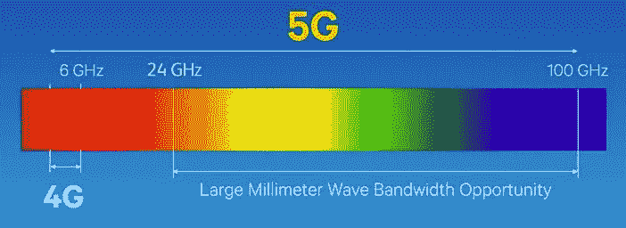

# 5G 毫米波初创公司值得关注

> 原文：<https://medium.datadriveninvestor.com/5g-mmwave-startups-to-watch-c2fc6e7044a6?source=collection_archive---------4----------------------->

这比电信业 10 年前最初计划的时间要早，但 5G 将于 2019 年开始在美国部署(以及许多其他国家)。甚至在 10 年前，对于街上的普通人来说，以无线方式达到 1 Gbps 的想法是可笑的。想象一下，当高通现在报告的典型速度为 1.4 Gbps 时，他们会作何反应！你没看错，1.4 Gbps。

> 客观地说:传输一个高清视频所需的最低带宽约为 5 Mbps，因此使用毫米波可以同时传输近 300 部电影。

我们看到了大公司的一些重大动作:Sprint 和 LG 已经签署了一项协议，在美国提供首款支持 5G 的智能手机；T-Mobile 和爱立信签署了一项 35 亿美元的协议，让 T-Mobile 使用爱立信的 5G 新无线电技术来升级 T-Mobile 网络，使其适应未来。

尽管速度大幅提升，毫米波仍有许多不足之处。顾名思义，毫米波使用非常高的频率，这意味着波长非常短(毫米)。波长越短，波越难穿过物体。在毫米波的情况下，普通物体，如一棵树，甚至一个人的身体，都可能严重阻碍信号。当没有人希望他们的日常 Instagram 浏览仅仅因为他们走进一栋大楼而被打断时，这听起来像是一个大问题！这导致了称为波束形成的技术的进一步发展，该技术通过使用多个天线和有策略地从物体反射信号来帮助缓解其中的一些问题。然而，未来仍有许多挑战，不仅是波束成形，还有 5G 的其他领域，这为大量商机的出现开辟了道路。

**下面是一些令人兴奋的 5G 初创公司。**

1.  [T5【莫凡迪】T6](http://movandi.com)。这家纽波特比奇初创公司已经筹集了 5230 万美元，正在开发完全集成的 RF 前端系统，以支持从基站、小蜂窝到移动接入点的广泛应用。通过将其 RF 前端系统与专有波束形成软件相集成，Movandi 正在寻求积极解决毫米波信号干扰问题。
2.  [**Phazr**](http://phazr.net) 。该行业资深团队创建了一个虚拟化无线电接入网络(vRAN ),该网络将毫米波频谱用于下行链路，而将低于 6 GHz 的频谱用于上行链路。这有什么关系？首先，毫米波频谱的战争相当激烈(事实上，Sprint 在十年前收购 WiMAX 频谱时获得了一笔意外之财，导致数十亿美元的损失，但意外地给 Sprint 留下了今天非常需要的频谱)。第二，这将平滑过渡到毫米波。大多数情况下，我们不需要在上行链路的毫米波频谱中。通过使用低于 6 GHz 的频谱，Phazr 至少可以消除上行链路中与毫米波相关的许多问题，直到这些问题得到解决。事实上，Phazr 的价值主张已经引起了美国两家最大的移动服务提供商的注意，据报道，威瑞森和 C Spire 已经要求测试 Phazr 的系统。
3.  [**枢纽通信器**](https://pivotalcommware.com/) 。Pivotal Commware 正在开发其专有的全息波束形成(HBF)技术，将波束形成提升到了一个新的水平。与在每个设备上放置扬声器相比，Pivotal Commware 的 HBF 技术由低成本、低功耗的软件定义天线提供动力。HBF 有什么不同？它动态地调整波束的形状和方向，允许频率在*相邻波束中*重复使用*，而不会相互干扰*！这项技术如此令人印象深刻，以至于比尔·盖茨是它的支持者之一。预计 Pivotal Commware 的 HBF 将在未来几个月投入商用。

有问题或意见吗？我很乐意连接！请在推特(@jjoshkim)上联系我，我会尽快回复！