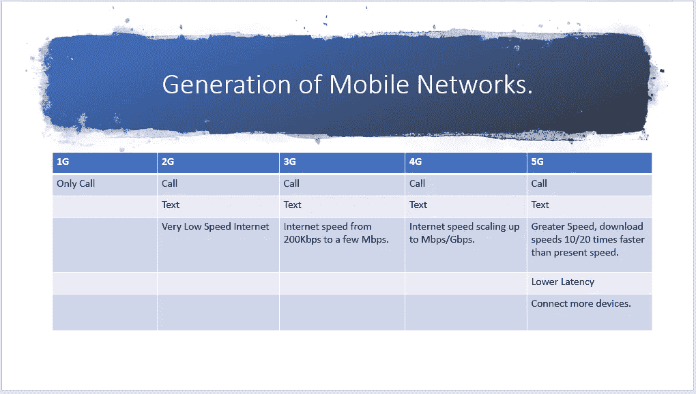
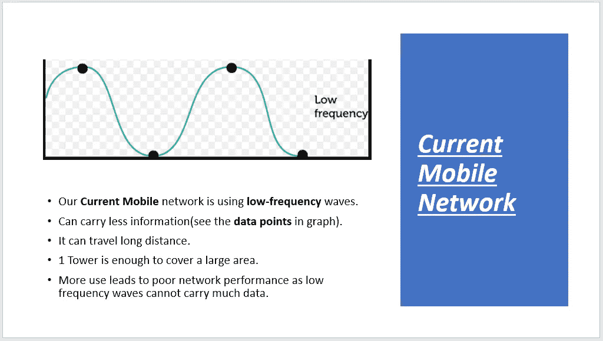
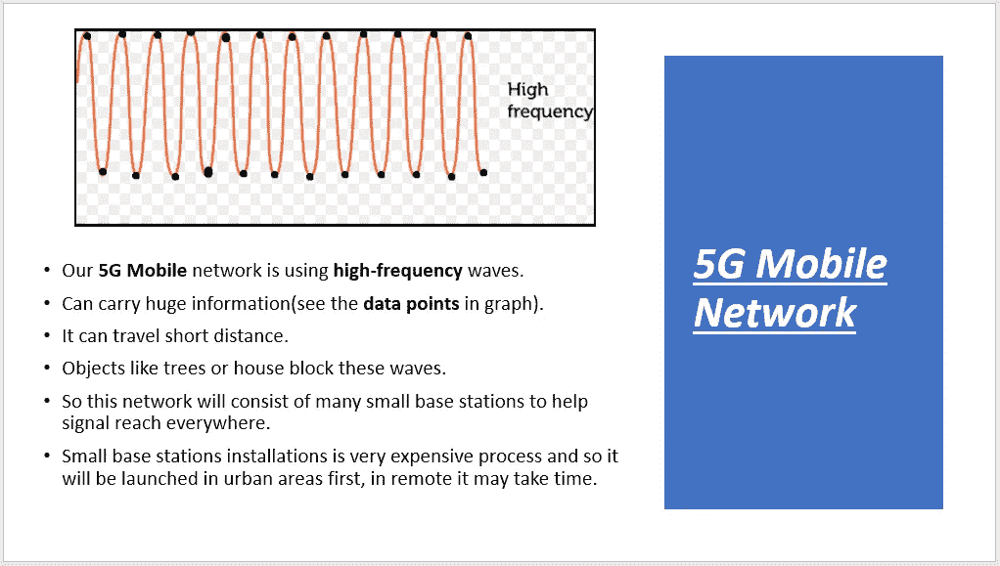
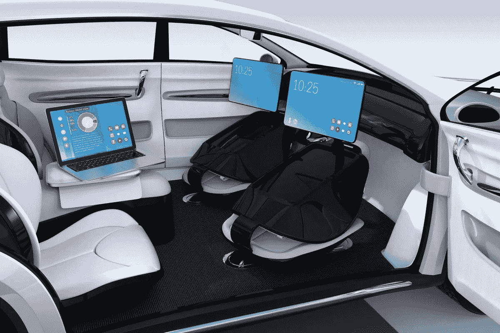
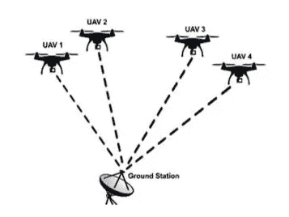
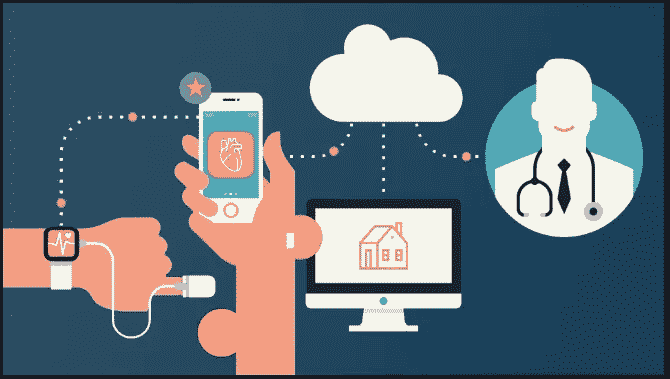

# 5 个简单点的 5G 技术。

> 原文：<https://medium.datadriveninvestor.com/5g-technology-in-5-simple-points-a052d1658785?source=collection_archive---------10----------------------->

# a.几代移动网络。

# b.5G 技术。

# c.5G 的应用。

**Self Driving Vehicles**

**Co-ordinated Drones**

**Smart Health Devices**

# d.它什么时候来？

> 根据不同国家的网络基础设施，世界将在 2019-2020 年拥有它。到目前为止，韩国有两家服务提供商，正在争夺 5G 网络的第一市场。此外，越南可能会在 2020 年看到 5G。

 [## 2019 年即将改变世界的技术|数据驱动的投资者

### 很难想象一项技术会像去年的区块链一样受到如此多的关注，但是……

www.datadriveninvestor.com](https://www.datadriveninvestor.com/2019/01/17/the-technologies-poised-to-change-the-world-in-2019/) 

# e.我需要一部新手机吗？

> 是的，恐怕是这样！但当 4G 在 2009-2010 年推出时，市场上已经有支持 4G 网络的智能手机了。

感谢您的阅读。希望您喜欢并非常兴奋地看到**高速 5G 网络。**