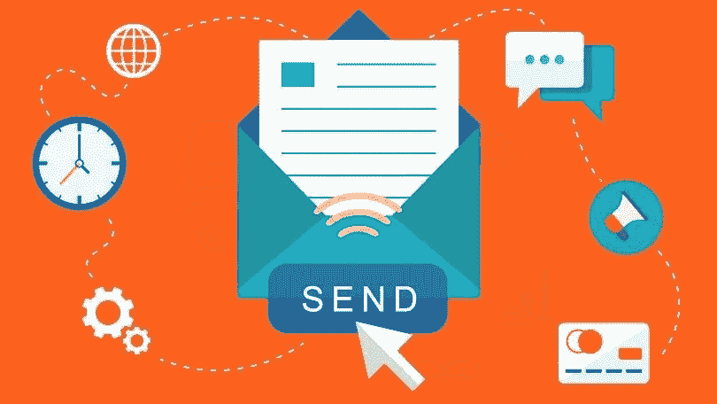
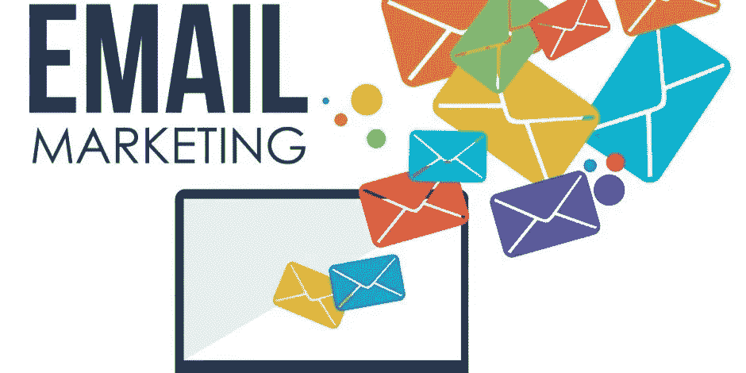

# 2019 年尝试的 6 个最佳电子邮件营销策略技巧和窍门

> 原文：<https://medium.datadriveninvestor.com/6-best-email-marketing-strategy-tips-hacks-to-try-in-2019-ebefa2ba97ae?source=collection_archive---------19----------------------->

尽管存在商业和行业垂直市场，但营销策略的实施是为了触及目标受众，并将他们转化为潜在客户。随着移动技术和社交媒体渠道的巨大发展，近来出现了各种营销渠道。一个完美的营销策略将适合购买者的旅程，满足他们的要求，然后把他们变成特权客户。在这里，我想谈谈传统的和最有效的电子邮件营销策略，这将导致可观的投资回报率。

**什么是邮件营销:**

电子邮件是我们在组织内部或组织外部进行沟通的常用渠道之一。随着我们使用的技术和智能设备的发展，全球电子邮件用户的数量上升到 34%以上。根据 Radicati group 的数据，平均每天有 1960 亿封电子邮件，其中 1090 亿封是商务邮件。使用电子邮件作为用户参与和潜在客户培养的营销渠道将会给你带来全面的结果。

Source: PCmag

电子邮件营销始于 20 世纪 70 年代初，从那时起，它对用户参与、潜在客户培育和转化产生了重大影响。这被认为是商业规划和推广中最有力的营销策略之一。相比之下，电子邮件营销是最具成本效益的战略，使你站在竞争对手。甚至我会收到几十封关于产品购买、技术新闻、工作机会和各种促销邮件的电子邮件。

我或你如何获得这些电子邮件？仅仅是我们用我们的既得利益订阅了那些服务。这些公司或品牌将发送电子邮件活动，以接触和吸引订阅用户。但是你真的打开了吗？你不确定。你知道为什么我们一般不打开促销邮件吗？因为它们不是定制化、细分化、个性化的，也不是我们所熟悉的。

成功的电子邮件营销策略的主要特征

**确定观众:**

首先，受众是执行任何营销计划的关键因素。在电子邮件营销的情况下，每个组织都应该有一个独特的和明确的受众群。除非你有用户数据库规划和花费时间在一起不会产生任何结果。或许，向陌生用户发送电子邮件最终会降低你的信任度。

我通常不打开邮件就删除与我无关的邮件。

**个性化邮件:**

这是执行电子邮件活动时最需要考虑的因素。我们通常在主题行中发送没有个性化愿望的批量电子邮件。这会对用户感知产生负面影响。你越个性化，你的点击率就越高。根据一份报告，个性化邮件可能比其他邮件获得大约 20%的点击率。

试着告诉读者他们的名字，或者用欢迎信息问候他们。

Thedrum

**对话内容:**

很少有电子邮件营销活动会无视买家之旅而直接进行推销。他们更多地谈论品牌和他们的产品价值。要执行一个成功的电子邮件营销策略，把你的内容调整得更像一个对话中心，而不是一个机器人。因为人类喜欢与人类交谈，而不是品牌和标志。如果你能精心制作对话内容，你就能吸引更多的流量和用户参与。你可以要求他们评论、分享和访问邮件底部的网站。

一位搜索引擎优化专家发现，电子邮件访问者比其他任何人都更有吸引力，是潜在的客户。一个设计良好的电子邮件外联可以帮助你在用户群中建立信任因素。

**行业和商业细分:**

拥有一个大的用户数据库池是必要的。但是，将所有联系人视为一个实体会产生不同的营销结果。因为一种适合所有人的策略并不适用于所有的联系人，所以您需要将他们划分到行业、业务和地理条件中。

你不能向那些正在寻找“保险计划”的人发送“购买智能手机”电子邮件活动。因此，建议对用户进行细分，并根据他们感兴趣的垂直行业制定电子邮件营销策略。

**手机友好内容:**

近来，智能手机的使用大幅增加。我们早上做的第一件事是检查电话、信息和提醒(如果有的话)。电子邮件是我们通常寻找的警报的一部分。发送给目标受众的任何内容都应该是移动友好且易于访问的。最近的一项研究表明，超过 61%的电子邮件是在移动设备上打开的。此外，**移动优先索引**是谷歌推出的最新功能，旨在增强用户体验。

当你发送一封商务邮件，但它没有得到很好的优化，那么你认为他们会怎么做？大多数情况下，他们会取消订阅或删除它。

**自动化电子邮件活动:**

选择用户名单和亲自发送电子邮件是繁琐和无用的。选择智能解决方案，实现电子邮件活动的自动化。市场上有太多的电子邮件管理工具可以用来自动化这个过程。因此，你可以专注于业务规划，而不是拍摄电子邮件。自动化工具的其他好处是，您可以跟踪 KPI、订阅用户和退订用户。

尽管电子邮件营销策略不是一个新概念，但它仍然会对用户参与和销售产生重大影响。一个设计良好的电子邮件活动将使你在竞争中脱颖而出，获得可持续的投资回报。最重要的是，它比 SEO，PPC，和其他营销渠道更划算。

建立一个完美的电子邮件营销策略，在不损失客户信任的情况下扩大你的品牌。

请提供您的想法以进一步改进，并通过 [**#Clickongadget**](https://twitter.com/ClickonGadget) 关注我们以获取更多更新。