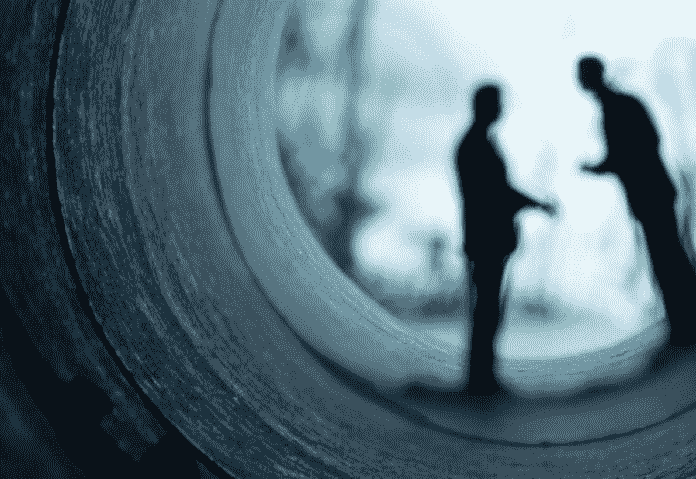
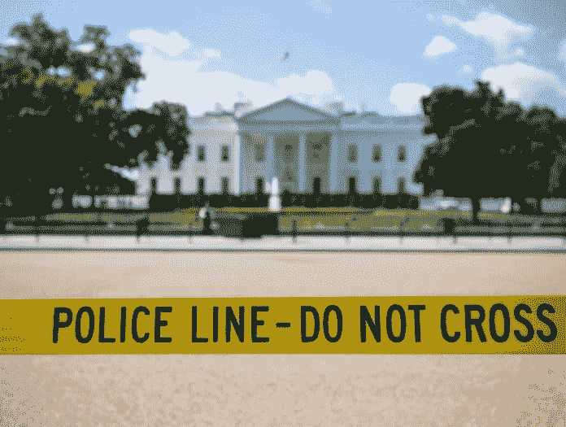
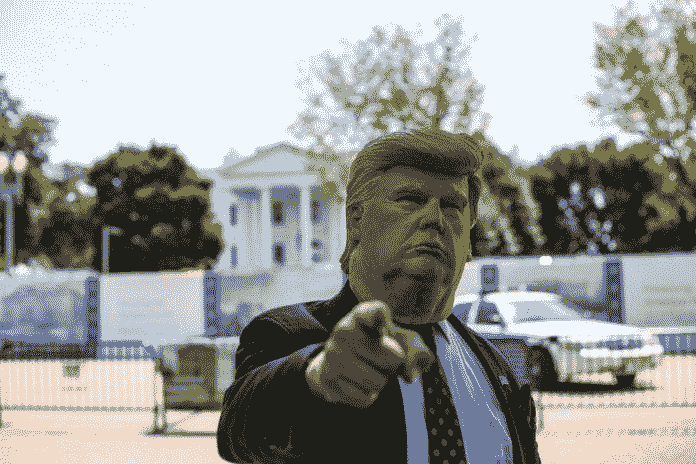

# 特朗普兜售的关于政治对手的 6 个阴谋论显示了 2020 年的预期

> 原文：<https://medium.datadriveninvestor.com/6-conspiracy-theories-trump-peddled-about-political-opponents-show-what-to-expect-in-2020-e8dbaebe26cf?source=collection_archive---------11----------------------->

为什么人们会关注这些阴谋？

特朗普能赢的唯一方法就是让选民相信他的对手和他一样坏。特朗普一再被证明无能、腐败，甚至可能精神错乱。更糟糕的是，特朗普只想雇佣和他一样坏或者比他更坏的人。考虑到这种情况，特朗普竞选团队只有两种战术可以使用。特朗普必须对自己的成功撒谎。特朗普和他的竞选团队必须编造关于他的对手的故事。这篇文章考察了特朗普及其同伙用来贬低其前对手希拉里·克林顿的许多故事中的一些。令人惊讶的是，许多特朗普的支持者实际上相信这种愚蠢。更令人惊讶的是，特朗普和他的支持者似乎认为特朗普仍然在与希拉里·克林顿竞选，因为这些故事仍然是特朗普集会上的热门话题。

耸人听闻的阴谋论很好玩。这些理论得到很高的评价。这样的收视率是旅游频道现在更像“幽灵频道”的原因。或者说，历史频道已经变成了一个“飞碟频道”几千年来，人们喜欢讲鬼故事。这些耸人听闻的故事是一种很好的娱乐形式。

 [## 保护主义、政治和经济动荡|数据驱动的投资者

### 美国股市昨日出现 400 多点的大幅反转，为未来的事情发出了警告信号。市场…

www.datadriveninvestor.com](https://www.datadriveninvestor.com/2018/06/28/protectionism-politics-economic-turmoil/) 

当涉及到政治时，阴谋故事会对我们的国家造成巨大的伤害。众所周知，特朗普是虚假政治阴谋论的兜售者。阴谋论帮助特朗普当选。现在，考虑一下我们的国家因为我们选举了特朗普而陷入的混乱。下面的阴谋列表是特朗普在 2016 年竞选中最受欢迎的几个，即使在今天仍有很多播放。

人们不禁要问，2020 年的竞选将会是什么样子。我确信乔/亨特·拜登的阴谋只是开始。除非特朗普被免职，否则阴谋论将变得更糟，我们可以预计会有更多类似披萨饼的暴力事件。

# 阴谋

## 披萨饼

[披萨](https://en.wikipedia.org/wiki/Pizzagate_conspiracy_theory)是这些奇怪的“克林顿阴谋”之一披萨门涉及克林顿儿童色情圈。在这一次，民主党人在所有地方的比萨饼店对儿童进行了仪式性的恶魔性虐待。我不得不承认，这些阴谋论者确实有一些生动的想象力。谁会想到把披萨和恋童癖混在一起？

一些人认为 PizzaGate 源自迈克尔·弗林关于希拉里竞选经理约翰·波德斯塔的一条推特。弗林在推特上写道，‘***约翰·波德斯塔在邪恶的仪式中喝了其他人的血和体液*** 。”弗林后来成为特朗普的首位国家安全顾问。弗林是在[穆勒报告](https://cdn.cnn.com/cnn/2019/images/04/18/mueller-report-searchable.pdf)中可以读到的主要人物之一。弗林已经对穆勒指控的罪行认罪。弗林正在等待判决。

## 匿名的阴谋

Q-Anon 是我所知道的最奇怪的阴谋论。维基百科将这一阴谋描述为“深层国家”针对特朗普及其支持者的阴谋。川普伪造了与俄罗斯的勾结，以便与罗伯特·穆勒联手，并试图揭露一个国际儿童性交易团伙，其中包括数名自由派好莱坞演员、高级政府官员和民主党政客。通过揭露这个儿童色情团伙，Q-Anon 希望阻止前总统奥巴马、希拉里·克林顿和乔治·索罗斯发动政变。令人惊讶的是，竟然有人相信这个故事。

我确实觉得这种 Q-Anon 现象非常有趣。有一个国际儿童色情团伙，可能涉及一些非常有权势的人，包括唐纳德·特朗普、比尔·克林顿和安德鲁·阿尔伯特·克里斯琴。这个性爱戒指就是杰弗里·爱泼斯坦的。Q-Anon 始于 2017 年末。到 2017 年，对爱泼斯坦和他有权势的朋友的指控已经众所周知十多年了。考虑到特朗普将自己的不良行为转移和投射到他人身上的历史，他和他的盟友创造一个像 Q-Anon 这样的故事并传播它是一致的。

## 克林顿死亡人数

自 20 世纪 80 年代以来，克林顿夫妇一直忙于杀人。参见维基百科的这篇文章，了解更多关于“克林顿死亡人数”的信息。要杀死所有这些人并且不留任何证据，需要一个类似黑手党的庞大基础设施。人们必须知道他们可以完全信任执行这些杀戮的职业杀手。不仅如此，这些杀手必须非常优秀，不能留下任何痕迹。这些袭击必须在远离比尔和希拉里的地方进行，这样他们就有不在场证明了。克林顿夫妇周围唯一的基础设施似乎是切尔西。我想切尔西才是真正杀死这些人的人。你不得不承认切尔西是好的，特别是因为这些谋杀案中的一些发生在 20 世纪 80 年代，当时她还在蹒跚学步。我忘了克林顿夫妇确实让比萨店的恋童癖为他们做了所有这些谋杀。不知何故，我不认为一群恋童癖者是克林顿夫妇需要的完美忍者。

我相信第一例死亡可能与[巴里·希尔的](https://en.wikipedia.org/wiki/Barry_Seal)行动有关。据称，巴里·希尔参与了中央情报局针对桑地诺民族解放阵线的行动。尼加拉瓜的这次行动据说是通过阿肯色州一个小镇的基地进行的。这个故事不是讽刺，它很有趣。有时候，真相比小说更离奇。

## 班加西和电子邮件

我在跟进[班加西](https://en.wikipedia.org/wiki/Investigation_into_the_2012_Benghazi_attack)调查时经历了一段非常艰难的时期。十项调查中，许多是由国会共和党人领导的，没有发现希拉里·克林顿有任何不当行为。当调查人员在世界另一端找不到国务卿在一名大使和他的安保人员死亡问题上的过失时，他们的调查不知何故转移到了克林顿夫妇的私人电子邮件服务器上。

只有真正有钱的人才会有自己的电子邮件服务器？对吗？这显然是错误的，因为我当然不富裕，而且我以前也有自己的电子邮件服务器。任何小企业都可以通过微软的 Exchange 轻松建立自己的电子邮件服务器。我很快意识到我无法保证邮件服务器的安全，因为我不断收到垃圾邮件。通过微软或谷歌基于网络的电子邮件服务，使用大公司的安全资源要容易得多。

人们不禁要问，为什么希拉里·克林顿想要自己的电子邮件服务器。最明显的答案是，作为世界上最著名的人之一，希拉里·克林顿想要一些隐私。将个人邮件和商务邮件混在一起给很多人带来了问题。不管什么原因，这次“电子邮件调查”没有任何结果，就像对克林顿夫妇的任何调查都没有任何结果一样。经过对克林顿夫妇多年的调查，唯一发现的不良行为是婚姻不忠。

一些人会指出包含政府电子邮件的电脑硬盘被销毁是希拉里·克林顿不道德行为的证据。对于这些硬盘的毁坏，有一个更合理的解释。很有可能，销毁硬盘是为了保护机密信息，而不是妨碍司法公正。这可能是最明显的解释。

类似地，IT 人员维护他们反对自证其罪的第五修正案权利也可能有一个合理的解释。有关计算机犯罪的法律因跟不上技术的变化而臭名昭著。更麻烦的是最近颁布的关于处理机密邮件的变化。由于法律的模糊性，It 员工可能会违反他们甚至不知道存在的法律。一个政党主张他们的第五修正案权利并不是承认有罪。这个场景是一个完美的例子，说明第五修正案保护可以帮助一个无辜的人。

然而，这些针对班加西/电邮指控的明显辩护都不重要。那些想看到阴谋的人会在任何事情上看到阴谋。正如已经提到的，其中一些人甚至将比萨饼店视为恋童癖的巢穴。调查的真正目的是在 2016 年大选前从政治上伤害希拉里·克林顿。因此，这次调查成功地完成了它的主要任务。关于班加西听证会的真正动机，请看 YouTube 上*彭博政治*的视频。

## 希拉里·克林顿应该被关起来

我一直想不通为什么特朗普的支持者要把希拉里关起来。我怀疑这只是特朗普集会的 WWE 摔跤类型环境中的一个愚蠢的口号。最好的解释是，这些圣歌是由容易受骗的人发出的，他们被特朗普兜售的其他克林顿阴谋论误导了。

## 塞斯·里奇的谋杀案

这是“克林顿死亡人数”的一部分，但由于不寻常的情况，值得特别提及。我不喜欢提到这个故事，因为这样的故事已经折磨了这个富有的家庭。然而，这里实际上可能有一个阴谋。塞思·里奇于 2016 年 7 月 10 日被杀，这可能是一次拙劣的抢劫。2016 年 7 月 11 日，政治阴谋论开始流传。塞思·里奇是个低级职员。阴谋怎么这么快就开始了？谁会有能力实施这样的谋杀并且不留任何证据呢？谋杀和阴谋论的传播推进了谁的事业？符合所有这些要求的唯一组织是俄罗斯情报机构。

由于已经存在的“克林顿死亡”阴谋论，克林顿夫妇是这种阴谋论的完美目标。对俄罗斯情报人员来说，一个小小的谋杀算什么？俄罗斯情报人员在其他国家杀人并不罕见。问问英国人就知道了。请看[神秘情况下俄罗斯人在英国死亡的漫长历史](https://www.independent.co.uk/news/uk/home-news/russian-deaths-uk-history-spies-murder-sergei-skripal-alexander-litvinenko-a8242061.html)来自*独立报*更多关于英国境内这些谋杀案的报道。我会听从 DC 警方的意见，相信这个未破案件可能是一次拙劣的抢劫。然而，我不会对退而求其次的解释视而不见。

# 结论

人们真的需要清醒了。任何花大力气宣传对手荒谬主张的人都有严重的问题。对于特朗普，有两个严重的问题导致他专注于诽谤对手的故事。首先，特朗普需要贬低他的对手，让自己的劣迹看起来不那么糟糕。其次，特朗普自上任以来未能完成任何事情，这需要通过将任何对手描绘成更糟糕来掩盖。对于任何认为特朗普作为总统取得了任何成就的人，我建议看看我的故事，*特朗普告诉他的支持者的 6 个谎言，他的支持者相信他*在[这个链接](https://medium.com/datadriveninvestor/6-falsehoods-trump-tells-his-supporters-and-his-supporters-believe-him-568aed7665b7)。

特朗普的支持者会求助于“主义怎么办”，并声称民主党有很多阴谋论。他们会引用“俄罗斯”的骗局。显然，俄罗斯的调查和 PizzaGate 之类的阴谋论有很大的不同。俄罗斯的调查得到了我们国家几十年来信任的情报和打击犯罪组织的支持和推动。当然，对许多特朗普的支持者来说，这些组织只是“深层状态”。PizzaGate 是由一个持枪的家伙支持和推进的，他枪杀了一家披萨店。看[华盛顿披萨店遇袭，假新闻带来真枪](https://www.nytimes.com/2016/12/05/business/media/comet-ping-pong-pizza-shooting-fake-news-consequences.html)来自*纽约时报*。几十年来，我们国家一直信任的媒体和新闻机构都对俄罗斯的调查进行了报道。俄罗斯机器人在社交媒体上报道了 PizzaGate。特朗普阴谋论和合法的国家安全调查之间有着明显的区别。

确定边缘媒体渠道和真正的新闻渠道之间的区别的一个方法是，新闻渠道在犯错时会承认。一个真正的新闻媒体会撤回不符合职业新闻诚信要求的报道。边缘媒体和俄罗斯机器人从不承认他们错了。从不承认错误的媒体，只是为了宣传的永久化或通过耸人听闻的报道获得高收视率而存在。

美国选民不仅必须忽视被可疑来源描绘成“新闻”的愚蠢行为，还必须告诫那些传播和相信这种愚蠢行为的人。这个国家曾经有一段时间，像《国家询问者》这样的报纸受到绝大多数人的鄙视。现在，国家询问者类型的故事非常受边缘媒体的欢迎，很大一部分人相信这些阴谋。这个国家的文化已经堕落到了轻信和无知的程度，以至于许多美国人几乎什么都会相信。只有通过善良的美国人的努力，才能挫败假新闻的传播。

*原载于 2019 年 10 月 14 日*[*https://www.datadriveninvestor.com*](https://www.datadriveninvestor.com/2019/10/14/6-conspiracy-theories-trump-peddled-about-political-opponents/)*。*