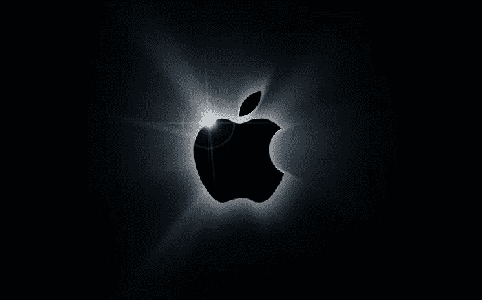
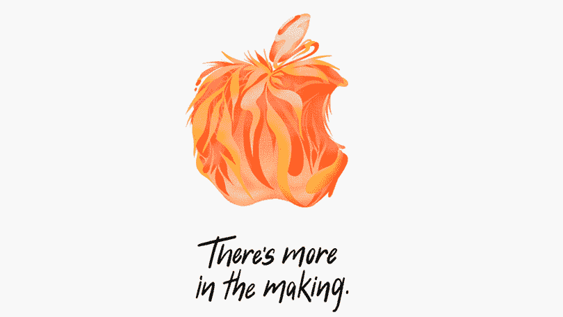

# 我们将很快看到苹果的 6 项发展(如果我们还没有看到的话)

> 原文：<https://medium.datadriveninvestor.com/6-developments-will-see-from-apple-soon-if-we-havent-already-5b088a4ee27a?source=collection_archive---------25----------------------->

## 苹果不一直是技术潮流的引领者吗？

当然是了。我们仍然记得乔布斯站在舞台上展示最新“设备”让我们惊叹的美好时光。现在那些日子已经过去了，我们意识到这不再是“设备”的问题了。我们应该预见到这一点，毕竟，首先是卡带播放器，然后是 CD 播放器，然后是 iPod。然后，我们看到 VHS 磁带去再见揭示 DVD 的年龄，现在甚至*正在慢慢下降。面对现实吧:*装置*正在死亡。现在，技术似乎越来越多地与我们的日常生活环境融为一体，在设计上实现了互联、自动化和自主化。你会明白，我们对 iPhone 销量下降的事实并不感到惊讶，这就是为什么苹果正在寻找技术领域的下一个**大事件**。*

# *苹果有一个目标。几个目标。实际上是六个。*

**

*其中一些可能会让你大吃一惊。这并不是说苹果对他们值得信赖的 iPhones 和 Mac 电脑失去了信心，因为它们在今天的环境下仍然非常重要。不过，现在比以往任何时候都更重要的是，在实际的 iPhone 上实现 iPhone 中的技术。很快，iPhones 将仅仅成为**配件**，而不是**产品**，原因如下:*

## *苹果将会成为新的网飞*

*没错:仔细想想。那是真的。我猜你听说过那些苹果电视，对吧？他们很快就会做得比这多得多。*

## *苹果会非常认真地看待人工智能*

*当你想到这一点时，这是一件相当大的事情，因为谷歌和亚马逊这两个巨头几乎掌握了这一领域的所有牌。[查看文章，了解更多信息。](https://vigyaa.com/@pierre/will-apple-go-ai-or-stick-with-the-iphone-f251a150/)*

## *智能家居技术可能是苹果的下一个目标*

*同样，这也是谷歌和亚马逊的强项。[问问你自己，苹果能做些什么来赚取利息？](https://vigyaa.com/@pierre/the-smart-home-market-doesnt-look-too-good-for-apple-707de562/)*

## *自动驾驶汽车呢？这是真的:苹果也在努力。*

*现在，他们变得雄心勃勃。这里我们谈论的是一个全新的垂直行业，由汽车制造商和*特斯拉汽车*等公司主导。但是苹果能做什么呢？[阅读文章，自己学习。](https://vigyaa.com/@pierre/apple-might-be-releasing-a-drivable-iphone-soon-707de562/)*

## *零售？真的吗？苹果在这个领域可能会做些什么？*

*你可能忘了，苹果可能是唯一一家拥有自己专属“商店”的科技巨头。不过，你必须看看这篇文章，看看他们打算用它做什么。*

## *最后，医疗保健…(真的吗？？)*

*是的。真的。[阅读这篇文章，了解苹果如何成为医疗保健行业的重要参与者。](https://vigyaa.com/@pierre/apple-will-be-actively-targeting-a-most-unusual-industry-very-soo-7296bed7/)*

**

# *野心怎么样？这是一个雄心勃勃的苹果。*

*苹果采摘 101:这家公司仍然存在是有原因的，但谁知道呢:他们可能会贪多嚼不烂，也许这些“苹果”中至少有一个可能有点腐烂？只有时间能证明一切。通过 [**注册一个免费的 VIGYAA 账户并开始写作**，让我们知道你对公司目标的想法！](https://vigyaa.com/accounts/login/)*

**最初发布:*[*https://vig yaa . com/@ pierre/6-developments-will-see-from-apple-soon-if-we-haven-always-7296 bed 7/*](https://vigyaa.com/@pierre/6-developments-will-see-from-apple-soon-if-we-havent-already-7296bed7/)*