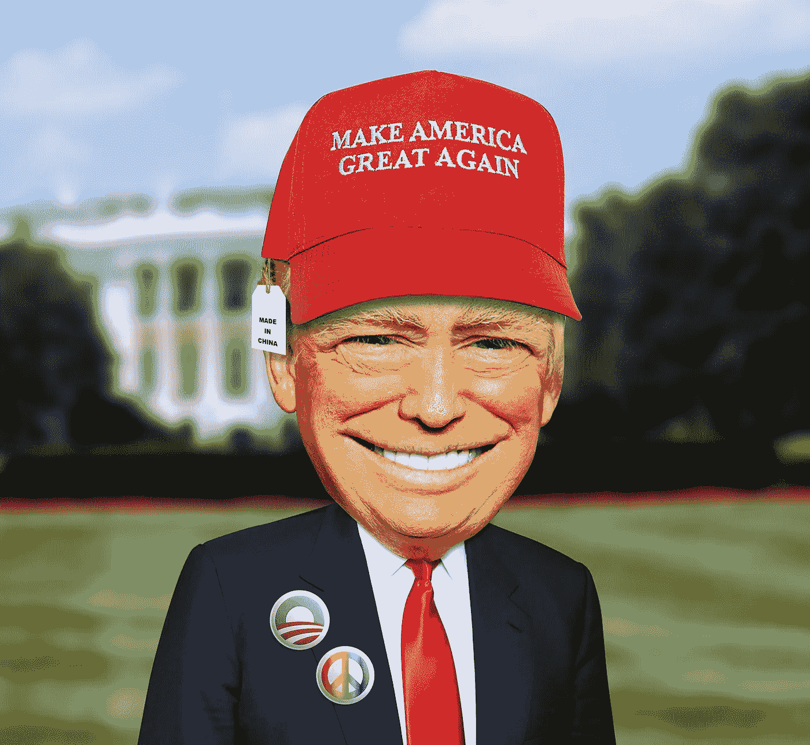
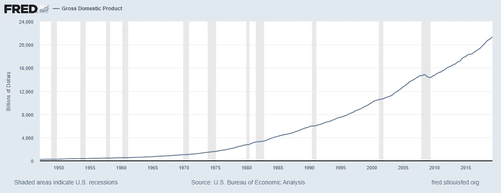
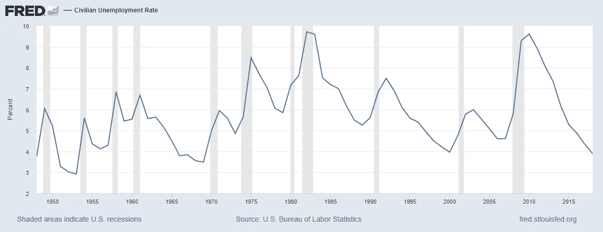
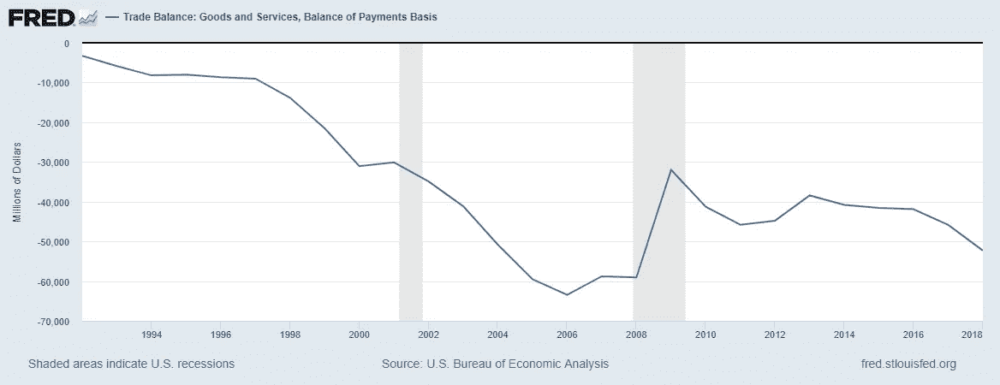

# 特朗普告诉他的支持者的 6 个谎言，他的支持者相信他

> 原文：<https://medium.datadriveninvestor.com/6-falsehoods-trump-tells-his-supporters-and-his-supporters-believe-him-568aed7665b7?source=collection_archive---------1----------------------->

在被揭穿了这么多谎言之后，为什么还有人相信特朗普说的任何话？

Image by [Richard Reid](https://pixabay.com/users/reidy68-208937/?utm_source=link-attribution&utm_medium=referral&utm_campaign=image&utm_content=2076668) from [Pixabay](https://pixabay.com/?utm_source=link-attribution&utm_medium=referral&utm_campaign=image&utm_content=2076668)

在我认识的许多特朗普支持者中，我还没有遇到一个人承认相信像 Q-Anon 和 Pizza Gate 这样更离谱的阴谋论。然而，我确实在电视上看到人们在特朗普的集会上穿着 Q-Anon 衬衫。我怀疑这些人就是参加 WWE 摔跤比赛的人，他们相信这一切都是真的。我确实知道许多人相信特朗普其余的愚蠢。

特朗普称赞《国家问询者报》。见[川普曾希望《国家询问者》赢得普利策奖。现在这可能会证明他的垮台](https://www.washingtonpost.com/lifestyle/style/trump-once-wanted-the-national-enquirer-to-win-a-pulitzer-now-it-may-prove-his-downfall/2018/08/26/9b30388c-a87d-11e8-97ce-cc9042272f07_story.html)来自*华盛顿邮报*。我认识的这些特朗普支持者不读《国家询问者》，或者至少他们不承认读过。那么，他们从哪里获得往往与事实完全相反的信息呢？首先，考虑不寻常的信仰，然后，我将讨论错误信息从何而来以及如何阻止这种错误信息。

 [## 保护主义、政治和经济动荡|数据驱动的投资者

### 美国股市昨日出现 400 多点的大幅反转，为未来的事情发出了警告信号。市场…

www.datadriveninvestor.com](https://www.datadriveninvestor.com/2018/06/28/protectionism-politics-economic-turmoil/) 

# 导致我们国家破坏性政策的信仰

## 在奥巴马总统执政期间，经济非常糟糕。特朗普上任，经济突然大有起色

请看下面的两张图表，分别显示了奥巴马总统和特朗普总统执政期间的 GDP 和失业率。

For an interactive version of this graph, see [this link](https://fred.stlouisfed.org/series/GDP) from the Federal Reserve Economic Database (FRED).

For an interactive version of this graph, see [this link](https://fred.stlouisfed.org/series/UNRATE) from FRED.

显然，在特朗普上任之前，奥巴马总统就有长期趋势。特朗普对成功的声称就像一个跑卫，当他的球队在对手的 10 码线上时，他的球队进入比赛，然后触地得分并声称得分，而另一名球员(奥巴马总统在这里)从自己的端线 90 码处开球，回到对手的 10 码线上。在这个类比中，奥巴马总统承担了扭转经济的重任。继续足球比喻，特朗普现在已经笨拙地处理了他的贸易战，另一支球队(这支球队被称为“衰退”)可能很快就会得分。

这种错误的信念让特朗普有信心相信，对于像他这样的“稳定的天才”来说，“贸易战很容易”。因此，美国消费者现在正遭受关税形式的高税收。

## 大批危险移民正在入侵我们的国家

在 2018 年大选前的几周，这个故事在右翼频道反复播出。事实是，尽管特朗普对移民施加了种种恐怖，但奥巴马总统在遏制非法移民方面要有效得多。我并不赞同奥巴马总统的移民策略，但我确实注意到，他更人道的策略要有效得多。见下图，该图显示了自特朗普上任以来，非法移民是如何增加的。

For an interactive version of this graph, click [this link](https://docs.google.com/spreadsheets/d/1ayQ-c8xWEbEu0fQ6wWJbwWIOg0BsHFIH2AERSD5jC6Y/edit#gid=334079672).

显然，特朗普残酷的反移民政策不起作用。关于特朗普和移民的更深入的讨论见，我的故事， [*特朗普对在南部边境*](https://medium.com/datadriveninvestor/trump-is-primarily-responsible-for-the-sharp-increase-in-immigrants-seeking-asylum-at-the-southern-6999c0675b3e) 寻求庇护的移民急剧增加负有主要责任。

## 特朗普的贸易战现在可能会受伤，但对美国有好处

特朗普选择了与整个世界进行贸易战，无论是朋友还是敌人。特朗普没有计划。特朗普的贸易战没有明确的目标。他只是想“得到更好的交易”如果这个更好的协议不比旧协议更好，这并不重要；真正的重点是让特朗普看起来像是在“为他的人民而战”。见[见见新北美自由贸易协定——与旧北美自由贸易协定相同](https://thehill.com/opinion/finance/441057-meet-the-new-nafta-same-as-the-old-nafta)见 *The Hill* 见川普在北美自由贸易协定上的“成功”。疏远长期盟友值得这一新政吗？

艾森豪威尔总统喜欢说，“计划是无用的，但计划是必不可少的”。特朗普一时兴起将美国带入破坏性的贸易战，这些贸易战对国家没有什么好处，但对全球经济和政治稳定确实有破坏性影响。当考虑到特朗普的政策对农民产生的严重负面影响时，我认为很明显，他的贸易政策和他自己的思想一样不健全。

特朗普使用的愚蠢方法无法实现美国的贸易目标。参见下图，了解特朗普执政期间贸易逆差是如何增长的。

For an interactive version of this graph, see [this link](https://fred.stlouisfed.org/series/BOPGSTB#0) from FRED.

数据显示，特朗普的“强硬”贸易政策和他的移民政策一样“愚蠢”。支持特朗普的农民正被引向毁灭之路。所有支持这种“保护主义”的美国人都失败了。我们有更好的方法来处理中国等国家的不良商业行为，但特朗普放弃了这些优越的方法。上图显示了追随特朗普愚蠢政策的无用性。

# 特朗普支持者的信念不仅危及我们的国家安全，而且正在撕裂我们的国家

## 穆勒的报告清除了特朗普的所有不法行为

[威廉·巴尔对](https://www.nytimes.com/interactive/2019/03/24/us/politics/barr-letter-mueller-report.html)[穆勒几百页报告的总结](https://cdn.cnn.com/cnn/2019/images/04/18/mueller-report-searchable.pdf)帮助创造了这个神话。在穆勒报告向公众公布之前，巴尔的总结是我们一个月的全部内容。到那时，右翼人士已经不感兴趣了。直到今天，我的右翼朋友中没有一个人读过穆勒报告。**事实是，穆勒发现他没有足够的证据表明特朗普竞选团队与俄罗斯人合谋影响 2016 年大选。然而，穆勒列举了特朗普及其盟友妨碍司法公正的几个例子。穆勒不认为他有权起诉特朗普妨碍公务。穆勒确实从特朗普的第一位国家安全顾问和他的竞选经理那里获得了认罪或有罪判决。人们应该问的第一个问题是，“如果特朗普妨碍司法公正，如果不掩盖不法行为，目的是什么？”人们应该问的第二个问题是，如果特朗普没有妨碍司法公正，会发现什么关于与俄罗斯人合谋的证据。**无论如何，这个案子已经结了。

## 间谍门是俄罗斯调查的开始

Spygate 试图混淆这个问题。这是被告在没有证据的情况下会做的事。当然，任何刑事辩护的一部分都是攻击调查。在这种情况下，他们指控调查人员的一切都不算什么。我在右翼电台听到的关于‘str zok’和‘Page’的任何事情都没有任何意义。调查的起源是完全正常的。随着不法行为的证据越来越有力，调查人员在调查过程中往往会产生偏见。有人认为联邦调查局对约翰·高蒂完全没有偏见吗？法官应该是公正的。检察官应该是公正的。调查人员往往会形成偏见，只要他们不做任何违法的事情来推进针对目标的案件，这就不是问题。

卡特·佩吉(不要和丽莎·佩吉混淆)在竞选之前已经被联邦调查局监视了好几年。然而，特朗普的支持者对卡特·佩吉加入特朗普竞选后更新 FISA 逮捕令所遵循的程序感到担忧。这些谈话没有一点意义。这些人只是尖叫着什么，什么都行，试图让足够多的人相信俄罗斯的调查是一个骗局。

本周，监察长对前联邦调查局局长詹姆斯·科米在通俄调查中的一些行为进行了申斥。监察长对詹姆斯·科米的斥责就像一辆消防车在灭火途中收到超速罚单一样。监察长称科米泄露备忘录违反了政策，但 DOJ 拒绝起诉来自 T2 NBC 新闻的 T1。

这些对俄罗斯调查起源的调查就像班加西调查、“选民欺诈特别工作组”或购买格陵兰岛一样愚蠢。这些人最好利用他们的时间去寻找一些不那么愚蠢的东西，比如大脚怪。

## 选举被操纵，不利于特朗普

在 2016 年竞选期间，特朗普一再声称选举对他不利，他将被偷走选举。选举结束后，特朗普声称他没有赢得普选，因为选民普遍存在欺诈行为。他甚至浪费了联邦资源，成立了一个“选民欺诈特别工作组”。见[民主，从*大西洋*中断](https://www.theatlantic.com/politics/archive/2019/01/trump-continues-to-attack-rigged-elections/580030/)。

在竞选期间，对俄罗斯关系的指控已经众所周知。我记得我当时认为，特朗普声称选举被操纵，以及他拒绝表示如果他输了，他将接受选举结果，这看起来像是他试图警告政府，如果他们透露任何关于他正在接受联邦调查局调查的事实，就会出现混乱。特朗普正在向政府发出含蓄的威胁，如果他们曝光任何可能减少他当选机会的事情，他和他的支持者会疯掉。

自选举以来，我一直认为这是一种可能性，但也考虑了另一种情景来解释特朗普的行为。特朗普希望制造一种假象，即如果他输了，选举就从他那里被偷走了，他的支持者的支持将转化为对特朗普电视网的支持，特朗普将从中大幅获利。这两种情况都可能解释为什么特朗普会做出如此疯狂的行为。

# 结论

为什么特朗普的支持者会相信那么多明显是谎言的言论？为什么特朗普的支持者相信这么多政策在起作用，而它们显然不起作用。首先，媒体(被特朗普支持者称为“主流媒体”)在解释真相方面做得不够。他们只是在给特朗普选民看，并说，‘我们不知道他们为什么会相信这些东西。’媒体需要更进一步，报道错误信息的来源。当然，媒体报道了俄罗斯的影响行动。不幸的是，媒体在报道极端主义媒体的疯狂和不准确方面做得不够。

媒体害怕对第一修正案的任何限制，正如全国步枪协会害怕对第二修正案的任何限制一样。在《人权法案》中对这些修正案加以限制是一种“滑坡”。对我来说，我认为正是害怕“滑坡”的“滑坡”导致了一事无成，并因此导致了诸如俄罗斯/右翼势力行动和校园枪击这样的悲剧。

[大法官 Oliver Wendell Holmes Jr](https://en.wikipedia.org/wiki/Oliver_Wendell_Holmes_Jr.)关于“[在拥挤的剧院](https://en.wikipedia.org/wiki/Shouting_fire_in_a_crowded_theater)大喊失火”的说法应该被更多的考虑。虽然我不同意霍尔姆斯在申克诉合众国案(,载于《美国最高法院判例汇编》第 249 卷第 47 页(1919 年)中的观点，但我确实认为，对美国安全造成“明显而现实的危险”的言论应该受到管制。可以用来确定什么构成这种受限制的言论的一个因素是故意虚假并在广播网络和社交媒体上传播的言论。防止这种宣传传播的一个方法是恢复公平原则。'