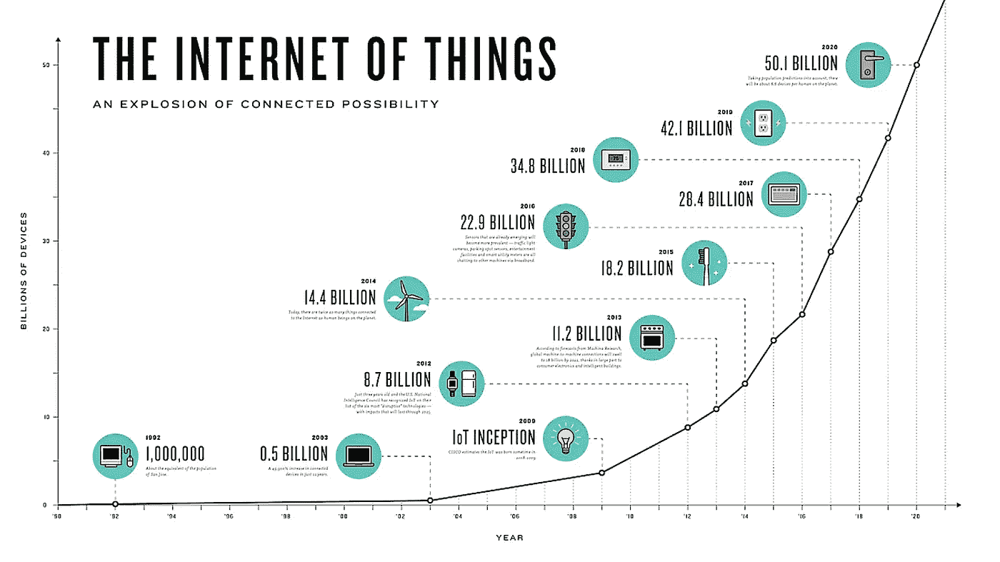
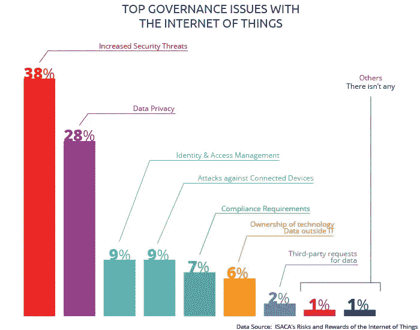
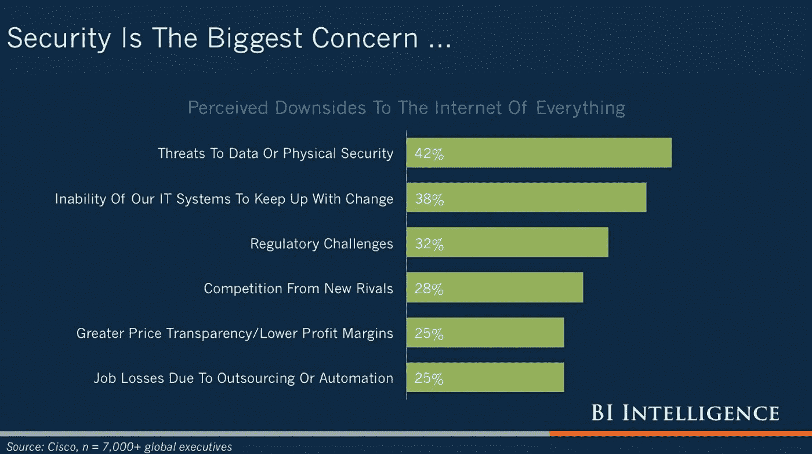

# 当代市场上的 6 种物联网(IoT)安全技术

> 原文：<https://medium.datadriveninvestor.com/6-internet-of-things-iot-security-technologies-on-the-contemporary-market-8b302d04d1d0?source=collection_archive---------1----------------------->

***所有主要的物联网安全技术在一个概述中—网络安全、认证、数据加密、分析、物联网 API 和 PKI。和最好的供应商！***

尽管智能技术广受欢迎，但大多数智能技术在用户安全方面都存在严重缺陷。正因为如此，物联网安全作为一个概念的出现是不可避免的。与此同时，这一领域仍处于不断发展的阶段。在给定的情况下，有必要区分物联网安全最佳实践，并在解决保护问题的平庸尝试中做出正确的选择。确定提供物联网安全的最佳技术是本文的主要任务。

Source: opentechdiary

一般来说，创建物联网安全框架的方法是针对具体问题的。换句话说，专家定义了需要改进的领域，并采用了能够弥补缺陷的技术。基于这一实践，可以区分出物联网的[安全解决方案的六个主要方向。特别是，在最常见的物联网安全问题中，专家提到了智能设备网络的脆弱性、身份认证问题、缺乏数据加密和安全分析、物联网 API 和 PKI 的问题，以及匆忙推出物联网解决方案的趋势。不过，好消息是:所有这些问题都被物联网安全技术成功解决了。在物联网安全方面，他们每个人都有特定的方法。](https://iot.intellectsoft.net/)

**1。** **物联网网络安全**

结合物联网安全最佳实践创建安全网络的关键工具是将其连接到预安装的后端系统。为了实现最高水平的复杂性，它将传统的数据保护工具(如抗病毒和防火墙)与协议、标准和复杂的设备功能相结合。

作为该领域的物联网安全解决方案领导者， [Bayshore Networks](https://www.bayshorenetworks.com/) 是一家专注于网络主动保护的开发商，这意味着可以确保轻松部署由工业控制系统专家设计的自动化学习引擎，及时提醒可能的威胁，并有效利用特定于 oT 的威胁情报源。因此，客户有机会对物联网网络的安全性保持冷静，了解公司提供的被动监控、不断更新的学习系统和适当的通知以防止威胁。

**2。** **物联网安全问题的认证修复**

这些物联网安全解决方案的功能意味着确保一个用户在多个设备上的安全认证。除了标准的基于密码的过程之外，该领域的开发人员强烈建议使用双因素身份验证、生物识别和数字证书。

作为这方面的一个恰当的例子，BlueID 是一家为安全连接和交互提供移动访问控制平台的公司。具体来说，其物联网安全技术包括为企业目的创建安全的生态系统:它基于云，高度可定制，由证书保护，具有智能移动接入，并提供各种网络选项(WiFi、3G 或独立于无线标准)。因此，物联网安全是通过身份维护和访问控制来实现的。

**3。** **物联网数据加密安全技术**

在各种观察者中，数据加密被定义为物联网安全生态系统的基础。在这种情况下，黑客在适当设计的加密算法的帮助下，信息变得不可及。事实上，该工具通常包含在更广泛的全加密密钥生命周期管理流程中，它们共同建立了一个强大的安全系统。

为了举例说明这种类型的物联网安全技术，[思科系统](https://www.cisco.com/)在市场上提供的各种 IT 解决方案中，为其客户提供了一种特殊的下一代加密技术。特别是，该公司通过使用完整的算法来解决这一问题，该算法包括椭圆曲线加密(而不是老式的 RSA 和 DH)、伽罗瓦/计数器模式(以加速认证过程)和 SHA-2(以取代哈希标签操作的 MD5 和 SHA-1)。因此，有必要说明思科设计了一套完整的算法套件，涵盖了全部数据加密所需的所有措施。

**4。** **安全分析作为物联网安全解决方案的一个维度**

为了提供物联网安全方面的必要措施，需要监控所有智能设备并检查其性能指标。为此，各种物联网安全公司在市场上提供他们的分析能力。在具体的服务中，它们通常有助于收集、聚合、监控和报告出现在所有物联网设备上的数据。为了妥善解决这个问题，基本分析工具包经常由最新的趋势技术支持，包括人工智能、机器学习和大数据。

在这个问题上， [Indegy](https://www.indegy.com/) 提出了一种有效的物联网安全解决方案。特别是，该公司通过提供全套网络安全解决方案，成功确保了物联网网络的可见性、安全性和管理。在分析技能方面，公司开发人员提供了一套全面的工业网络安全套件，包括检测问题区域的外观和范围，持续监控其性能，并及时向客户发出警报。换句话说，信息安全智能分析是软件解决方案不可或缺的一部分。

**5。** **物联网安全技术:核心保护方法(物联网 API 和物联网 PKI)**

在这个维度上，API 安全和物联网 PKI 的重要性进入舞台。

一方面，API 安全潜力包括对完全受保护的物联网网络内的信息流进行认证和授权的能力，包括智能设备、后端系统和第三方应用。在这方面的物联网安全解决方案中， [Akana 平台](https://www.roguewave.com/products-services/akana)的投入值得特别关注。确切地说，这个软件(由 Rogue Wave 提供)提供了一个端到端的 API 管理解决方案，可以在使用 API 的所有过程阶段帮助客户，包括制作、实现、保护、管理、监控和发布。借助这一功能，该平台能够通过丰富的身份验证和授权功能来保证敏感信息的安全存储。

另一方面，X.509 数字证书以及加密生命周期功能允许防止利用 PKI 的威胁。在这种背景下， [DigiCert](https://www.digicert.com/) 是一家专门将 PKI 纳入物联网领域的公司，依靠其对所用设备加强信任和控制的能力。确切地说，该解决方案包括高度的定制化、可伸缩性和竞争力。此外，开发人员致力于将 PKI 整合到产品设计、部署和持续的平稳维护中。

**6。** **物联网安全最佳实践:专门安装智能设备的公司**

在 IT 市场， [Bitdefender](https://www.bitdefender.com/oem/iot-security-technologies/) 作为一家处理保护智能设备免受可能威胁的公司出现。由于供应商自己定义了其活动的核心任务，主要的物联网安全问题是网络攻击。为了准确应对这种危险，开发商提供了物联网安全解决方案，将所有平台(包括 PC、智能手机、智能电视、游戏机和 Wi-Fi 点)集成到一个统一的安全网络中。在该公司提供的具体物联网安全技术中，有 URL 黑名单、漏洞评估、设备检测、漏洞防范、异常检测、蓝色力量保护和隐私数据保护&。因此，开发人员设法交付物联网安全实施的完整包，解决该领域的所有主要问题。

作为一家公司适合所有公司方法的另一个例子， [Armis](https://www.armis.com/) 是一家名列前茅的物联网安全公司的开发商。特别是，它致力于识别设备，确定其风险，并使物联网保护流程自动化(通过应用无摩擦部署和集成)。换句话说，很明显，该公司还提供了一整套物联网安全解决方案，并可以解决其运营各个层面的问题。

**因此，现在是保护您的物联网网络的时候了！**

从上面的概述来看，物联网安全是一个需要专家持续关注的领域。作为客户，您只能确保您的所有物联网设备在端到端方法下工作，并具有加密以及必要的成熟时间。与此同时，专业人员的帮助是必不可少的，因为智能设备用普通用户无法管理的复杂问题挑战着当代 IT 市场。为了处理物联网安全问题，开发人员使用了多样化的工具和技术。

因此，确保你在市场上找到了正确的解决方案——不要重蹈维基解密的覆辙！