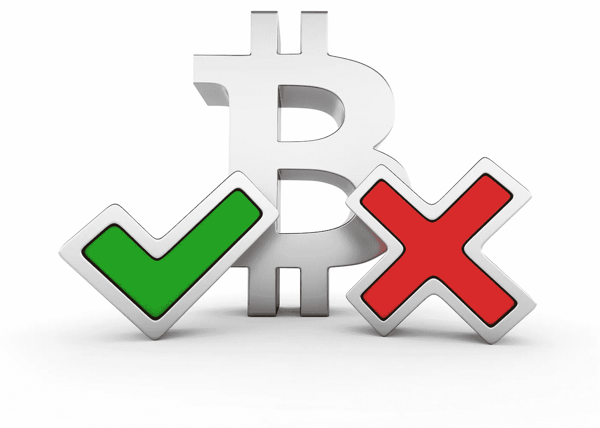
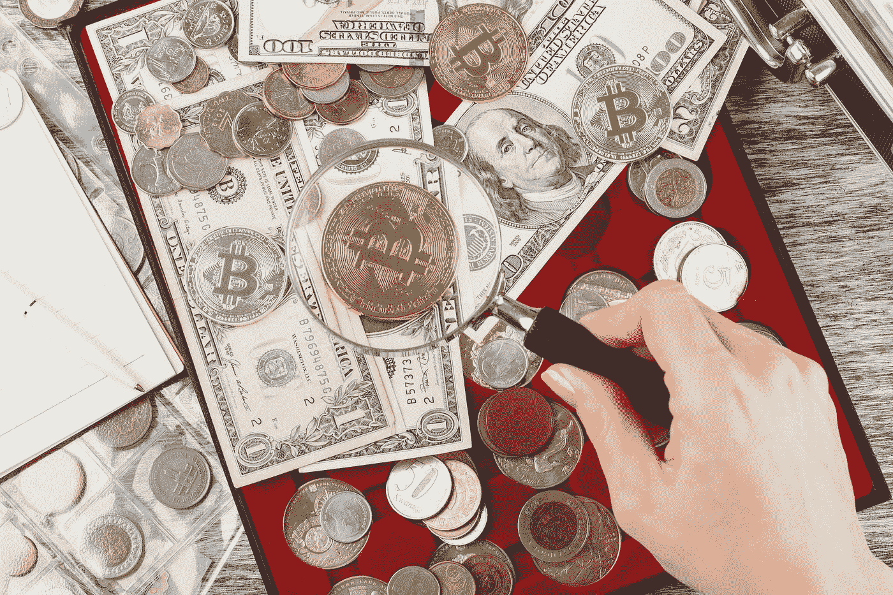
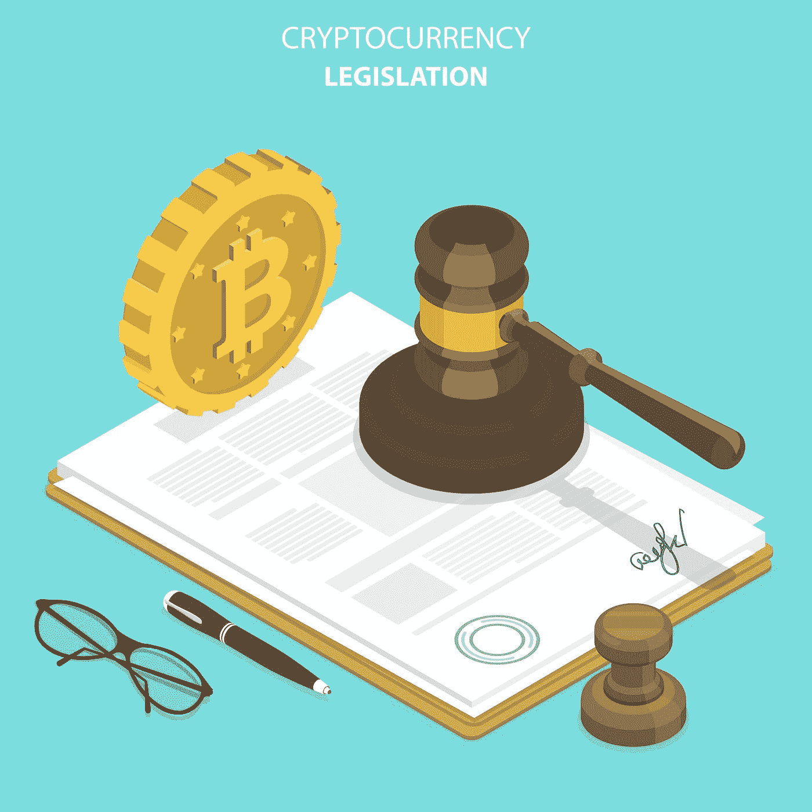

# 安全令牌和实用令牌之间的 6 个主要区别

> 原文：<https://medium.datadriveninvestor.com/6-key-differences-between-security-and-utility-tokens-d89c65901af8?source=collection_archive---------0----------------------->

毫不夸张地说，首次公开募股(ico)彻底改变了全球初创区块链公司的融资格局。去年，通过此类活动筹集了 40 多亿美元，轻松超过了区块链初创企业通过更传统的风险投资渠道筹集的资金。事实上，许多人会将 2017 年称为令牌年。

但缺乏足够的监管导致该领域出现了许多骗局和可疑的筹款行为。作为回应，美国证券交易委员会(SEC)正在加强对 ico 的审查，以确保此类产品符合规则，特别是联邦证券法。美国监管机构目前在 ICO 监管方面处于领先地位，预计世界上许多其他国家将紧随其后。

证交会努力的核心是试图推断代币是否具有内在效用，或者它们是否只是为了投资目的而提供的。金融监管机构现在特别关注 ico，试图核实此类事件是否涉及未注册证券的销售，以及主办公司是否在事件发生前向投资公众做出了任何重大误导性陈述。

例如，12 月 11 日，SEC 发布了针对 Munchee 的[停止令](https://www.sec.gov/litigation/admin/2017/33-10445.pdf)，Munchee 是一家科技公司，今年早些时候托管了一个价值 1500 万美元的 ICO，旨在创建一个餐厅餐饮评论“生态系统”。它的应用程序允许用户写评论和张贴餐馆提供的食物的照片。该公司将 Munchee token(“MUN”)作为这个生态系统的一个组成部分进行营销，用户可以购买 Munchee token 来购买广告和撰写评论。

根据 Munchee 的白皮书，mun 将在应用程序中使用的事实证明了它们被归类为“实用”令牌，而不是“证券”。证交会不同意。

**区分‘效用’和‘安全’的重要性**

“效用”和“安全”的区别对监管者来说很重要。从证券法的角度来看，代币和其他提供效用的物品如房地产和贵金属的销售在很大程度上被排除在证券监管范围之外，尽管买方购买此类物品至少部分是出于投资目的。事实上，这正是 Munchee 等公司避免将其代币归类为证券的原因，因为这需要适当的许可，而获得许可可能会非常昂贵和复杂。因此，他们的目标是在托管其 ico 时将其令牌作为公用令牌进行营销，这涉及的法规遵从性要少得多。

但是，如果有问题的代币代表一种证券，那么该公司将受到联邦证券法的管辖，正如 SEC 在 7 月份对发生在以太坊平台上的 DAO 代币发行进行[分水岭调查后首次得出的结论。当时，SEC 的结论是，道银行出售的代币是证券，因此应受联邦证券法的管辖。但他们也确定道令牌是有价证券，而以太不是。正如](https://www.sec.gov/news/press-release/2017-131) [Devebois & Plimpton 所观察到的](http://www.nasdaq.com/article/sec-weighs-in-on-ico-tokens-as-securities-ether-still-labeled-currency-cm822080)，“该报告似乎区分了贴有虚拟货币标签的以太和贴有证券标签的道币。市场参与者可能会对这一区别感到欣慰，因为它支持这样一种观点，即根据美国联邦证券法，并非所有区块链代币都是证券。”

考虑公用令牌的最简单方式是，它们是用来驱动系统成功运行的“燃料”。它们主要不是为了投资而设计的，无论是现在还是将来，因此不受该国证券法律的约束。这也许解释了为什么打算提供公用事业代币的项目更喜欢将其 ico 称为代币发行或代币生成事件，以便不将其与股票世界的首次公开发行(IPO)相混淆，从而不会引起监管机构的过度关注。事实上，以太可以被认为是一种公用事业令牌，因为它代表了使网络运行的“气体”,其主要功能是实现智能合同的公平执行，并促进网络上应用程序的构建。通过执行代码和智能合同，以太坊矿工可以获得天然气奖励，以以太的价值来表示。破纪录的 Filecoin 是另一个例子——它的 ICO 筹集了 2.57 亿美元，并出售了令牌，这些令牌将为用户提供访问其分散式云存储平台的机会。

另一方面，安全令牌更类似于金融交易工具。当它们被用作新公司的投资，或分享公司的利润/亏损时，通常可以观察到它们。最终，伴随证券的是对未来利润的预期，这种利润至少部分来自他人(通常是公司的创始人)的努力，以及投资价值的增加。

但证交会实际上是如何进行区分的呢？到目前为止，它所能使用的最有效的工具是豪威测试，这是最高法院的一项发现，它作为投资合同的主要定义形成了基础。该标准规定，投资合同是"一种合同、交易或计划，根据这种合同、交易或计划，一个人将其资金投资于一个共同的企业，并被引导期望仅从发起人或第三方的努力中获利。

因此，根据豪威测试阈值，SEC 得出结论，Munchee 发行了伪装成公用事业的证券。投资者对利润的期望取决于其他人的努力；具体来说，该公司为创建生态系统所做的努力，以及将为 MUN 令牌创建二级交易市场的事实。更重要的是，Munchee 的白皮书本身强调，该公司的经营方式将使 MUN 代币升值。

此外，SEC 主席杰伊·克莱顿(Jay Clayton)明确区分了这两个类别，声称“仅仅将代币称为‘效用’代币或对其进行结构化以提供某种效用，并不妨碍代币成为证券。”如果代币还在一定程度上强调投资者基于“他人的创业或管理努力”在未来某个时候获利的潜力，那么当局也会将代币视为一种证券。

**如何识别公司是否发行安全令牌**

作为一名希望参与 ICOs 的投资者，作为全面尽职调查的一部分，您应该知道发行公司是否试图销售伪装成公用设施代币的安全代币。随着美国证券交易委员会(SEC)出台进一步监管措施，从法律角度把握 ICO 前景将变得越来越重要。考虑到这一点，以下是一些帮助投资者(以及发行公司本身)进行这一努力的实用指南:

1.  **看看代币的功能:**你能按照代币声明的目的使用它吗？虽然这个项目可能只是处于“测试”模式，但平台至少应该强烈地表明它可以被代币购买者按预期使用。理想情况下，这应该在推出 ICO 之前确定。
2.  该公司的营销重点是什么？它的大量在线文献(例如，在论坛、脸书和它的网站上)是针对投资者和秘密社区的吗？如果是这样的话，这应该会引起人们对代币是一种证券的担忧，监管干预可能指日可待。但如果该公司转而专注于试图吸引人们使用其平台，而不是使用专注于赚取利润的措辞，而是讨论令牌的功能，那么该项目的合法性可能更有说服力。
3.  **不要依赖 SAFT 框架:**一份简单的未来代币协议(SAFT)是由项目开发商提供给合格投资者的投资合同。该框架旨在断言，当令牌被发行给 ICO 中的投资者时，它们具有实用性，因此它们不被视为证券，因此可以在二级加密货币市场上出售给投资者。但投资者不应该简单地认为，有一个 SAFT 就能让公司合规。在 Munchee 一案中，SEC 总结道，“即使 MUN 代币在发行时有实际用途，也不能排除代币作为证券的可能性。确定一项交易是否涉及一种证券并不需要贴标签——比如将一个 ICO 描述为涉及一种“公用事业权标”——而是需要对“交易背后的经济现实”进行评估。"
4.  **警惕寻求在交易所发行代币的公司**:如果一家公司声称要发行公用事业代币，但也在努力最终通过自己或第三方在交易所发行代币，这应该是一个危险信号。正如 Clayton 在 SEC 的 Munchee 命令发布后所评论的，在交易所拥有代币并推销其可转让性强烈暗示了这种代币是证券。
5.  **发布的内容是否陈述或暗示投资者可以获利？**该公司发布在博客、论坛、社交媒体平台上的在线内容，或认可其他第三方内容(如 YouTube 上的加密货币“权威人士”)暗示购买该公司代币可以实现收益，这应引起投资者的关注。事实上，Munchee 发表了一篇博文，称“随着越来越多的用户使用这个平台，你的 MUN 代币就变得越有价值。”该公司还发布了一个 YouTube 视频的链接，鼓励投资者尽早参与 ICO，因为他们会获利。
6.  **监管机构可以在任何时候进行干预**:仅仅因为象征性出售已经开始，并不意味着监管机构不会在稍后阶段停止这一活动。Munchee 再次为这一点提供了一个理想的例证，在象征性出售开始一天后，SEC 就发布了停止令。

Munchee 一案——以及其他如 [BitConnect](https://cointelegraph.com/news/texas-regulator-orders-bitconnect-to-cease-and-desist-marketing-securities) 之类的案件——引发了几个重要问题，这些问题围绕着总部位于区块链的新公司发行的代币的性质。美国证交会执法部门联席主管斯蒂芬妮阿瓦基安(Stephanie Avakian)表示，该监管机构“将继续警惕地审查市场，寻找寻求在没有必要的注册或豁免的情况下向公众出售证券的不当发行”。

但也应该强调的是，SEC 似乎并没有试图卑鄙地关闭 ico 或不必要地压制区块链/加密货币公司的潜力。如果制定和执行正确，那么代币生成事件将继续代表新项目筹集资金的创新性、革命性渠道。然而，如果代币符合证券的标准，那么正如克莱顿明确指出的那样，它们“必须伴有我们的证券法要求的重要披露、流程和其他投资者保护。”

尽管如此，这一过程继续以相当快的速度发展，根据美国证券交易委员会[的一些最新声明](https://www.wsj.com/amp/articles/regulators-are-looking-at-cryptocurrency-1516836363)，“无论所提供的证券……是被贴上‘硬币’还是‘公用代币’的标签，而不是股票、债券或投资合同，联邦证券法都适用。”虽然许多人认为应该明确区分公用事业和证券，公用事业代币需要的监管力度要小得多，但克莱顿和吉安卡洛最近的评论似乎强烈表明，未来这两个类别之间的区别会更小，更多的项目将需要遵守证券法。

如果这是美国采取的最终方向，那么世界大部分地区都会效仿。反过来，这应该有助于全球投资者在参与 ICO 时获得适当的保护，并为其提供成熟和发展所急需的合法性空间。

# 有关系的

评论

*原载于 2018 年 4 月 8 日*[*www.datadriveninvestor.com*](http://www.datadriveninvestor.com/2018/04/08/make-sure-you-know-the-difference-between-a-utility-vs-security-token/)*。*