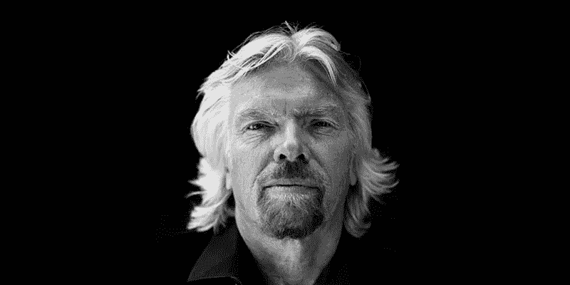

# 社交媒体的 6 堂课

> 原文：<https://medium.datadriveninvestor.com/6-lessons-from-social-media-f13245dfdcd7?source=collection_archive---------28----------------------->

社交媒体教会了我们很多关于我们生活的世界，以及我们如何提升自己的潜力。

社交媒体给了我们前所未有的机会，让我们可以从知名人士那里了解更多关于世界、商业和现实生活的问题。Instagram、脸书、Youtube 和 Twitter 上充满了许多人认为“成功”的人物。

然而，我注意到许多“有抱负的企业家”转发、记录、转贴，却没有真正反思和吸取这些成功简介的教训。

每个社交媒体人物都有一个你可以从他们身上学到的关键东西。学会这一点，并把它加入到你的技能中，然后继续前进。

1.  **加里·韦内尔丘克(insta gram/脸书/Youtube**

加里·维(Gary Vee)是 VaynerMedia 的负责人，他非常讨人喜欢，满嘴脏话，在短短十年内将家族的葡萄酒业务从 300 万美元增加到 6000 万美元，取得了巨大成功。他是跨所有平台的多产社交媒体内容创作者。这也包括他的播客，名为# askgaryvee。

嘶…播客今年越来越受欢迎了！查看[为什么你的企业应该投资创建播客。](https://blogs.constantcontact.com/podcasting/)

加里·维的最新项目？通过去车库拍卖和在易趣上卖东西赚钱，教他们如何“翻屎”。

> 关键教训:停止空谈，执行！

Just Do It! (Sorry Nike, Gary now owns this)

2.**西蒙·西内克(Instagram/Twitter)**

Sinek 是一名励志演说家，曾在联合国全球契约领导人峰会和 TED 大会上发表演讲。他的演讲，[‘伟大的领导者如何激励行动’](https://www.youtube.com/watch?v=qp0HIF3SfI4)**，**是有史以来最受欢迎的 TED 演讲之一。

他已经写了四本书，他的最新作品《无限游戏》(The Infinite Game)登上了《华尔街日报》和《纽约时报》的畅销书排行榜。西蒙不仅仅使用 Twitter 来宣传他的书和成就，他还利用这个平台用他的哲学吸引观众。

> 关键教训:不要模仿你的导师或试图复制他们的成功。找到你的**为什么，你会在你的条件下成功。**

‘How Great Leaders Inspire Action’ (*TEDxPuget Sound)*

3.**雷伊·达里奥**

雷伊·达里奥是 BridgeWater Associates 的负责人，是有史以来最成功的投资者之一。他最近出版了广受好评的书《生活和工作的原则》，在书中，他列出了自己的原则，嗯……实现成功所需的一切。利用 Youtube 作为一个平台来加工他的信息，他制作了一系列精彩的视频来概述经济是如何运转的。

> 关键经验:**评估**和**重复**你的指导原则，尽可能做到最好。

Probably the most life-shatteringly inspiring animation you’ll ever watch

4.**比尔·盖茨**

每个人都知道比尔盖茨…除非你生活在岩石下。没有被广泛意识到的是他的慈善努力的广度。除了资助剑桥奖学金，比尔和梅林达·盖茨基金会还为小额贷款服务、农业发展、水、环境卫生和个人卫生项目提供资金，并站在消除疟疾的最前沿。比尔·盖茨是慈善事业的典范。

> 关键教训:“让世界变得比你发现时更美好”

*Philanthrops successfully*

5.**理查德·布兰森(博客:理查德@维珍/Linkedin/Instagram)**

理查德·布兰森名下有超过八本书，是无可争议的“品牌之王”。通过他无处不在的维珍品牌，他涉足了很多领域。从维珍银河，维珍媒体，维珍航空，维珍邮轮到维珍移动。维珍显然是任何行业的主要参与者。布兰森在 Instagram 上有 300 万粉丝，他展示了自己如何“将想法变成现实”。

> 关键经验:“用有益于生活的方式解决问题，你会找到成功。”

‘Screw it, just do it’

6.**特别提及——埃隆·马斯克(推特)**

不管你喜欢还是讨厌他，埃隆·马斯克都将作为伟人之一载入史册。

迄今为止，他的一些成就包括:

*   特斯拉首席执行官
*   SpaceX 公司的首席执行官
*   无聊公司的首席执行官
*   AI 公开赛赞助商
*   神经链接。

如果你能从埃隆·马斯克身上学到什么，那就是:

> 你远比你想象的更有能力完成更多的事情！

You forgot Musk was in Iron Man 2, didn’t you?