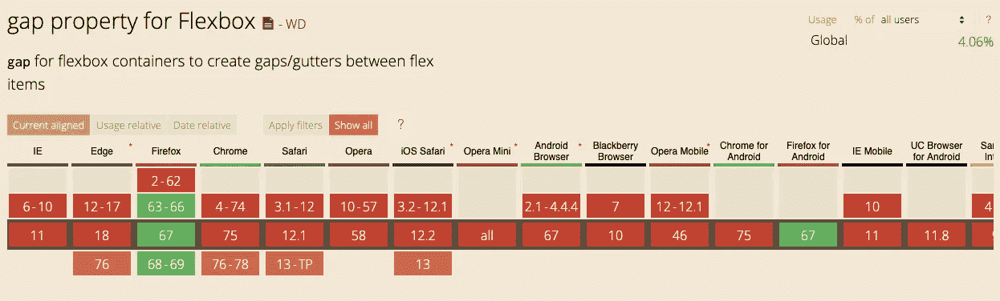
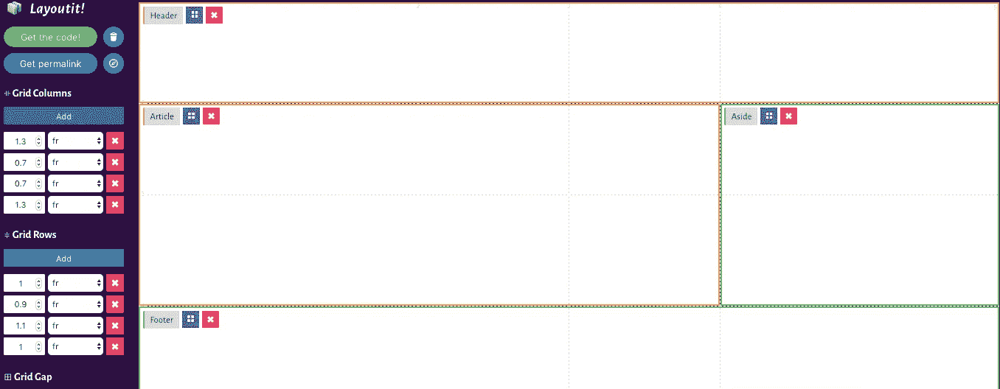
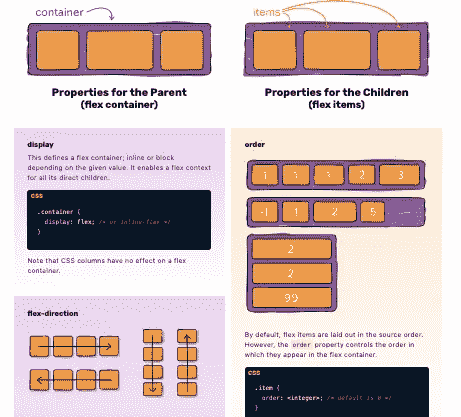
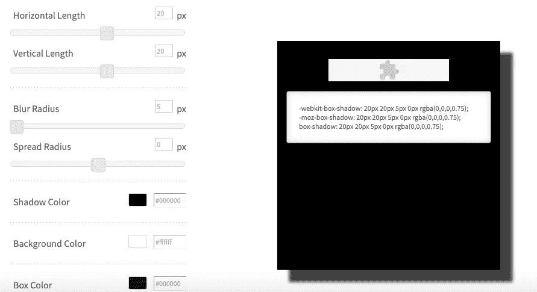
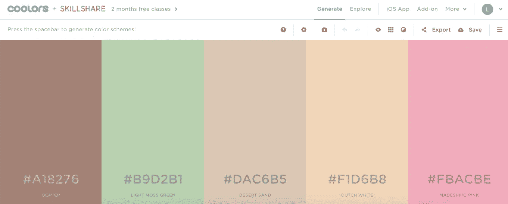
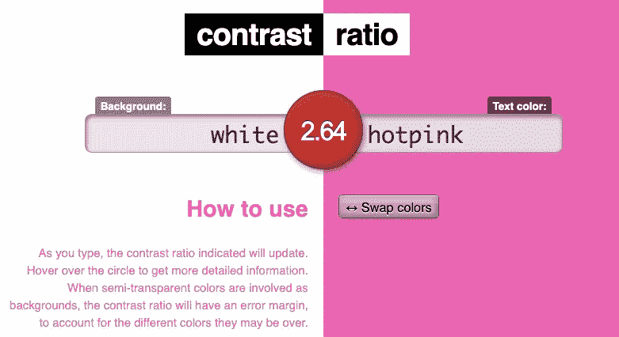
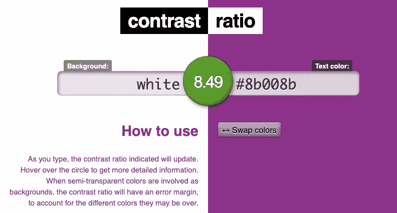

# 6 个拯救生命的前端编码技巧

> 原文：<https://medium.datadriveninvestor.com/6-life-saving-front-end-coding-hacks-5a4cc49473bf?source=collection_archive---------14----------------------->

代码——正如最近有人在 Twitter 上说的，“对于那些喜欢在世界上最聪明和最笨的人之间转换的人来说，这是一个很好的职业”。

为了减少后一种感觉，我整理了 6 个编码技巧，让我省时省力。我花了很多时间(嗯，至少几分钟)在谷歌上搜索这些——并在这里编译了它们，所以你不必这么做。

 [## 2019 年最值得学习的编码语言——数据驱动的投资者

### 在我读大学的那几年，我跳过了很多次夜游去学习 Java，希望有一天它能帮助我在…

www.datadriveninvestor.com](https://www.datadriveninvestor.com/2019/02/21/best-coding-languages-to-learn-in-2019/) 

**1。**[**can use**](https://caniuse.com/#home)

随着如此多新奇的新功能几乎每天都出现在科技世界中，很难跟上哪些功能在不同的浏览器中运行良好。[can use](https://caniuse.com/#home)删除猜测工作。只需输入你想使用的功能，应用程序就会输出一个闪亮的图表，绿色方块表示浏览器会满意你的选择，红色方块表示浏览器会崩溃。

如果适用，CanIUse 甚至会告诉您使用哪个前缀来享受对特定功能的支持。这才是服务！

**2。** [**LayoutIT 网格生成器**](https://grid.layoutit.com/)

CSS grid——可以说是自微波炉以来最节省时间的发明，但安装起来要困难得多(虽然烦人的噪音更少，也没有爆炸的危险)。

[CSS 网格生成器](https://grid.layoutit.com/)完成了计算那些`fr`单元的艰苦工作(不再考虑分隔线在哪里，或者到底发生了什么)。你只需要知道你的布局会是什么样子，并且记得点击保存按钮。

不过，警告一句，生成器不会重构代码。这意味着，如果一个元素的宽度为`3fr`，生成器将输出该元素的`1fr 1fr 1fr`。虽然这可以工作，但它不是干净的代码，所以最好进去整理一下。

**3。**[**Flexbox 完全指南**](https://css-tricks.com/snippets/css/a-guide-to-flexbox/)

Flexbox——不可否认，这是在 resize 上包装项目的唯一方式，但是如果你没有[这个备忘单](https://css-tricks.com/snippets/css/a-guide-to-flexbox/)，那就有些莫名其妙了(所以我想，至少，谢天谢地，这是我第一次使用 Flexbox 时看到的，所以我从来没有在没有它的情况下挣扎)。

备忘单显示了哪些属性应该在父元素上，哪些应该在子元素上。它还让您了解所有属性的工作原理。即使你不确定你想用 Flexbox 做什么，它也是一个获取新技术和新想法的好方法。

**4。** [**阴影发生器**](https://www.cssmatic.com/box-shadow)

谁不爱 CSS 影子？一个简单而有效的方法，让元素在页面上弹出，同时让它看起来像你做了几个小时的工作。虽然添加阴影并不复杂，但它可能很假，尤其是如果你不确定你想添加什么类型的阴影。

这就是 S [阴影发生器](https://www.cssmatic.com/box-shadow)的用武之地。只需指定水平和垂直阴影大小，并调整模糊效果，扩散半径和颜色，如果你愿意。然后，应用程序输出 CSS，供您复制并粘贴到您的样式表中。它甚至给了你前缀`-webkit`和`-moz`，所以你的影子是跨浏览器兼容的。发生器是一个很好的方式来玩阴影，学习如何使用它或尝试不同的项目想法。

该网站也有梯度，边界半径和噪声纹理生成器，所以它是提高你的设计技能的一个很好的来源。

**5。** [**酷派**](https://coolors.co/)

严格来说与代码无关，但尽管如此，这个易于使用的交互式[配色方案生成器](https://coolors.co/)在做任何前端工作时都是一个很大的帮助和乐趣。只需点击空格键，该应用程序会给你一个完美协调的配色方案，颜色可以复制和粘贴。您可以锁定自己喜欢的颜色，并根据项目需要调整色调。最重要的是，有一个后退按钮，所以如果你对空格键有点过于热衷，也不用担心。

6。 [**对比度**](https://contrast-ratio.com/)

一个好的网站对普通文本的对比度至少应该是 7:1，对大文本的对比度至少应该是 4.5:1，以确保最大的可访问性(和最小的斜视)。如果你不确定如何测量对比度，这可能是一件痛苦的事，但幸运的是 contrast-ratio.com 可以随时提供帮助。

输入你想用于背景和文本颜色的颜色，如果对比度可以，应用程序会返回一个大的绿色圆圈，如果不行，会返回一个大的红色圆圈。它可以识别所有的颜色单位，包括 CSS 颜色名称。更好的是，说明文字会根据您选择的颜色进行更改，这样您就能真正感受到文字在项目中的外观。您也可以反转颜色，看看您的项目是否会受益于较暗或较亮的感觉。

Computer says no.

Onto a winner!

这就是我的六大代码挫败阻止者，我希望它们能帮你节省很多时间。如果你有任何其他你想看到的 tops 技巧或快捷方式的想法，请在评论区告诉我。编码快乐！