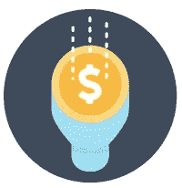

# 6 种鲜为人知的增加销售额的方法

> 原文：<https://medium.datadriveninvestor.com/6-little-known-ways-to-increase-sales-ea54a59b9e23?source=collection_archive---------65----------------------->

我们都希望我们的生意有更多的销售，我相信你会同意的。毕竟，如果不是为了赚钱和获得财务自由，以便有时间在我们想做的时候做我们想做的事情，我们许多人当初为什么要创业。

你会经常读到关于流量和转换率的所有内容，这些对你的底线至关重要，所以你需要确保你的销售过程尽可能优化。

那么，请继续读下去，找出 6 种鲜为人知的增加销售额的方法。好的一面是这些都不需要太多时间，但是任何一个都可以为你的底线增加可观的销售额。或者尝试所有六个，看看你的销售爆炸。

# 你的潜在客户不信任你

提供您的真实联系信息，包括姓名、公司名称、蜗牛邮件地址(物理地址比邮政地址更好)和电话号码。

**为什么？因为你的潜在客户害怕你不是你所说的那个人。**

在你的“关于我”页面上，再次提供所有这些信息，连同你的照片，你的任何员工，甚至你的位置。让信任你变得超级容易，你就会获得更多的销售。

# 提升您的潜在客户的地位，以实现更多销售

人们想证明他们比别人优秀，让人们尊敬他们。这并不坏，这只是人的本性。你也可以利用这些知识来增加销售。

***打起这种倾向来觉得更重要。向潜在客户展示购买你的产品将如何提升他们在同龄人、朋友、家人等中的地位。向他们展示，购买你的产品会让他们变得多么重要。***

# 你的销售信息来自同行吗

提高你的销售信息的回应的“秘密”之一是让它来自你的理想潜在客户的同事。

换句话说，你希望你的信息来自你的销售目标群体中的某个人。

你向 40 多岁的女人推销吗？你的信息是来自一个 40 多岁的女人向投资者推销吗？你的信息来自另一个投资者，等等。

你可以利用你现在正在进行的任何促销活动，改变来自潜在客户同事的信息，并大大增加你的回应。

当你向一个高度怀疑的人推销时，这种技巧就更重要了。没有什么比从一个你认为和你非常相似的人那里听到一条信息更能融化阻力。

分开测试，看看反应——我想你会对这种简单技巧带来的销售增长感到震惊。

# 专注于利益的利益！

你已经知道利益对销售过程有多重要。

功能固然重要，但更重要的是它的好处。

例如，那本减肥书很漂亮，有 300 页——这些都是特色。好处是，如果读者按照书中的计划去做，他们将会减轻体重。

但是好处有什么好处呢？

在上面的例子中，问问自己减肥有什么好处？

例如:

*   看起来更好
*   感觉好些了吗
*   变得更有吸引力
*   长寿
*   穿上他们已经拥有的衣服
*   更加自信
*   回头率和获得日期

诸如此类。

仅仅谈论主要的好处——在这种情况下，减肥——是不够的。

你想更深入地挖掘并阐述你的客户将获得的所有好处，然后描绘他们使用你的产品后的新生活。

# 讲故事

每个产品都有一个隐藏在某个地方的故事——你只需要把它挖掘出来。

例如，看看约翰·卡尔顿的这个标题:

*“一条腿的高尔夫球手发现了惊人的秘密，让你的击球增加了 50 码，消除了钩球和削球……几乎一夜之间，你的比赛可以减少 10 杆！”*

我对高尔夫球毫无兴趣。没有。然而看完这个标题，我想了解一下这位独腿高尔夫球手。

现在想象一下，如果我打高尔夫，想象一下所有读到这个标题的高尔夫球手都做了什么。是的——我保证，他们会情不自禁地继续阅读，寻找那个独腿高尔夫球手。

这就是好故事的力量。

# 鼓励微观承诺

一个人对某事承诺得越多，就越不可能改变主意。

例如，如果你能让某人选择加入你的两个或更多名单，他们会更愿意留在你的名单上。

还有，他们也更有可能购买。

心理学的一个原则是，一个人越是致力于某事，就越有可能长期坚持下去。

例如，有人可能会说他们将要开始跑步。但他们所做的只是说出来——他们不做任何其他事情——一周之内他们就把这件事忘得一干二净了。

但是如果同一个人买了新的跑鞋和衣服，访问了跑步网站，订阅了跑步杂志，加入了跑步俱乐部，那么我可以保证他们会去跑步。

你的单子也是一样。如果你能让订阅者选择加入多个列表，他们会变得更忠于你，更忠于利基或主题本身。

所以，假设你的定位是狗。你可能会要求你的新订户选择参加一个关于如厕训练的特别课程，另一个关于不良行为矫正的课程，另一个关于他们特定品种狗的课程等等。

通过从你的读者那里获得更多的这种微承诺，你就大大增加了他们成为你的客户，甚至多次从你这里购买的几率。

这有多棒？太棒了，我想你会同意的！

好了，你知道了；6 个鲜为人知的方法。

原刊[此处。](https://copyscape.com/prosearch.php)