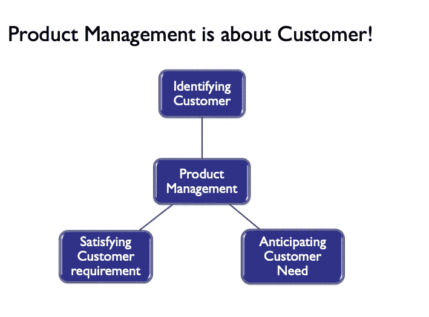

# 让产品经理变得优秀的 6 个必备技能！

> 原文：<https://medium.datadriveninvestor.com/6-must-have-skills-that-turn-a-product-manager-good-to-great-74511097971e?source=collection_archive---------3----------------------->

## 产品管理导论

## 产品管理职能为什么存在？

组织由两个实体驱动，

*   一个是专注于**定义目标**

定义目标所涉及的功能是“面向客户”的。他们也在现场倾听客户的需求和关切。

通常情况下，销售和业务开发团队会参与为组织带来客户。

还有不断评估客户需求的主题专家，与客户建立关系并向他们提供产品和解决方案的执行领导。

而财务、法律和合规等其他实体则负责预算，P&L 则负责阐明地区和全球政府规则。

*   另一个关注于**执行目标**

在技术行业，会有技术团队来确保目标按照计划执行，这个职能确保交付。

还有其他支持技术团队的职能，如运营和客户支持，以确保交付给客户的产品/解决方案得到监控、维护和支持。

**所以问题是，在这种设置中，产品管理职能适合于哪里？**

*简而言之，将产品管理职能视为这两个实体之间的桥梁，确保既定目标的执行符合客户的期望。*

**现在的问题是，为什么我们需要一个桥梁，为什么这些实体不能相互沟通和协调来完成工作！**

这两个实体都有特定的目标，

*   提高销售额，建立更多的合作伙伴和参与度，从而扩大业务。
*   在符合最新技术和架构指南的解决方案中创建。

这种情况下缺少的一个关键目标是关于**客户和产品**

组织需要一个专门的职能部门，其主要工作是专注于“**识别客户**”、“**预测客户需求/愿望**”和“**用优秀的产品满足客户的喜悦**”。这就是产品管理功能存在的原因。

产品经理，产品管理职能的一部分必须以客户为中心！！

*为了有效地履行职责，产品经理需要具备某些必备技能，这是当今几乎所有产品公司都要求具备的技能！！*

## #1 适应不确定性和模糊性

> 人们想自己创业或者经济独立。但是你不会成为一个成功的企业家，除非你找到一种方式去热爱风险、不确定性、一次又一次的失败，以及在你不知道是否会成功的事情上疯狂的工作。
> 
> **马克·曼森-** 自助作家、个人发展顾问、企业家和博客作者

需要构建的解决方案或产品从业务和技术两方面来看都完全清晰的可能性非常小。

产品经理需要不断地试图澄清模糊的目标。以下是处理这种情况的一些方法:

1.  这可能涉及与业务、客户或技术团队的多次讨论。
2.  您必须记录每一次讨论的会议纪要，其中包含后续步骤或行动项目，并在会议纪要中提及所有者。
3.  最后，继续跟进 1 和 2

***对于一个产品经理来说，这里的关键不是自己想出解决方案，而是向所有相关利益方提出尖锐而正确的问题，这有助于澄清未知。***

## #2 成为推动/促进沟通的领导者

> 有两种创造的方式。一个人可以唱歌和跳舞。或者一个人可以创造一个环境，让歌手和舞者蓬勃发展。
> 
> **沃伦·本尼斯—** 美国学者、组织顾问和作家，被广泛认为是当代领导力研究领域的先驱。

以下是培养这种技能的一些方法:

1.  在参加会议之前，先做好准备，列出你想要达到的目标
2.  允许每个人发言并提出自己的观点
3.  真诚地对谈话感兴趣，并保持好奇心
4.  最后，不要犹豫，问一些显而易见且愚蠢的问题。你永远不知道问了这个问题后会发生什么！！！

***不要等别人率先带动讨论。特别是在事情不清楚的情况下，这里的关键是产品经理将正确的人召集在一起，以一种可能产生解决方案的方式推动讨论。***

## #3 思维清晰——练习批判性思维

> “第一名认为我们寻求的是一般的认知能力，而不是智商。是学习能力。这是动态处理的能力"
> 
> **谷歌人力运营高级副总裁拉兹洛·博克** [*【来源】*](http://www.nytimes.com/2014/02/23/opinion/sunday/friedman-how-to-get-a-job-at-google.html)

最常见的是，每当产品经理需要解决一些问题时，他们会立即开始思考解决方案。批判性思考者首先理解问题本身。他们分析性地检查并试图理解为什么这是一个问题！！

以下是一些培养批判性思维技能的方法:

1.  收集数据并分析有关问题的数据。
2.  准备一系列深思熟虑的问题，并与相关利益相关者进行讨论。
3.  合作，倾听和理解所有人的推理。
4.  提炼、分析事实并**定义**问题。

在回应客户、团队或任何其他内部利益相关者之前“**停下来思考**”。不要急着回应，但你的目标是理解不同的思维过程。

***先说服自己，再说服别人。明确你的回应方式。请记住，您的最终目标是向客户提供最佳解决方案/产品。***

## #4 一直问“为什么”

> *你做什么人家不买；他们买你为什么这样做。你所做的只是证明你所相信的。*
> 
> 西蒙·西内克——英裔美国作家、励志演说家和组织顾问。

另一个让思维清晰的方法是问“为什么”。了解业务用例背后的动机。再问一次为什么，直到你完全满意，确信为止。

这有时很难做到，尤其是当你与高层领导沟通时。在任何情况下，都要记住，如果产品经理没有清晰的画面，那么这可能会向许多只与产品经理讨论的其他利益相关者传递错误的信息。

## #5 成为自己产品的用户

> “通过焦点小组设计产品真的很难。很多时候，人们不知道他们想要什么，直到你给他们看。”
> 
> 史蒂夫·乔布斯

这并不意味着你开始对你的产品进行端到端的测试。这意味着把自己当成一个消费者，经历使用产品的过程。

这可以帮助产品经理体验潜在用户可能面临的痛点，同时这可以帮助你在团队和其他利益相关者面前建立信誉。

当你亲身体验过产品后，你会更有信心与顾客交谈。

## #6 坦然接受对你想法的提问

> 成为一名优秀的领导者需要记住，你在那里是有原因的，而原因当然不是随心所欲。高度正直的领导者不仅欢迎质疑和批评，而且坚持这样做。
> 
> **特拉维斯·布拉德伯里—** 情商 2.0 的合著者&TalentSmart 总裁

这是最重要的技能。一个产品经理将不得不与许多人交谈，每个人都可以提出自己的想法，并可以在可用性或任何其他方面挑战你和你的产品。

学会处理这种情况，你需要了解什么是合理的担忧/问题，什么是你可以忽略的。

重要的是在回答问题时不要有太多的防卫心理。自如地处理问题。

简单的方法就是分清轻重缓急，勇往直前！！