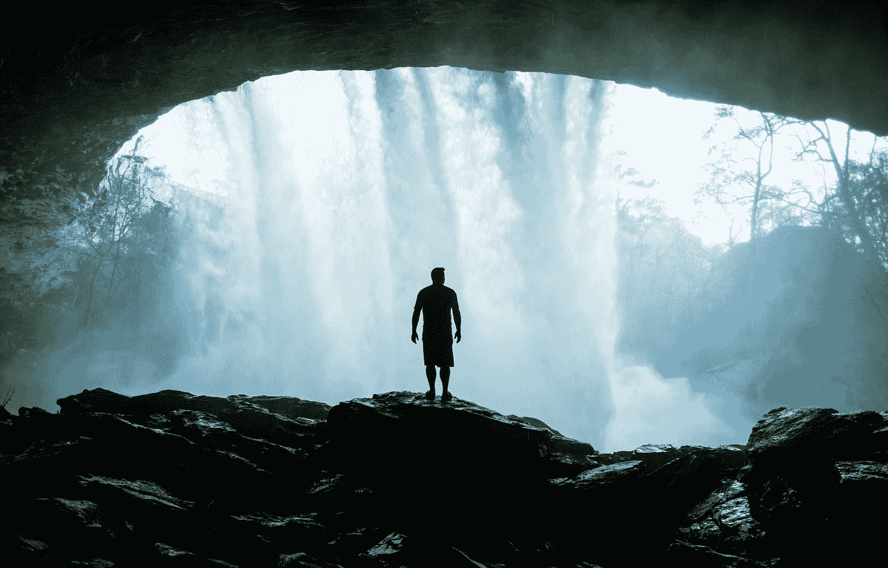
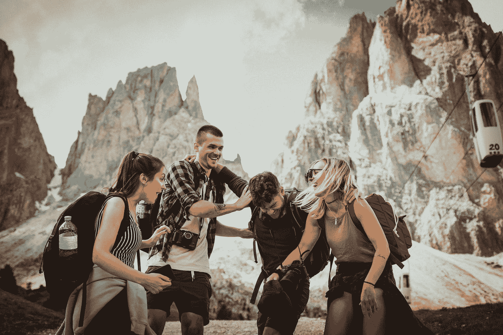
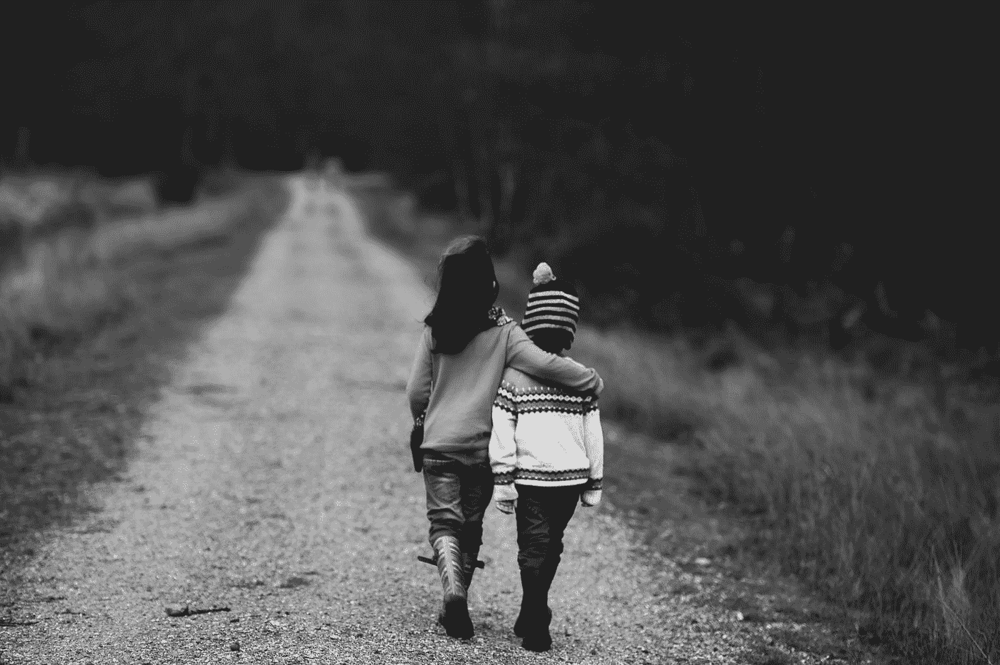
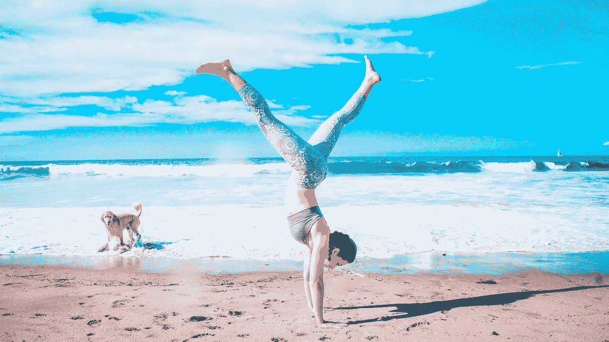

# 给新毕业生的 6 条改变生活的建议

> 原文：<https://medium.datadriveninvestor.com/6-pieces-of-life-changing-advice-for-new-grads-eb75bac1ed0?source=collection_archive---------6----------------------->

我将要和你分享的建议改变了我的生活，让我有了一种不同的生活方式。

我本来可以写很多，但我保持简单易懂。我保证，如果你使用其中的一个，它会对你的生活产生巨大的影响。

Photo by [Tim Foster](https://unsplash.com/@timberfoster?utm_source=medium&utm_medium=referral) on [Unsplash](https://unsplash.com?utm_source=medium&utm_medium=referral)

# **1。相信自己**

必须从基础开始。不要低估自己！相信你的潜力。没有人会比你更看重你。**所以你如何推销自己就是你将如何被收购。**

大胆一点💪

Photo by [Muzammil Soorma](https://unsplash.com/@muzammilo?utm_source=medium&utm_medium=referral) on [Unsplash](https://unsplash.com?utm_source=medium&utm_medium=referral)

# **2。做有风险的事情**

不要为了一份工作而优化，因为你会赚更多的钱。现在是时候做一些让你兴奋、让你紧张、让你害怕、让你走出舒适区的事情了。如果这意味着去国外旅行，做志愿者，为你崇拜的人实习，开公司，无论是什么，只要能让你每天醒来都充满期待！不要墨守成规，也不要害怕被你的朋友/同龄人超越。这不是比赛，这是你的人生。我的导师有一句名言，“天赋是通用的，而机会不是，”去寻找你的机会吧！

简而言之，投篮😉

Photo by [Felix Rostig](https://unsplash.com/@felixrstg?utm_source=medium&utm_medium=referral) on [Unsplash](https://unsplash.com?utm_source=medium&utm_medium=referral)

# **3。操假朋友**

事实上，你意识到只有少数人关心你，并为你的成功加油。你的推特、Insta、Snap 粉丝可能不算。这里有一个简单的公式可以帮助你:想想当你最需要的时候，有多少人会在你的床边。想想有多少人会在你最艰难的时候支持你。想想你实际上能打电话给多少人，他们会马上回答或回电。

 [## 摔倒不是失败。-数据驱动型投资者

### 你只有在放弃的时候才会失败。每个英雄都会倒下，我们活着就是为了失败者出现的时刻；上升到…

www.datadriveninvestor.com](https://www.datadriveninvestor.com/2019/01/17/falling-isnt-failing/) 

我第一次读到吉米·罗恩的一句话时，吓了我一大跳。"你是和你相处时间最长的五个人中的平均水平。"**只选最好的。人生苦短，不能和 B 级玩家一起玩。**

这似乎很难。不是的。如果你想过你自己的生活，那肯定不难。🤷‍♂️

Photo by [Sammie Vasquez](https://unsplash.com/@sammieeev?utm_source=medium&utm_medium=referral) on [Unsplash](https://unsplash.com?utm_source=medium&utm_medium=referral)

说到消极，与有毒的人(悲观主义者)断绝关系。把它们想象成一氧化碳。它无色，无嗅，无味，但它仍然会杀死你！每一个影响都很重要。你不必成为一个永远的乐观主义者，但是肯定的是，消极不会给你带来任何好处。生活的过山车已经很颠簸了，你需要尽可能多的积极。就比较而言，这是人类的天性，我完全感同身受。

但是记住，就像有人说的，“你不能把你的第三章和别人的第二十二章相提并论。”✍️

Photo by [Aron Visuals](https://unsplash.com/@aronvisuals?utm_source=medium&utm_medium=referral) on [Unsplash](https://unsplash.com?utm_source=medium&utm_medium=referral)

# **4。尊重你的时间**

我在哪里读到过，20 多岁被认为是你的黄金时期。不管你是否同意，有一点是肯定的:无论一个人的净资产有多高，时间都是买不到的。这包括杰夫·贝索斯。留意它并明智地使用它。这是你最珍贵的东西。不要把你最宝贵的财富浪费在不能给你带来快乐的人或事上。你可能生活在人类见证的最伟大的时代。尽你所能为之做出贡献。

现在是你的时候了。🤔

Photo by [Annie Spratt](https://unsplash.com/@anniespratt?utm_source=medium&utm_medium=referral) on [Unsplash](https://unsplash.com?utm_source=medium&utm_medium=referral)

# **5。有同理心**

也许是我们这一代人面临的最大挑战之一。对于那些不知道的人来说，同理心的正式定义是“理解和分享他人感受的能力。”在今天的时代，很容易立即对人做出判断，但很少有人真正试图理解对方。

每个人都在进行自己的战斗，有些人在与抑郁、焦虑发作作斗争，为失去亲人而悲伤，遭受健康状况的折磨，与自己的不安全感作斗争，每个人都有一些事情要做。事实上，我们甚至根据别人的穿着、长相、所做的事情来判断他们，也许他们的环境不允许一种“典型”的生活，也许他们的教养很差，我们他妈的是谁来判断彼此呢！？

每个人都相信自己的观点是正确的，对吗？花一点时间从他们的角度想想，看看你是否有一点不同。达赖喇嘛说得好，“爱和同情是必需品，不是奢侈品。没有它们，人类无法生存。”

**如果你拥有谦逊的力量，你将赢得全世界。那是事实而不是观点。🙌**

Photo by [Marion Michele](https://unsplash.com/@marion_michele?utm_source=medium&utm_medium=referral) on [Unsplash](https://unsplash.com?utm_source=medium&utm_medium=referral)

# **6。你的健康很重要**

最后但同样重要的是，健康。这并不复杂，健康才是最终的财富。如果你有健康，你就拥有了整个世界。留意你吃的东西，进行有规律的身体运动，以及冥想就是全部。从长远来看，每天 30 分钟会有很大的不同。

事实上，我会更进一步。如果你有吃的，有住的，健康的身体，充沛的精力，能够随心所欲地笑、哭、走、跑，你就拥有了一切。这可能令人惊讶，但我们大多数人已经拥有了幸福和健康所需的一切。这是对我们没有的东西的追求，以及一旦我们达到目标，我们就会获得幸福的感觉，这就是问题所在。

你已经过上了全世界数百万人梦寐以求的生活。那些人会为了你的问题而杀人(你的咖啡温度不对，现在你变得暴躁)。有数百万人只想呆在美国。

你只有一次生命。保持身心健康，尽最大努力改变你在地球上的生活。✊

# 当你开始人生的下一个篇章时，我祝你健康快乐。向月球射击，事实上，向火星射击，即使你错过了，你也会在星星中着陆。🚀 😉

附言:我不宣扬我不实践的东西。这些建议大部分是我的导师、播客、阅读材料给我的。

希望你能从中发现一些价值。如果你喜欢这个，你会 also❤️我的播客， [*人民的愿景*](https://itunes.apple.com/us/podcast/vision-of-the-people/id1386339640) *在那里我采访了鼓舞人心的世界领导人(Twitter 的联合创始人，维珍轨道的首席执行官，通用催化剂的总经理等投资&运行数十亿美元的公司)并谈论他们的产品，愿景和建议，他们将与那些也希望对世界产生影响的年轻人分享！期待收到你的回复。在推特上找到我@LilRushiShah*

*特别感谢 Adi 的点评。*

# 多❤️
到下次，继续努力！