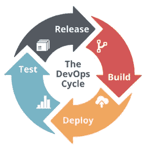

# 你应该采用 DevOps 文化的 6 个理由

> 原文：<https://medium.datadriveninvestor.com/6-reasons-why-you-should-be-adopting-a-devops-culture-82dc88592d6b?source=collection_archive---------4----------------------->

数字化正在席卷许多行业，为企业创造了前所未有的需求，要求它们更快地创新、实验和交付能力。提高速度和灵活性不仅仅是一种愿望，也是生存的必要条件。您需要采用一种更加灵活和高效的软件交付方法——一种消除障碍并利用开发和运营之间的依赖性的方法。为此，你可以采用 DevOps 文化。

在 DevOps 环境中，您的整个团队负责提供新功能和稳定性。不再是简单地创建代码并将其交给运营团队投入生产，而是更加平等地平衡责任，并通过适当的程序确保两个团队都能洞察和了解应用性能。

毫不奇怪， [DevOps 实践继续流行](https://devops.com/state-devops-adoption-trends-2017/)。根据 DevOps.com 的数据，从 2015 年到 2016 年，采用率大幅增加，从 66%增加到 74%。

是什么推动了这种转变？软件投入生产的漫长准备时间使得公司很难提供尖端服务和[增强客户体验](https://perspectives.mobilelive.ca/blog/future-proofing-customer-experience-for-steadfast-growth)。为了跟上市场需求，IT 团队必须以更快的周期构建、部署、测试和发布软件。

以下是您应该考虑采用 DevOps 文化的六个原因:

# 1.加速创新

有了集成的运营和开发团队，应用程序的开发和部署速度将会更快。这是至关重要的，因为今天的商业成功很大程度上取决于一个组织比竞争对手更快创新的能力。由于变更集更小，问题往往不那么复杂。DevOps 工程师可以利用实时性能数据快速掌握应用程序变化的影响。软件修复速度更快，因为团队成员只需检查最新的代码更改是否有错误。

# 2.改善协作

一个成功的 DevOps 环境不是试图消除两个学科之间的差异，而是承诺建立一座桥梁，使它们更好地合作。然后，软件开发文化继续关注组合的成就，而不是单个的目标。当您的软件和操作团队相互信任时，他们可以更有效地进行实验、研究和创新。这不再是把应用程序代码扔到墙上，然后抱最好的希望。随着所有团队成员朝着共同的目标努力，您的开发环境变得越来越无缝。

# 3.提高效率

自动化工具和标准化生产平台是 DevOps 最佳实践的关键要素，有助于提高部署的可预测性，并将您的 IT 员工从繁琐的重复性任务中解放出来。有了[自动化测试](https://www.mobilelive.ca/automation)和集成，开发人员不需要浪费时间依赖代码集成过程来完成。

加速和开发平台为提高效率提供了额外的机会:

*   可扩展的基础设施，如基于云的解决方案，通过增加对硬件资源的访问，有助于加快测试和部署过程。
*   编译和开发工具有助于缩短开发周期和加快产品交付。
*   连续交付工作流有助于更快、更频繁地发布软件。

# 4.减少故障

与强大的 DevOps 方法相关的更短的开发周期促进了更频繁的代码发布。有了这些更加模块化的实现，您的团队可以更早地暴露配置、应用程序代码和基础设施中的问题。DevOps 还让团队成员参与到一个特性或应用程序的整个生命周期中，从而产生更高质量的代码。因为开发人员在编写代码时会寻找并消除潜在的问题，所以需要的修复更少。根据最近的 DevOps 报告，采用 DevOps 文化的组织比没有实施 DevOps 方法的组织的失败次数[少 60 倍](https://puppet.com/resources/whitepaper/2015-state-devops-report)。

# 5.加快恢复时间

因为 DevOps 部署更有针对性和隔离性，所以更容易发现 bug，相应地，修复通常也更快更容易实现。您的团队通常需要检查最新的代码更改才能解决问题。因为故障排除和修复的责任仍然包含在单个团队中，所以解决问题的时间本质上更快。事实上，研究表明，高绩效的开发运维团队从失败中恢复的速度[比低绩效的同行](https://puppet.com/resources/whitepaper/2015-state-devops-report)快 168 倍。

# 6.提高工作满意度

DevOps 倡导一种更加基于绩效的公司环境，而不是基于规则或权力的文化。这减少了官僚障碍，促进了风险分担。结果是更满足和更高效的员工队伍，这有助于提升你的业务绩效。开发人员和运营工程师通常更喜欢 DevOps 环境，因为他们可以更高效地工作，并且身兼多职。他们可以更好地了解自己的角色在更大的 IT 范围内以及在整个业务中的位置。这使得它们更有市场，更有价值。

快速软件交付在当今的数字时代至关重要，DevOps 文化是这一过程的驱动力。它使您的企业能够加速走向市场服务，并快速高效地推出新功能。虽然采用 DevOps 不是一个简单的过程，但如果操作正确，投资回报将远远超出最初的努力。凭借更高的速度、安全性和稳定性，DevOps 文化可能正是您获得重要性能优势所需的变革性转变。

[让我们连线](https://www.mobilelive.ca/contact-us)帮你获得 DevOps 优势！