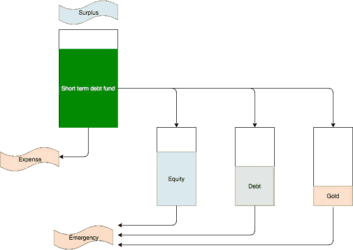
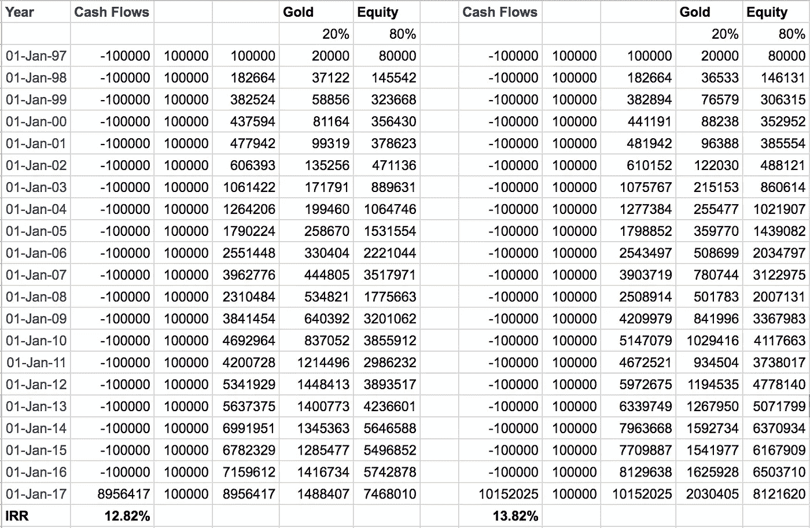
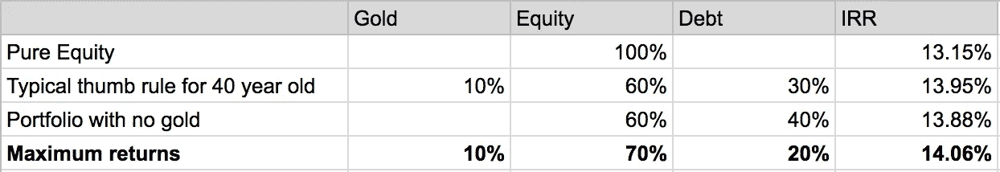

# 6 个简单的步骤让你的投资获得巨大回报

> 原文：<https://medium.datadriveninvestor.com/6-simple-steps-to-earn-great-returns-on-your-investments-2c404ba117c5?source=collection_archive---------7----------------------->

赚取高额投资回报并不像大多数财务顾问希望你相信的那样复杂。它也不需要像 PMS(投资组合管理服务)这样复杂的产品，除非你的投资组合是几十亿。所需要的只是一些纪律。

通常，财务规划是从你的财务目标开始的。例如，什么时候你需要钱来应付你的生活状况，比如婚礼、买房子或者你的孩子上大学。

> 但是，在收入和支出都不确定的情况下，你真的能相信财务目标吗？

大多数时候，很难准确地计划你什么时候需要钱。你真的知道你到底想什么时候买房子吗？这也将取决于你能负担多少。同样的，真的可以计划到一定年龄退休吗？你不可能预测在任何时候你会赚多少钱，你的投资回报会是多少。

所以在我看来，投资应该根据你所能承受的风险赚取最大的收益，并且要有一定的灵活性，这样你就可以在支出增加的时候支付费用。

好消息来了。

简单的策略可以帮助你在风险很小的情况下获得巨大的投资回报。让我们看看它是如何工作的。

# 可以投资哪里？

让我们简要地看一下个人投资者可以利用的各种投资渠道。这些在金融术语中被称为**资产类别**。每一类都有一定的风险，并适合于特定的目的。

*   **股权** —股权是对公司的投资，可以直接购买公司股票，也可以通过共同基金间接投资。这是唯一能让**实现资金增长**的课程。

> 债券是由公司或政府发行的有一定利息和期限的固定收益工具。你可以把它们看作定期存款，但它们可以买卖。被称为债务基金的共同基金买卖这些存款，就像股票基金买卖股票一样。

*   **长期债务基金** —期限较长，如 5 至 10 年及以上的债券称为长期债券。然而，不要混淆——这些带有很大的风险。利率波动影响债券价格。因此，长期债务基金也每年波动很大。这些都适合**长期**，多年的停车钱。
*   **短期债务基金** —发行期限较短，比如 1 年到几天的债券称为短期债券。这些较不容易受到利率变化的影响。买卖这些的共同基金被称为短期债务基金或流动基金。这些**适合随时存钱**，就像你的储蓄银行账户一样。
*   **固定收益** —定期存款、固定期限计划、PPF 属于这一类。还有其他一些政府计划也属于这一类。这是适合**在特定时间段**停车的钱。
*   **黄金**——黄金被认为是一种储蓄投资，其长期升值幅度几乎与通货膨胀率相当。所以投资组合中的一部分需要黄金来抵御通货膨胀。
*   **房地产** —房地产很难买卖，不同地点的回报差异很大，而且除非你将回报投资到房地产上，否则会有巨额税收。所以我真的不认为房地产是一个投资渠道，除非你的投资组合非常大。你最好把它看作是可以使用的东西，比如一辆车。

还有其他奇特的途径，比如早期公司、葡萄酒等等。但是这些都是复杂且有风险的。现在让我们看看你可以使用的具体策略。

# 规则 1——将你的盈余投资于短期债券

投资的第一条规则是不要试图进行长期投资。这被称为试图把握市场时机。

当股市下跌很多时，人们认为是时候买入了。但它可能会跌得更多。同样，如果黄金价格上涨，也不意味着是时候卖出了。这是行不通的，因为你永远无法预测市场。

因此，与其孤注一掷，不如定期规划你的投资，比如每个月。如果你在任何时候有剩余资金，这些资金应该存放在短期债券中，这是所有资产中风险最小的。你可以通过购买短期债务基金或流动资金来实现这一点。

# 规则 2——简化你的投资渠道

第二条规则是只投资那些你容易理解并且不会占用你太多时间的产品。

通过共同基金投资股票，而不是通过直接股票或股份。直接投资股票需要太多的时间和运气才能给你带来好的回报，而且真的没有人能在几年内重复这样的表现。

> 但是共同基金那么多，应该怎么选？

你的大部分资金应该投入指数基金。指数基金不依赖于基金经理的技能，但如果经济总体表现良好，指数基金也会表现良好。一部分可以进入中型基金，这取决于你想承担多大的风险，但正如你将在后面看到的，对于良好的回报来说，这不是必需的。

如果你有直接投资的股票，最好立即卖出，将剩余部分放在指数基金中。

我们已经讨论过使用短期债券来存放资金。长期债务基金有两种类型——金边债券基金，只持有政府发行的债券。以及由公司和政府发行债券的长期债务基金。在我看来，如果你使用长期基金，你应该只使用金边基金，因为没有违约风险。其他债券基金的回报率要高 1%到 2%,但债券的重点是安全，而不是增长。

通过主权黄金债券投资黄金。这些债券由印度政府发行，不仅随黄金价格涨跌，还会给你每年 2.5%的利息。

除非你的税率很低，否则你根本不应该投资定期存款。它们的税收效率很低。

# 规则 3——学习重新平衡的科学

很容易看出，并非所有资产类别都在同一时间点上涨。当股市或股票上涨时，黄金可能下跌。但是你总是会注意到，只有一种资产类别在一段时间内达到峰值，而其他一些资产通常会在其他时间达到峰值。利用这一点的方法是再平衡。

重新平衡意味着你决定投资组合中每种资产的特定比例。让我们假设你有一个 200 美元的投资组合，决定将 50%的资产放在股票上，50%放在债券上。

所以你的投资组合是:100 美元股票，100 美元债券。

再想象一下，在那一年，股票涨了一倍，而债券跌了一半。所以你现在的投资组合是:200 美元股票，50 美元债券，总共 250 美元

为了实现再平衡，你应该卖出价值 75 美元的股票，并用这 75 美元买入债券。所以你的投资组合变成了:125 美元股票和 125 美元债券

为什么会这样？因为明年债券很可能会超过股票，而且因为你现在有 125 美元的债券，而不是 50 美元，获得良好回报的机会更高。唯一要注意的是，**不要把你的直觉带入图片**每年调整，坚持你的百分比。

> 如果你投资卢比。从 1997 年开始，每年 100，000 英镑，其中 20%投资黄金，80%投资指数基金，你过去 20 年的回报率为 12.82%。另一方面，如果你下一次投资时也每年进行再平衡，你今天的回报率将是 13.82%，或者投资组合价值超过 1 亿卢比。

# 规则 4——在每个资产类别中投入多少

这在很大程度上取决于承担风险的能力。典型的经验法则是你应该有(100-你的年龄)%投资在股票上。因此，如果你的年龄是 40 岁，你的投资组合中应该有 60%是股票。同样，另一个经验法则是，你投资组合的 10%应该是黄金，以抵御通胀。投资组合的其余部分可以是债券或固定收益产品。

这是一个很好的经验法则，但我做了更多的分析，以了解我们如何才能获得最大的回报。为了进行计算，我将 NIFTY 指数作为股票的基准，将 10 年期印度政府债券收益率作为长期债券的基准。黄金价格很容易获得。

结果发现，对于过去 20 年的数据，即 1997 年至 2017 年，如果你每年投资 100，000 英镑，并进行再平衡，通过上述资产组合获得的回报率最高为 14.06%。你只需选择任何指数基金、任何政府债券基金，每年只需检查一次你的投资组合。你能打败它吗？

# 规则 5——不要把保险和投资混在一起

第五条规则是不要把保险和投资混在一起。ULIP 计划是一种非常昂贵的保险方式。因此，购买一个长期计划是最具成本效益的方式。

> 收入法则提供了最基本的经验法则，它认为个人保险金额至少应该是一个人年收入总额的八到十倍。例如，一个年收入 10 万卢比的人应该有 80 万到 100 万卢比的人寿保险。— [你应该投保多少？](https://www.rediff.com/money/2008/jul/18perfin.htm)

当然，随着医疗费用的上涨，医疗保险是必须的。大多数雇主都提供这样的计划，如果你的雇主没有提供足够的保险，你当然应该买一份。

# 规则 6——知道何时使用固定收益产品

现在让我们讨论最后一条规则。什么时候用固定收益？

定期存款的税收效率非常低，尤其是对最高税收阶层的人来说。7.5%的定期存款会给你税后 5%的利润。所以大多数人不应该投资定期存款。

然而，也有一些例外。一个是 PPF。这些天大多数顾问会告诉你 PPF 利率在 7-8%左右，这不是一个好的回报。然而，即使你的收入现在不在 30%的范围内，它也会在未来的某个时候达到，这一回报将相当于 11-12%的定期存款，这是完全安全的，并由印度政府支持。

固定收入的一个好例子是老年人。老年人专用。投资 pm vvy(prad Han Mantri Vaya Vandana yo Jana)和 SCSS(老年公民储蓄计划)是有意义的。尽管这些计划没有税收优惠，但它们没有任何风险，并得到政府的支持。而公司的 NCDs 和定期存款都带有一定的违约风险。

# 享受您的储蓄

我们都忽略的一部分是享受我们的储蓄。当我们追逐投资回报的时候，有时我们会忘记，这并不是一个要一直增加的数字。你也需要享受它。

因此，几年前，我曾经在基于股息的固定收益计划中设置了我的投资组合的一部分，这些计划过去每个季度都会提供一些股息。现在，由于股息分配税，这些债券已经变得税收效率低下，所以我投资了一些 10 至 15 年的长期固定收益债券，这些债券在每年年底提供利息。这是一笔年度奖金，可以支付你的假期或做其他你喜欢的事情。小额固定收益多一个案例。

投资愉快！