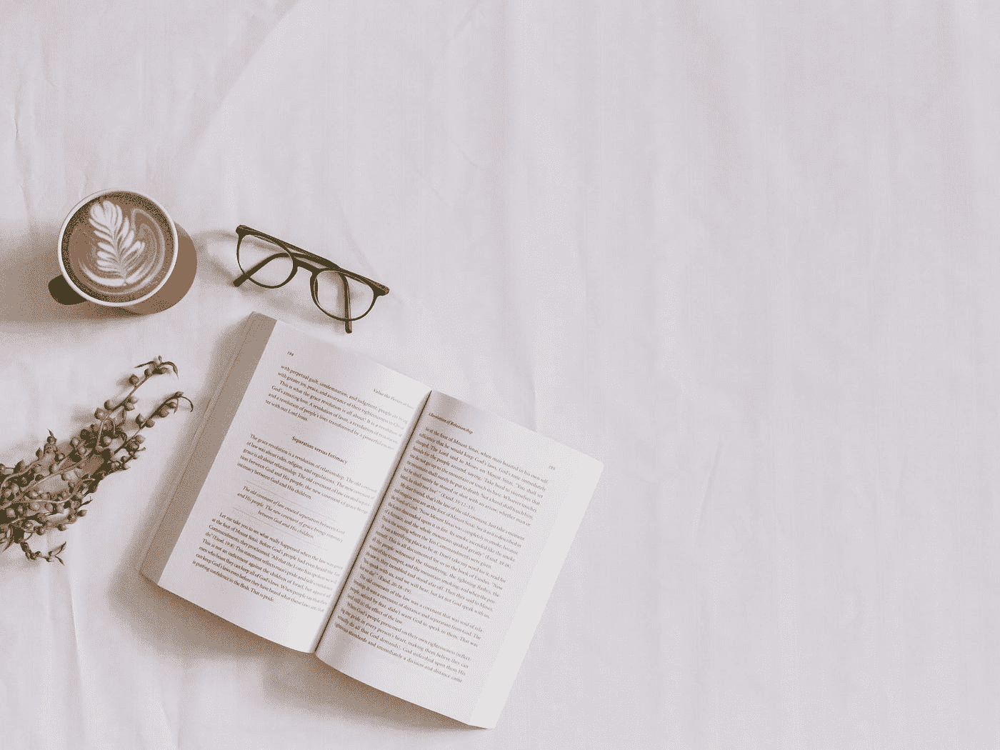
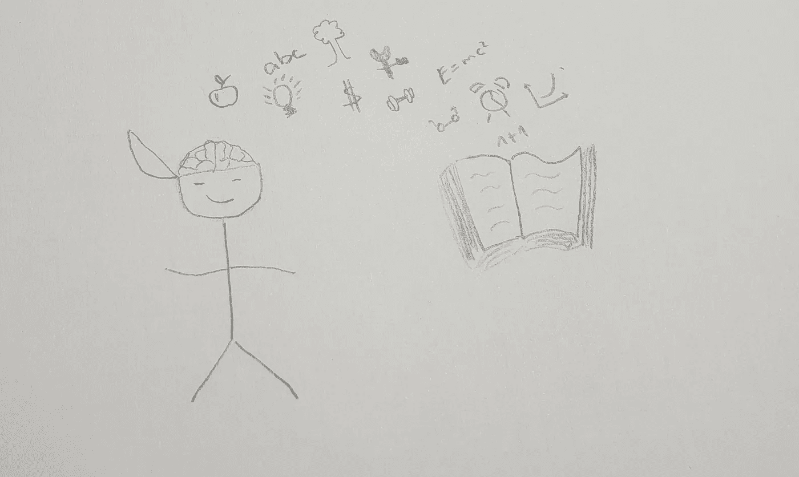

# 充分利用你所读内容的 6 个步骤(不是重读)

> 原文：<https://medium.datadriveninvestor.com/6-steps-to-get-the-most-out-of-what-you-read-not-rereading-23d0ba677f58?source=collection_archive---------8----------------------->

Photo by [Nicole Honeywill](https://unsplash.com/@nicolehoneywill?utm_source=medium&utm_medium=referral) on [Unsplash](https://unsplash.com?utm_source=medium&utm_medium=referral)

我们大多数人阅读非小说类书籍，不是为了纯粹的乐趣，而是为了从中获得一些东西。

但是如果你读了一本书又一本书，却没有一本书合你意，那该怎么办呢？

有没有一种方法不仅能阅读，还能理解和实现你所阅读的内容？

 [## 成功人生的 25 种自我提升方式|数据驱动的投资者

### “我活得越久，学到的就越多。学的越多，体会的越多，知道的越少。”―米切尔·莱格兰德时间到…

www.datadriveninvestor.com](https://www.datadriveninvestor.com/2019/03/12/25-self-improvement-ways-for-a-successful-life/) 

绝对的。

我今年的目标是阅读 100 本非小说类书籍，并发表一篇关于它们的总结。我已经读完了 50 本书，所以我已经上路了。

在这篇文章中，你将了解到我是如何最大限度地保持我所阅读的内容，以及你如何在自己的生活中实现最好的想法。

# 1.阅读正确的东西

如果你正在阅读，而这本书非常令人讨厌，或者你有一段异常艰难的时间，这是一个强烈的信号，表明现在不是阅读它的正确时间。明天再试一次，如果还是很烂，就停止阅读。也许这本书还不错，一年后你会爱上它。当然，如果你在学习或者你必须为工作而读书，你没有其他选择。但是你至少可以通过应用我提供的建议来充分利用它。

我总是试着买五到十本书，随时准备阅读。然后，我挑选我最有动力去读的书，而且通常是与我目前正在做的事情相关的书。比方说，你想建立一个创业公司，在开始的时候，你可以阅读经典著作，比如《精益创业》或者《100 美元创业》。随着你的进步，你可能会阅读关于创造力或设计的书籍。之后，你理想地到达了你想卖东西的点，你可以开始阅读营销书籍。如果你这样做，你也可以马上实施你所学的东西，从而大大提高你的学习。

确保你清楚你为什么要读一本书。你想从你投入的时间中得到什么？我的意思是，如果你只是为了读书而读书，那就去读吧。但是既然你在读这篇博文，我假设你读一本书是因为你想得到一些回报。问题是加强你的注意力和让你的潜意识参与进来的有力工具。如果你提出一个问题，你的大脑会试图回答它。因此，它会让你读得更深入。因此，写下至少一个你想通过阅读这本书得到答案的问题。

# 2.充实你的思想

我知道这听起来很老套，但是准备就是一切。为了从你所读的东西中获得最大的收获，我建议你从阅读一个你能在网上很容易找到的摘要开始。或者你在 YouTube 上看一个总结，随便你最喜欢的。这将有助于你对这些书的风格有一个印象，当你读的时候，某些重点你已经听起来很熟悉了。

一旦你做了这些，你可以谷歌一下作者，感受一下是谁在和你说话，为什么他说的是相关的。这种方式更像是作者在指导你，而不是简单的信息消费。

第三步是一页一页地浏览这本书。不是真的阅读，而是看标题和图形。这样，在你阅读信息之前，你的潜意识就已经有时间处理信息了。

# 3.深潜下去

找一个舒适的地方，开始潜水。就技巧而言，我使用一种速读的形式。所以，我用笔来引导我的眼睛，并尝试使用我的周边视觉。这意味着我从行内大约 1.5 厘米处开始用笔，直到结束。这样，我就把我的眼睛必须移动的距离减到最小。我的目标从来不是尽可能快地阅读，而是在正确理解的情况下快速阅读。我总是试图变得更快一点。我的长期目标是在正确理解的情况下达到每分钟 500 到 800 个单词。

为了确保你理解了你所读的内容，最好是在你读完这本书的一个章节时休息一下，否则你会觉得你的思绪飘走了。在这个休息时间，你试着在脑海中总结你刚刚读到的内容。我必须承认这有时会令人沮丧，因为在第一瞬间，我有时会觉得自己忘记了一切。但我发现这是一个真正的游戏改变者，也是一个非常有价值的练习。

另一个更好地记住你所读内容的好方法是制作一部心理电影。你可以想象自己在某些情况下已经使用了你刚刚学到的东西，并因此受益于你的大脑独特的能力，使思想感觉好像是真的。

# 4.双倍留成

像大多数事情一样，随着时间的推移，阅读会变得越来越容易。试着找一个固定的阅读时间，试着每天阅读，从五分钟开始，一小时一小时。对我来说，最好的时间往往是清晨，晚上，接近就寝时间。

此外，我喜欢一次看两本书。不是立刻，而是在它们之间切换。所以，如果我总共读一个小时，我会把它分成三十分钟。当然，如果我在读一本书的时候设法进入心流，我会驾驭这种心流，不会转换。另一方面，如果我不能专注于一本书，我会更早切换。

阅读两本书背后的原因是一个叫做间隔重复的学习原则，即如果你把材料间隔更长的时间并更频繁地回来，你会学得更好。所以，如果你只读了一半，你就给了你的大脑两倍的时间来消化这本书。既然你不想浪费时间，你就一次用两本书来做。但是不要本末倒置，这是一种先进的技术，如果你刚刚开始养成阅读的习惯，从一本书开始。

# 5.让它成为你的书

用你读到的东西去做点什么，这可能是成功人士和那些未能实现自己梦想的人之间最显著的区别。因为没有行动的知识只是储存的信息。今天，我们有电脑来储存记忆，我们大脑的力量是用你消耗的信息做一些新的事情，而不仅仅是储存它。你的大脑可以将新的和旧的信息联系起来，甚至可能从中产生一些独特的和新的东西。但要做到这一点，你需要的不仅仅是简单地阅读一本书——你真的必须拥有它。通过拥有一本书，我的意思不仅仅是买一本书。但是你如何对待这本书决定了，你是让这本书成为你自己的一部分，还是仅仅拥有它。如果你读一本好书，作者可能会对他写的东西进行很多思考，有时还会包含几十年的智慧。所以，你有一个独特的机会将所有这些知识下载到你的大脑中，并使之成为你的一部分。那么你是如何做到这一点的呢？

为了使这一点更实际，你可以现在就决定你想从这篇文章中学到什么。如果你自己回答了这个问题，你已经离阅读和实施更近了一步。

# 6.更深入

你读了很多声称想要成功，你必须每周读一本书。这对你真的有帮助吗？我对某人去年阅读的书籍数量印象不深。对我来说，重要的是，他用他读到的东西做了什么？如果你跳过上面列出的步骤，在读完之后直接进入下一本书，你除了参与盲目信息消费的竞赛之外，什么也没做。相反，在开始阅读下一本书之前，你要深入阅读你所读的内容。你可以听专门关于这本书的播客，你可以看 YouTube 视频或者搜索是否有关于其他人从这本书里得到了什么的博客文章。这将有助于你巩固所学的知识，并让你进一步了解如何运用新知识。一旦你觉得你已经从这本书里学到了所有的东西，是时候进入下一本书了。

所以，你有它。为了成为领导者，现在轮到你成为一名读者了。

*原载于 2019 年 2 月 3 日*[*【https://roadtolimitless.com】*](https://roadtolimitless.com/6-steps-to-finally-get-the-most-out-of-what-you-read/)*。*

# 准备好变得无限吗？

如果你想变得无限并大大加快你的学习速度，看看我的小抄:

[单击此处立即获取备忘单！](https://roadtolimitless.com/cheatsheet/)