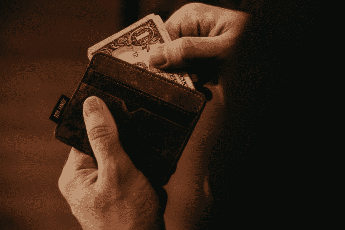

# 让你少花钱的 6 个步骤

> 原文：<https://medium.datadriveninvestor.com/6-steps-to-make-you-spend-less-6a814fc2747d?source=collection_archive---------14----------------------->

许多行为科学、行为经济学和行为金融学都犯有同样的错误。不停地谈论理论框架、行为建模，并进行纵向或大的统计分析，以得出关于某些行为的结论。无论它们是否发生。无论它们对个人、家庭或整个社会有积极或消极的影响。行为是否可以和应该被解决。有时它只是拖延…

但在其他时候，我们知道行为正在发生。我们知道这很糟糕。我们知道这个问题需要解决。现在就需要解决。但是怎么做呢？

 [## 外汇投资如何帮助偿还债务|数据驱动的投资者

### 外汇是对外汇市场的投资，不同国家的货币在外汇市场上进行兑换

www.datadriveninvestor.com](https://www.datadriveninvestor.com/2019/02/13/how-forex-investment-helps-to-repay-your-debts/) 

人们在管理财务时最常遇到的一个问题是，他们似乎没有正确地进行预算。意思是，他们的钱还剩下很长一段时间。这总是导致受害者(同时也是犯罪者)惊呼:“我需要少花钱！”在他们继续做和以前完全一样的事情之前，一点也不花更少的钱，仅仅一个月后就达到同样的程度。在这篇文章中，我会给你 6 个步骤，确保你最终少花钱。让我们开始吧！

# 在你毁掉自己之前跟踪自己

安装一个支出追踪应用程序。看在上帝的份上。突然你会发现你在咖啡、外出就餐、化妆品、鞋子、不再使用的订阅等方面花了多少钱。这一步至关重要。为什么？因为我们在银行对账单上积累了大量的财务混乱。

如果你检查一下你的银行对账单，你就会明白我的意思。或者直接打开你的银行 app。很乱。到处都是小额支出。疯狂是没有秩序的。它给你提供了绝对没有概述。如果它没有在右上角显示你的余额，你将很难计算出你还有多少钱可以花，这就是问题所在。

如果你倾向于靠现金生活，这一步会相当困难，因为没有应用程序可以跟踪你的现金去向。然而，你可以通过在笔记本上写下来或者在手机上记下来来追踪你的支出。结果将是一样的。对你来说足够幸运的是，倾向于使用现金作为主要支付方式的人与使用信用卡的同龄人相比，倾向于花费更少。所以至少你已经得到了你想要的！

# 重新确定优先顺序

一旦你知道情况有多糟糕(很糟糕，你不知道你一个月花了这么多钱在咖啡上)，你可以重新安排优先事项:如果你想剩下更多的钱，这是新的优先事项。星巴克(或 Costa……)咖啡现在的优先级(低得多)了。

对于你在第一步中发现的每一项支出，你都要问问自己，它是否比你的新目标更重要。对于每一笔支出，你都必须问自己:我真的需要这笔钱吗？没有这个我能不活吗？拥有这个比拥有一个额外的…月底还剩$美元？你必须为每一笔支出都这样做。

你需要订阅健身房吗？当然可以。但是当它一个月要花 40 英镑，而你一个月只有两次的时候，你还需要它吗？不…取消。下一个。

这是一个艰难的过程，最好是和一个支持你但固执的朋友一起完成，他会对你的财务决策给予一些严肃的严厉的爱。然后喝一瓶酒(或更烈的东西)来帮助你减轻疼痛。因为这会很痛苦。重新安排优先次序的另一个重要部分是找出你真正需要的东西，这将抑制你的支出。我们经常消费，因为我们认为我们需要一些东西。但是我们有吗？深入下一点将有助于澄清这个问题。

# 购买你的存货

你曾经买过你认为你需要的东西，后来发现你家里已经有类似的东西了吗？是啊，我也是。正如我以前说过的，很难掌握我们的钱和银行存款余额。追踪我们目前的财产同样困难，如果不是更困难的话。有的时候东西是不可能找到的，有的时候我们不再喜欢的东西又摆脱了，忘记了已经摆脱了，然后疯狂的寻找，又错过了。现在，找出你已经拥有的东西的最简单的方法就是把它们都浏览一遍。是的，是时候采取一些行动了。

如果你不知道玛丽·近藤是谁，她是一个瘦小的日本女人，看起来很温柔，但在打扫厕所时却很无情。她不会为你打扫卫生，不，你必须自己打扫，但她会解释这背后的理论。她的翻译知道。她是一种现象，也是一股不可忽视的力量，尤其是如果你是一个囤积者的话。

现在回到第 3 步。翻一翻你的衣柜，看看你有什么，把你不再想要/需要/喜欢的东西拿出来，放在不同的地方。为你的衣服、陶器、清洁用品、办公用品、书籍、技术等做这件事。直到一切都结束。现在把你仍然想要的东西放回去，然后看看你说你仍然需要的东西的清单。你最初想摆脱的一些东西能通过这个功能摆脱吗？

难看但舒适的鞋子可以用于散步或健身。旧牛仔裤可以变成夏天的短裤。衬衫可以变成枕套、清洁毛巾、织物袋等。旧锅和罐子可以上漆，用于家居装饰，无需去宜家。最糟糕的情况是，你可以卖东西(赚点外快)，把它带到一个交换活动中(用你的东西交换别人的东西，这应该是免费的)，或者把它捐出去，让其他处境不那么幸运的人开心。

现在，除了让你在生活环境中有更多的空间，对你已经拥有的东西有更好的了解，它还会阻止你购买更多的东西。为什么？因为你现在知道你拥有多少。如果您刚刚经历了一大堆事情，您可能不想再添加了。当你不得不搬家时，这变得尤其普遍。突然你不想再拖着所有的东西了。

# 不带它就离开家

Prelec 和 Simester (2001)有一篇论文叫做:“总是不带着它离开家:信用卡对支付意愿影响的进一步调查。”整篇论文都集中在这样一个事实上，仅仅是信用卡的存在就有可能让你花更多的钱。那么他们的解决方案是什么？别带在身上。

现在是 2019 年(很快是 2020 年)，我们有大量的支付方式可供选择。但是如果我可以给你一些建议的话:如果你想限制你的花费，使用一种有限度的方法。坚持用现金。把卡片留在家里。

现在，有些人对不带卡(或手机/数字钱包)感到有点不安。请原谅，我提出的已经是一个非常宽松的版本了。最初的想法是你身上一分钱都不带。但是，因为事情确实会发生，所以随身携带一点现金以防万一也没什么坏处。只要你不把它花在喝咖啡上…

这是一件值得思考的有趣事情:现金带来的限制。一旦你没有现金，你就不能继续消费。你不能透支或赊账，因为这不是现金券的工作方式。谢天谢地。现金是一种简单的切断自己的方法。这也消除了你不断在头脑中记录开销的需要。

想象一下在一个预算有限的夜晚外出。你只想花 30 美元(你需要确保你不会花更多，因为房租很快就要到期了，你想要一个栖身之处)。尤其是喝醉的时候(或者只是微醉)你最初制定的那些计划会飞出窗外。如果你继续用信用卡支付，很有可能你会继续支付，而不是停留在你自己设定的限额上。如果你只带了 30 美元现金，其他什么都没有，你就不能超过限额。你甚至不用去想，你就是不能。把卡留在家里，坚持用现金。

# 不要进入毁灭之庙

如果你脑子里想的是钱，特别是集中精力不去花它，你本质上就是不停地想着钱和花。这是导致灾难的原因。对你(自己)施加这种限制会产生和你节食一样的效果:现在你一直在想不健康的食物(有人吃布朗尼吗？).

对于“财务节食”来说，其结果是不断思考你想买的许多东西。现在购物和不带钱会有所帮助。你可以去商店，但是没有钱，购物会突然变得困难很多。但是，当然，在家也有问题。你保存所有付款方式的地方。以及您的笔记本电脑与网络世界连接的位置。网上购物世界。

你可以明白我的意思。到目前为止，你在财务方面(或者工作、饮食、健身或其他方面)做得很好，想犒劳一下自己。或者，你在上述任何一个方面(或所有方面)都做得很糟糕，想要安慰自己。你转向网上购物。这就是一切都出问题的地方。

现在，有两种方法可以避免这种情况:你依靠自己的意志力(祝你好运…)或者你开始屏蔽某些网站。这就像一个“儿童锁”，但对你自己来说。上不去，就花不了钱。

# 计划失败，计划失败

现在，有时你不得不去商店，在线或离线。你至少需要食品杂货。但是你会对你要买的东西做好充分的准备。

你会有一张你需要的东西的清单。你只会去那些存放这些产品的小岛和摊位，你的新口号将是:进去，拿到然后出来。其他任何东西都是不可接受的。

如果不是关于食品杂货，而是关于更琐碎的支出，你还是应该把它列在清单上。称之为长期清单。这个名单你每个月都要编辑。所以，每个月你都必须决定你是否还想要清单上的东西。如果过了一段时间后你仍然想买，而且你的经济状况允许，那就去买吧。但是你可能会发现，一旦冲动和“立即快乐”的想法消失了，你就不再那么想要它了。

这就是拖延的力量。对作业有效，甚至对购物也有效！

上面概述的六个步骤中的一些会立即减少你的开支。其他措施旨在减少花钱的习惯。总之，它们将确保你过上更稳定、更健康的生活，并能更好地掌控自己的钱。

如果你打算尝试这些建议，或者你有其他对你有效的方法，请在推特上告诉我。拯救快乐！

## 关于作者

莫尔·范·登·阿克是华威商学院行为科学专业的博士生。她研究了不同的支付方式，尤其是非接触式和移动支付方式，对我们管理个人财务的影响。在她的“空闲”时间里，她写了一些关于个人理财、行为科学、行为金融和博士生生活的文章，这些都发表在《金钱在头脑》上。通过 DDI，她撰写了关于个人和行为金融的文章，以确保学术界的知识流入主流，并能帮助尽可能多的人！

*原载于 2019 年 10 月 29 日*[*【https://www.datadriveninvestor.com】*](https://www.datadriveninvestor.com/2019/10/29/6-steps-to-make-you-spend-less/)*。*