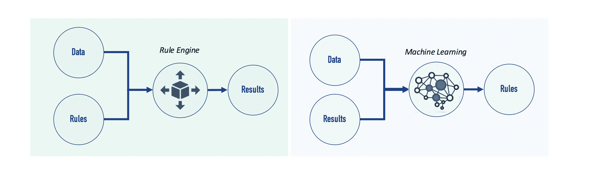
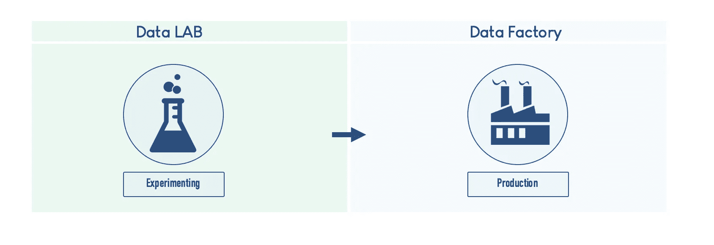

# 金融行业人工智能的 6 个步骤

> 原文：<https://medium.datadriveninvestor.com/6-steps-to-powering-ai-in-the-finance-industry-from-someone-who-actually-tried-c815d13475e?source=collection_archive---------2----------------------->

过去八年来，我一直在金融行业工作……自 2010 年以来，我一直在观察快速发展的颠覆性技术如何改变这个行业，以及我们从事金融的方式。从 FinTechs 和 RegTechs 的出现，到替代金融解决方案(加密货币、众筹、点对点贷款)的创造，最重要的是，人工智能、云计算、区块链等新技术和工具的爆发。

人工智能是塑造当今金融业的主要技术之一。它被广泛应用于各个领域:提高效率、降低成本(在监管的情况下)、锁定客户、风险管理等。但传统金融机构目前面临的主要问题是:如何超越人工智能项目中的“概念验证”,并投入生产？

在这篇文章中，我会根据自己的经验给出一些答案，所以请随意分享、评论和反馈。

让我们开始第一步…

# 1.从用例开始

在“传统”金融机构中实施新技术不是一个趋势问题…它应该是关于改善业务和在不断变化的世界中竞争。在过去的几年里，我看到许多传统的银行和保险公司对区块链和人工智能等技术进行了无数次的概念验证……最后却把所有的东西都扔进了档案馆。这些未完成的工作的主要原因之一是它们主要是“技术驱动的”和“技术聚焦的”，只要标题中有“AI”这个词，用例几乎无关紧要。

# 2.了解技术

**了解技术——忘记传统智慧**

技术发展非常快，变得比以往任何时候都更加复杂。为了克服这一点，在开始考虑用例之前，必须理解核心概念&技术的第一个抽象原则。当应用于人工智能和区块链等技术时，这一点尤其如此……对于接下来的技术来说，这可能也是如此。这个来自[世界经济论坛](https://medium.com/@weforum)的视频就是一个很好的例子。对于一个业务经理来说，理解人工智能是如何工作的，这是重要的第一步，它将为她/他打开许多想法和用例的机会。除此之外，回报和投资回报将更加清晰。当考虑银行和保险公司时，人工智能&机器学习可以应用于几乎任何业务部门:市场营销、客户个性化和特征分析、欺诈检测、反洗钱和反恐融资、人力资源等。

# 3.数据是新的石油

> “世界上最有价值的资源不再是石油，而是数据”。《经济学人》2016 年 5 月

许多调查证明，数据驱动型公司的表现优于竞争对手，尤其是在财务方面——见下面的“Tableau 软件”图表。数据是释放公司全部潜力的关键，尤其是在金融领域。在由" *Tableau* "进行的研究中，在数据使用方面表现突出的公司在考虑其财务表现时处于领先地位。

当我们在金融行业进行真正的人工智能项目时，这一点变得更加明显。

> 在机器学习的情况下，数据是我们不能离开的一个主要组成部分。

与传统的软件开发方法不同，机器学习基于对历史数据的学习——尤其是在处理监督学习算法时——

我为一家大型欧洲保险公司进行了一个机器学习项目，为他们的反洗钱平台提供支持。当我们开始这个项目时，我们的主要问题不是关于算法或技术…它首先是关于“数据”:我们需要什么数据？有吗？质量好吗？…等等。

> 数据是任何人工智能过程的基石之一，还有模型和算法~ [Alan D. Duncan](https://www.gartner.com/analyst/51402) ，Gartner 研究副总裁

如下图所示，当人们不能快速简单地找出规则时，最好使用机器学习技术。许多业务流程都是如此，尤其是营销、销售、风险和合规。很难根据“经验”写下识别欺诈或洗钱技术的规则，但是 ***当有足够高质量的标记数据时，这就变成了一个相对简单的任务*** 。

# 4.从想法…到实验室…到工厂！

> 传统金融机构面临的主要问题不是开始机器学习实验，而是将项目交付给最终用户——“在生产环境中”。

一旦数据问题得到解决，我们需要合适的基础设施来托管数据以及其他设计和开发工具，以便进行实验。

1.  ***BigData 基础设施*** (Hadoop 生态系统，Impala，Hive 等。)
2.  ***自动化通道*** 以便将数据运送到“数据湖/数据集市”
3.  ***ETL*** 运行模型前处理和清理数据的工具
4.  ***development framework*ks**，像 Anaconda、Jupyter Notebook for Pyhton 等库和工具。
5.  ***敏捷组织和方法论*** 。传统的软件开发方法不能应用于人工智能项目，因为规则和参数不能预先设定。这就是为什么有必要采用“测试和学习”的方法！

从数据实验室转移到数据工厂并不像看起来那么容易。试验机器学习项目与将它们投入生产模式是完全不同的。特征的创建和维护应该是自动化的，数据应该在非常短的时间内在生产系统中更新，以便为机器学习模型等进行处理和准备。

> 对于传统金融机构来说，从数据实验室到数据工厂的过渡是一个巨大的挑战，这主要是因为数据来自独立的(非通信的)数据孤岛，没有标准化。

# 5.业务/工作流程整合与组织

AI 就是来给用户(无论是员工还是客户)赋能的。它的使用应该从流程和工作流集成以及用户体验的角度来考虑。

传统软件/工具和人工智能之间的主要区别是，人工智能可以执行迄今为止我们认为只有人类才能完成的任务。这对组织和员工来说都是一个巨大的变化。

以下是人工智能在业务流程和工作流中顺利集成的 3 个主要组成部分:

1.  ***人&变*** :在人工智能驱动的业务流程中工作/贡献/互动的人应该意识到该技术和组织使用人工智能旨在实现的目标。
2.  ***寻找门槛*** 让 AI“几乎看不见”。随着时间的推移，人工智能系统会改进自己的行为和性能。成功的关键是只有当 AI 组件优于现有系统时才集成它。
3.  *:当将人工智能集成到业务流程中时，你应该记住，系统将需要一个 on 上的数据和案例。在大多数情况下，当处理“受监督的”机器学习时，前 6 至 12 个月被视为模型的真实生活条件测试。应要求最终用户提供反馈和调整，除此之外，模型监控必须严密。*

# *6.治理和监控—巨大的挑战*

*将机器学习项目投入生产可能是一个相当大的挑战，维护它是另一回事！*

*一旦机器启动，你就会开始问一些你以前从未问过的关于传统节目的问题。结果如何解释？…随着时间的推移，生产模式如何保持一致？当我们为了加班学习而喂它的时候，模型是不是在漂移？我们失去了背景吗？…我们为什么要设置该参数或删除该功能？等等。*

*为了克服所有这些问题，这里有一些建议:*

1.  *为生产中的机器学习模型设置一个 ***清晰的治理*** :一个例子是由业务经理、数据科学家和 IT 经理组成的项目礼让，以在将新版本推向生产之前验证 ML 模型的演进，等等。*
2.  ****以动态的方式记录所有技术决策*** ，同时保留记录历史。(使用维基、Git 实验室和其他工具)*
3.  *保持 ***监控 KPI****

> *到 2020 年，20%的公司将专门安排员工来监控和指导 AI ~ Gartner。*

*在下一篇文章中，我们将讨论金融行业中机器学习的用例。敬请期待！*